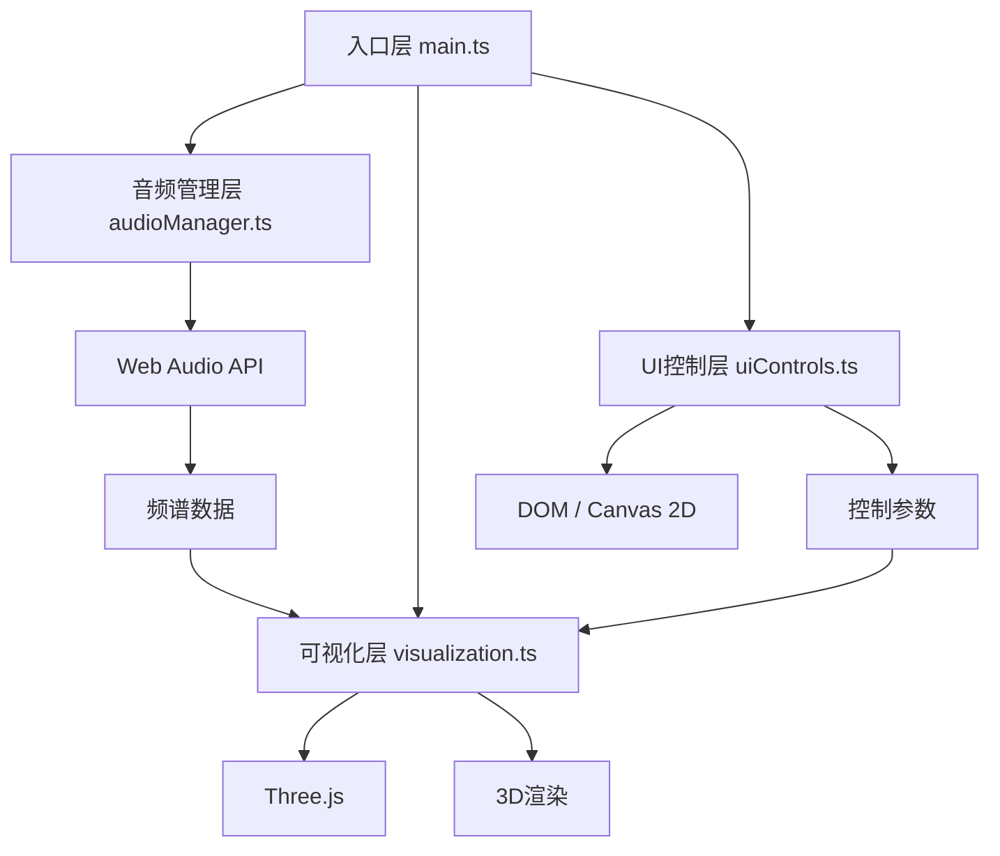

## 1. 架构设计

本项目为纯前端3D音乐可视化应用，采用分层架构设计，各模块职责明确，低耦合高内聚。



## 2. 技术描述

- **前端框架**：原生TypeScript + Three.js（无React/Vue框架）
- **构建工具**：Vite 5.x
- **核心依赖**：
  - three@0.160.0 - 3D渲染引擎
  - @types/three - Three.js类型定义（开发依赖）
- **音频技术**：Web Audio API（AnalyserNode获取频谱数据）
- **UI技术**：原生DOM + Canvas 2D（波形预览）
- **语言标准**：TypeScript严格模式，target ES2020

## 3. 项目文件结构

```
auto69/
├── package.json          # 项目依赖和脚本
├── vite.config.js        # Vite构建配置
├── tsconfig.json         # TypeScript配置（严格模式）
├── index.html            # 入口HTML页面
└── src/
    ├── main.ts           # 应用入口，初始化场景/相机/音频
    ├── audioManager.ts   # 音频管理，Web Audio API封装
    ├── visualization.ts  # 3D可视化，粒子/波形渲染
    └── uiControls.ts     # UI控制面板，交互逻辑
```

## 4. 模块接口定义

### 4.1 AudioManager 接口

```typescript
interface AudioManager {
  constructor();
  init(): Promise<void>;
  startMicrophone(): Promise<void>;
  loadAudioFile(file: File): Promise<void>;
  getFrequencyData(): Uint8Array;
  getWaveformData(): Uint8Array;
  getCurrentSourceName(): string;
  isPlaying(): boolean;
  dispose(): void;
}
```

### 4.2 Visualization 接口

```typescript
interface Visualization {
  constructor(scene: THREE.Scene, camera: THREE.PerspectiveCamera);
  init(particleCount: number): void;
  update(
    frequencyData: Uint8Array,
    sensitivity: number,
    rotationSpeed: number,
    particleSpread: number,
    deltaTime: number
  ): void;
  setMode(mode: 'particles' | 'waveform' | 'mixed'): void;
  dispose(): void;
}
```

### 4.3 UIControls 接口

```typescript
interface UIControls {
  constructor();
  init(): void;
  getSensitivity(): number;
  getRotationSpeed(): number;
  getParticleSpread(): number;
  getMode(): 'particles' | 'waveform' | 'mixed';
  onMicrophoneClick(callback: () => void): void;
  onFileSelect(callback: (file: File) => void): void;
  updateWaveformPreview(waveformData: Uint8Array): void;
  setSourceName(name: string): void;
}
```

## 5. 核心数据结构

### 5.1 频谱数据

```typescript
type FrequencyBand = {
  low: number;      // 低频 0-100Hz (红)
  mid: number;      // 中频 100-2000Hz (绿)
  high: number;     // 高频 2000-20000Hz (蓝)
};

type SpectrumData = {
  raw: Uint8Array;        // 原始频谱数据 0-255
  bands: FrequencyBand;   // 分频段能量
  energy: number;         // 总能量（用于节奏检测）
};
```

### 5.2 可视化参数

```typescript
type VisualizationParams = {
  sensitivity: number;      // 0.5 - 2.0
  rotationSpeed: number;    // 0 - 2.0
  particleSpread: number;   // 0 - 1.0
  mode: 'particles' | 'waveform' | 'mixed';
};
```

## 6. 性能优化策略

### 6.1 3D渲染优化

- **粒子系统**：使用THREE.Points + BufferGeometry，单次draw call渲染所有粒子
- **顶点动画**：波形曲面顶点更新采用BufferGeometry.attributes.position.needsUpdate，避免重建几何体
- **材质复用**：粒子和网格材质共享Uniform更新，减少GPU状态切换
- **自适应降级**：移动端自动减少粒子数量（5000 → 2000）

### 6.2 音频处理优化

- **频谱更新频率**：使用requestAnimationFrame与3D渲染同步，约60Hz
- **数据复用**：复用TypedArray存储频谱数据，避免频繁GC
- **平滑处理**：对频谱数据进行时间域平滑，减少视觉抖动

### 6.3 UI交互优化

- **CSS动画**：面板显示/隐藏使用CSS transition，GPU加速
- **节流防抖**：滑块值变化使用requestAnimationFrame节流
- **被动事件监听**：触摸/滑动事件使用passive: true，提升滚动性能
