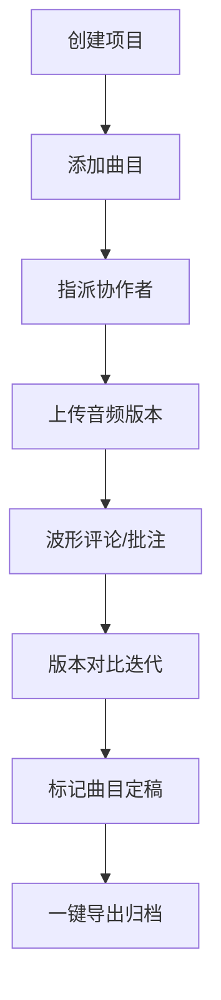

## 1. 产品概述
音频项目协作管理平台，为独立音乐人和小型录音棚提供在线管理音频项目、协作混音及版本历史追踪的一站式解决方案。
- 解决音频文件版本混乱、修改意见回溯困难、多人协作进度同步不及时的核心痛点
- 目标用户：独立音乐制作人、录音师、混音师、小型音乐工作室团队

## 2. 核心功能

### 2.1 用户角色
| 角色 | 注册方式 | 核心权限 |
|------|----------|----------|
| 项目创建者 | 系统内创建 | 创建项目、指派协作者、导出定稿曲目、管理所有内容 |
| 协作者 | 被邀请加入 | 编辑被指派曲目、上传版本、添加评论、标记完成 |

### 2.2 功能模块
1. **项目列表页**：项目创建表单、项目卡片网格、进度可视化
2. **项目详情页**：曲目管理、版本时间线、波形对比、评论系统
3. **导出对话框**：曲目勾选、文件信息展示、批量下载、预览试听

### 2.3 页面详情
| 页面名称 | 模块名称 | 功能描述 |
|----------|----------|----------|
| 项目列表页 | 项目创建表单 | 项目名称(40字)、客户名称、风格标签(多选)、BPM范围(60-200) |
| 项目列表页 | 项目卡片网格 | 渐变背景卡片、进度条展示、悬停动效、点击跳转详情 |
| 项目详情页 | 曲目管理 | 创建曲目、状态流转(待录制/已录制/混音中/已定稿)、协作者指派 |
| 项目详情页 | 版本时间线 | 纵向时间线视图、版本节点展开、自动版本号递增 |
| 项目详情页 | 波形对比 | 并排波形展示、蓝橙双色区分新旧版本 |
| 项目详情页 | 评论系统 | 时间点评论、表情符号、对话气泡、删除确认 |
| 导出对话框 | 导出管理 | 定稿曲目列表、文件大小显示、预览播放器、批量下载 |

## 3. 核心流程
用户登录系统后创建新项目，在项目内添加多个曲目并指派协作者。协作者上传音频版本，其他成员可在波形任意时间点添加评论和批注。所有版本以时间线形式呈现，支持版本间波形对比。项目定稿后，创建者可一键导出所有曲目。

## 4. 用户界面设计

### 4.1 设计风格
- 主背景色：#111827（深灰黑）
- 卡片背景：#1F2937，线性渐变至 #111827
- 强调色：#F59E0B（琥珀橙，进度条、时间节点、品牌色）
- 功能色：#10B981（成功/完成）、#EF4444（危险/删除）、#3B82F6（旧版本）、#F97316（新版本）
- 文字主色：#F9FAFB，次要文字：#9CA3AF
- 圆角：卡片16px、按钮12px-8px、气泡12px
- 过渡动画：统一 0.2s-0.3s ease

### 4.2 页面设计概述
| 页面名称 | 模块名称 | UI元素 |
|----------|----------|----------|
| 项目列表页 | 项目卡片 | 300px宽渐变卡片、悬停上浮4px+阴影加深、底部6px琥珀色进度条 |
| 项目详情页 | 版本时间线 | 左侧#4B5563垂直线、12px琥珀色圆点节点、点击展开详情 |
| 项目详情页 | 评论气泡 | #1F2937背景、12px圆角、左侧4px琥珀色条、支持5种表情 |
| 全局 | 侧边导航 | 260px宽#0F172A背景、底部用户信息、响应式折叠菜单 |

### 4.3 响应式设计
- 桌面端（≥1024px）：左侧导航栏常驻展开
- 平板端（768px-1023px）：导航栏折叠为40px汉堡按钮
- 手机端（<768px）：导航栏全屏覆盖，0.95透明度半透明背景

### 4.4 动效与性能
- 进入动画：元素从底部20px渐入，0.4s过渡
- 加载状态：#334155灰色渐变骨架屏闪烁动画
- 性能指标：页面首渲染≤500ms，音频播放FPS≥55，导出UI阻塞≤1s
