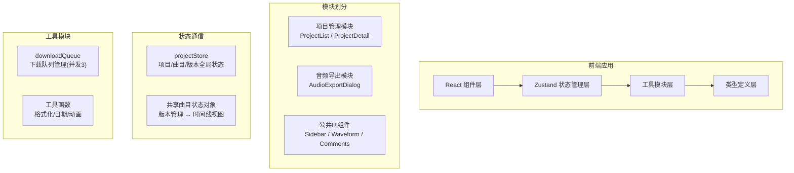
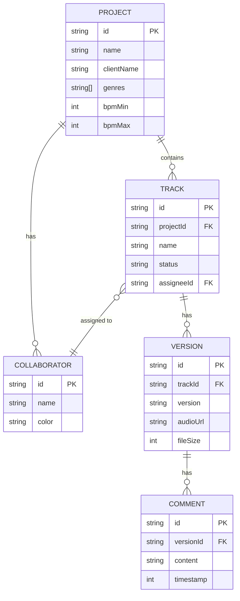

## 1. 架构设计



## 2. 技术描述
- 前端：React@18 + TypeScript + Vite
- 状态管理：Zustand
- 路由：React Router DOM
- 工具库：uuid、date-fns
- 样式方案：TailwindCSS + 自定义CSS变量
- 后端：无（纯前端Mock数据）

## 3. 路由定义
| 路由 | 用途 |
|------|------|
| / | 项目列表页，展示所有项目卡片 |
| /project/:id | 项目详情页，曲目管理与版本时间线 |

## 4. 数据模型

### 4.1 类型定义
```typescript
interface Project {
  id: string;
  name: string;
  clientName: string;
  genres: string[];
  bpmRange: { min: number; max: number };
  trackIds: string[];
  collaborators: Collaborator[];
  createdAt: Date;
}

interface Track {
  id: string;
  projectId: string;
  name: string;
  description: string;
  status: 'pending' | 'recorded' | 'mixing' | 'finalized';
  versionIds: string[];
  assigneeId?: string;
  createdAt: Date;
}

interface Version {
  id: string;
  trackId: string;
  version: string;
  uploader: string;
  uploadTime: Date;
  note: string;
  audioUrl: string;
  fileSize: number;
  commentIds: string[];
}

interface Comment {
  id: string;
  versionId: string;
  author: string;
  authorId: string;
  content: string;
  emoji?: string;
  timestamp: number;
  createdAt: Date;
}

interface Collaborator {
  id: string;
  name: string;
  color: string;
}
```

### 4.2 ER 图


## 5. 文件结构
```
src/
├── main.tsx                    # 应用入口
├── App.tsx                     # 根组件（路由）
├── index.css                   # 全局样式 + Tailwind
├── store/
│   └── projectStore.ts         # Zustand 全局状态
├── modules/
│   ├── projectManager/
│   │   ├── ProjectList.tsx     # 项目列表页
│   │   └── ProjectDetail.tsx   # 项目详情页
│   └── audioExport/
│       └── AudioExportDialog.tsx # 导出对话框
├── components/
│   ├── Sidebar.tsx             # 侧边导航
│   ├── ProjectCard.tsx         # 项目卡片
│   ├── Timeline.tsx            # 版本时间线
│   ├── Waveform.tsx            # 波形对比
│   ├── CommentBubble.tsx       # 评论气泡
│   ├── AudioPlayer.tsx         # 音频播放器
│   └── ui/                     # 基础UI组件
├── utils/
│   └── downloadQueue.ts        # 下载队列模块
├── types/
│   └── index.ts                # 全局类型定义
└── data/
    └── mockData.ts             # Mock演示数据
```
