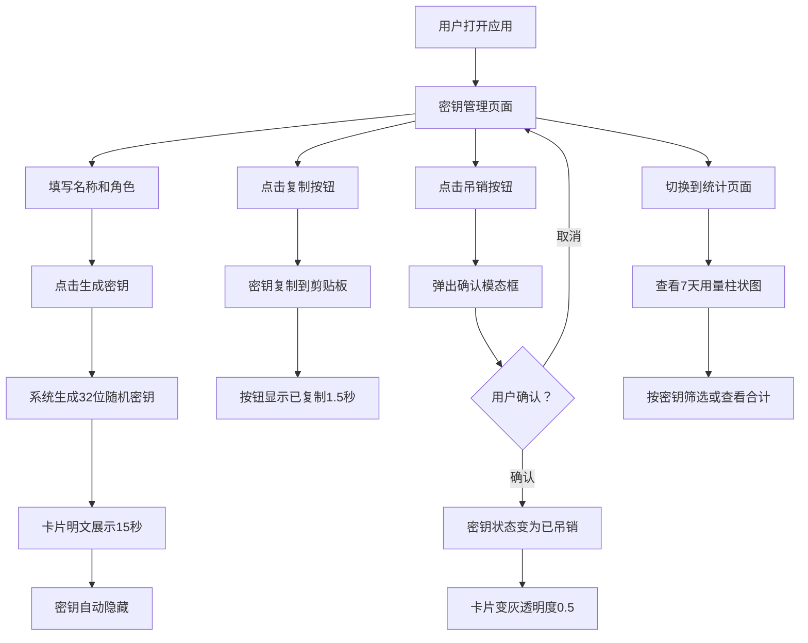

## 1. 产品概述

KeyVault 是一款面向独立开发者和小团队的 API 密钥管理与用量看板应用，解决密钥明文保存在代码仓库或被滥用的安全隐患，同时提供直观的用量统计和过期提醒功能。

## 2. 核心功能

### 2.1 用户角色
| 角色 | 注册方式 | 核心权限 |
|------|----------|----------|
| 独立开发者 | 无需注册（本地应用） | 管理所有密钥、查看用量统计 |
| 小团队成员 | 无需注册（本地应用） | 管理所有密钥、查看用量统计 |

### 2.2 功能模块
1. **密钥管理页面**：密钥生成表单、密钥卡片列表、吊销确认弹窗
2. **用量统计页面**：柱状图看板、密钥筛选、汇总数据

### 2.3 页面详情
| 页面名称 | 模块名称 | 功能描述 |
|----------|----------|----------|
| 密钥管理 | 密钥生成表单 | 输入名称（最长50字符）和角色（admin/editor/reader），生成32位随机密钥，明文展示15秒后自动隐藏 |
| 密钥管理 | 密钥卡片列表 | 2/3列响应式网格展示，显示密钥前缀、名称、角色标签、创建时间、状态，已吊销卡片透明度0.5 |
| 密钥管理 | 复制功能 | 一键复制密钥到剪贴板，按钮文本切换为"已复制"并变绿1.5秒 |
| 密钥管理 | 吊销确认弹窗 | 模态框提示"确定要吊销密钥[name]吗？此操作不可撤销。"，确认后状态变为已吊销 |
| 用量统计 | 柱状图看板 | 按天聚合最近7天调用次数，蓝色渐变柱体，支持按密钥名称筛选 |
| 用量统计 | 汇总数据 | 图表下方显示总调用次数和活跃密钥数，数字从0递增动画（0.5s ease） |

## 3. 核心流程

用户打开应用后进入密钥管理页面，左侧为生成表单，右侧为密钥列表。用户填写名称和角色后点击生成，系统生成32位随机密钥并在卡片中明文展示15秒后隐藏。用户可复制密钥或吊销密钥（需确认）。切换到统计页面查看用量柱状图，可按密钥筛选。

## 4. 用户界面设计

### 4.1 设计风格
- 主色调：深色主题，背景#1E1E2E，卡片#2A2A3E，边框#3A3A5E
- 按钮风格：圆角8px，渐变背景#6C63FF→#8B5CF6，悬停亮度提升10%，过渡0.2s ease
- 字体：JetBrains Mono（密钥展示）+ Outfit（UI文字）
- 布局风格：左右两栏（1/3表单 + 2/3列表），间隙24px，768px以下上下排列
- 角色标签颜色：admin红色#EF4444、editor蓝色#3B82F6、reader绿色#10B981
- 密钥明文高亮：黄色背景#FEF08A，黑色文字

### 4.2 页面设计概览
| 页面名称 | 模块名称 | UI元素 |
|----------|----------|--------|
| 密钥管理 | 密钥生成表单 | 深色表单区域，名称输入框，角色下拉选择，渐变生成按钮，卡片圆角16px |
| 密钥管理 | 密钥卡片列表 | 2/3列响应式网格，卡片圆角16px边框#3A3A5E阴影，角色色标，状态标签 |
| 密钥管理 | 吊销确认弹窗 | 模态遮罩，白色文字提示，红色确认按钮，灰色取消按钮 |
| 用量统计 | 柱状图看板 | 白色背景圆角12px浅阴影，蓝色#3B82F6渐变柱体，响应式宽度 |
| 用量统计 | 汇总数据 | 数字递增动画，总调用次数和活跃密钥数统计卡片 |

### 4.3 响应式设计
- 桌面优先设计，768px以上左右两栏布局
- 768px以下变为上下单列排列
- 卡片网格2列（小屏）到3列（大屏）自适应
- 图表宽度100%响应式
