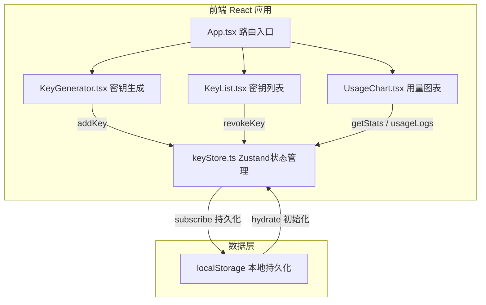
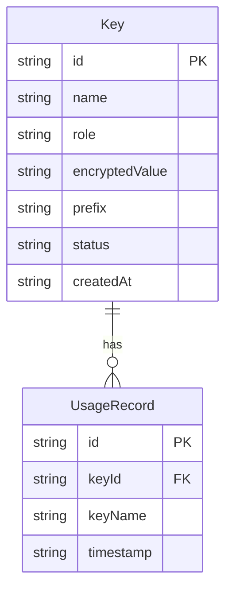

## 1. 架构设计



## 2. 技术说明
- 前端：React@18 + TypeScript + Vite
- 状态管理：Zustand（轻量级全局状态，内置subscribe/persist中间件）
- 图表库：Recharts（柱状图渲染）
- 工具库：uuid（密钥ID生成）、crypto-js（密钥加密存储）
- 初始化工具：Vite（vite-init）
- 后端：无（纯前端本地应用）
- 数据库：localStorage（浏览器本地存储）

## 3. 路由定义
| 路由 | 用途 |
|------|------|
| / | 密钥管理页面（左侧表单 + 右侧列表） |
| /stats | 用量统计看板页面 |

## 4. 数据模型

### 4.1 数据模型定义



### 4.2 类型定义

```typescript
interface Key {
  id: string;
  name: string;
  role: 'admin' | 'editor' | 'reader';
  encryptedValue: string;
  prefix: string;
  status: 'active' | 'revoked';
  createdAt: string;
  revealUntil?: number;
}

interface UsageRecord {
  id: string;
  keyId: string;
  keyName: string;
  timestamp: string;
}
```

### 4.3 Zustand Store 设计

**keyStore.ts** 导出以下 actions：
- `addKey(name, role)` → 生成32位随机密钥，加密存储，返回明文用于临时展示
- `revokeKey(id)` → 将密钥状态改为 revoked
- `logUsage(keyId)` → 记录一次密钥调用
- `getStats()` → 返回按天聚合的调用统计数据

**数据流向**：
1. KeyGenerator 表单输入 → `store.addKey()` → store 更新 keys 列表 → KeyList 重新渲染
2. KeyList 吊销操作 → `store.revokeKey()` → store 更新密钥状态 → 卡片样式更新
3. UsageChart 读取 → `store.usageLogs` + `store.getStats()` → 图表渲染
4. Store 订阅变化 → 自动写入 localStorage → 页面刷新时从 localStorage 恢复

## 5. 文件结构

```
├── package.json
├── vite.config.ts
├── tsconfig.json
├── index.html
└── src/
    ├── main.tsx          → React入口，渲染App
    ├── App.tsx           → 路由配置，页面布局
    ├── store/
    │   └── keyStore.ts   → Zustand store，Key/UsageRecord类型，actions
    └── components/
        ├── KeyGenerator.tsx  → 密钥生成表单
        ├── KeyList.tsx       → 密钥卡片列表
        └── UsageChart.tsx    → 用量柱状图
```

**文件调用关系**：
- `main.tsx` → `App.tsx`
- `App.tsx` → `KeyGenerator.tsx`、`KeyList.tsx`、`UsageChart.tsx`
- `KeyGenerator.tsx` → `keyStore.ts`（调用 addKey）
- `KeyList.tsx` → `keyStore.ts`（读取 keys，调用 revokeKey）
- `UsageChart.tsx` → `keyStore.ts`（读取 usageLogs，调用 getStats）
- `keyStore.ts` → `localStorage`（持久化读写）
