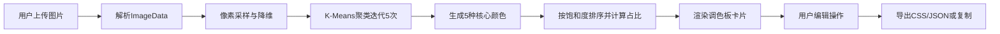

## 1. 产品概述

ColorHunt是一款在线图片色彩提取与调色板编辑工具，帮助设计师和开发者从参考图片中快速提取核心配色方案，并支持编辑、导出等操作。

- 核心目标：让用户上传图片后自动提取主色调和辅助色，生成美观的色彩主题调色板
- 目标用户：UI设计师、前端开发者、插画师、品牌策划人员
- 产品价值：大幅提升配色方案生成效率，确保配色来源于真实参考图

## 2. 核心功能

### 2.1 功能模块
1. **图片上传模块**：拖拽或点击上传图片，支持PNG/JPG格式
2. **颜色提取模块**：基于K-Means聚类算法从图片像素中提取5种核心颜色
3. **调色板编辑模块**：颜色卡片展示、拖拽排序、锁定/解锁、添加/删除
4. **导出与复制模块**：导出CSS变量/JSON，一键复制所有色值

### 2.2 页面详情
| 页面名称 | 模块名称 | 功能描述 |
|-----------|-------------|---------------------|
| 主页面 | 图片上传区 | 400×280px虚线边框容器，拖拽高亮动画，支持PNG/JPG |
| 主页面 | 调色板网格 | 流动网格布局，每行4-5张卡片，色块+色值+占比展示 |
| 主页面 | 颜色卡片详情 | 点击展开，显示HEX/RGB/HSL三种格式，锁定切换按钮 |
| 主页面 | 操作按钮组 | 添加颜色（色轮选择器）、导出下拉菜单、一键复制按钮 |

## 3. 核心流程

用户上传参考图片 → 系统解析像素数据并执行K-Means聚类 → 提取5种核心颜色按饱和度排序 → 生成调色板卡片展示 → 用户可手动编辑（拖拽/锁定/添加删除） → 用户选择导出CSS变量/JSON或一键复制色值

## 4. 用户界面设计

### 4.1 设计风格
- **主题**：深色模式科技风，紫蓝色调
- **主背景**：#1A1B2E（深邃午夜蓝）
- **卡片背景**：#2D2E44（半透明深色面板）
- **文字颜色**：#E4E4E7（浅灰白）
- **强调色**：#A5B4FC（浅紫色边框和提示）、#8B5CF6（紫色阴影）
- **按钮风格**：圆角胶囊型，悬浮微上浮效果，点击有绿色打勾动画
- **字体**：系统无衬线字体，标题加粗，正文Regular
- **布局风格**：居中卡片式布局，流动网格响应式排列
- **视觉层次**：紫色调阴影，卡片悬浮层次，柔和过渡动画

### 4.2 页面设计概览
| 页面名称 | 模块名称 | UI元素 |
|-----------|-------------|-------------|
| 主页面 | 上传区域 | 400×280px虚线边框(#A5B4FC)，SVG上传图标，提示文字浅紫，拖拽时背景#EFF6FF |
| 主页面 | 颜色卡片 | 宽160px圆角12px，上半部分色块高80px，下半部分显示HEX(#小字)和占比(#6B7280) |
| 主页面 | 展开态卡片 | 放大过渡0.3s ease-out，显示RGB/HSL/HEX可复制值，锁定SVG图标 |
| 主页面 | 操作按钮 | 添加颜色+导出下拉+复制按钮，点击绿色对勾fleet动画 |
| 主页面 | 整体 | 背景#1A1B2E，卡片#2D2E44，紫色阴影0 4px 12px rgba(139,92,246,0.12) |

### 4.3 响应式适配
- **设计策略**：Desktop First，移动端自适应
- **≥1024px（桌面）**：上传区400×280px，卡片每行4-5张，按钮横排
- **768px-1024px（平板）**：上传区宽度90%，卡片每行3张
- **<768px（移动）**：上传区宽90%且高度auto，卡片每行2张，色值字体0.8rem，按钮竖排
- **触控优化**：移动端按钮最小点击区44×44px，拖拽操作增大触发区域

### 4.4 动效与交互
- **页面加载**：卡片依次淡入上浮（staggered动画）
- **上传拖拽**：边框从虚线变实线，背景渐变过渡
- **卡片展开**：transform: scale() + opacity 0.3s ease-out
- **按钮点击**：fleeting绿色打勾SVG动画（缩放+淡出）
- **色值复制**：点击时色块轻微闪烁确认反馈
- **拖拽排序**：拖拽时半透明+轻微放大，占位符虚框提示
