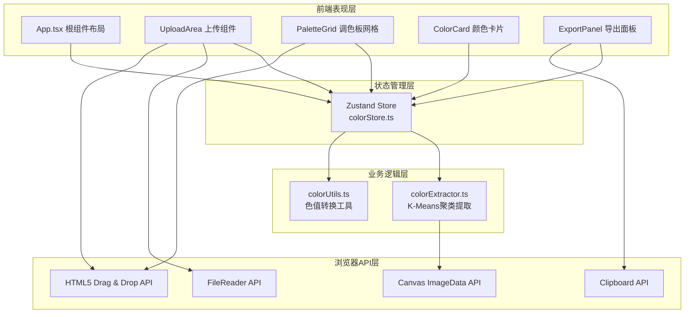

## 1. 架构设计



## 2. 技术描述

- **前端框架**：React@18 + TypeScript
- **构建工具**：Vite@5
- **状态管理**：Zustand@4
- **ID生成**：uuid@9
- **样式方案**：原生CSS + CSS Modules（轻量级，无需CSS框架）
- **色彩算法**：自研K-Means聚类（5次迭代，像素采样优化）

### 初始化方式
使用 `npm init vite-init@latest` 创建React+TypeScript项目模板，然后手动安装Zustand和UUID依赖。

## 3. 文件结构与路由

| 文件路径 | 职责 |
|-------|---------|
| `package.json` | 项目依赖与脚本配置 |
| `vite.config.js` | Vite构建配置（React插件） |
| `tsconfig.json` | TypeScript严格模式配置 |
| `index.html` | 入口HTML（深色背景，系统字体，全屏容器） |
| `src/main.ts` | React应用入口（渲染App组件） |
| `src/App.tsx` | 根组件（整体布局、组件组织、数据流） |
| `src/store/colorStore.ts` | Zustand状态管理（调色板状态、Action方法） |
| `src/modules/extractor/colorExtractor.ts` | 颜色提取核心算法（K-Means聚类） |
| `src/modules/editor/ColorCard.tsx` | 颜色卡片组件（展示、展开、锁定、拖拽） |
| `src/modules/editor/ExportPanel.tsx` | 导出面板组件（CSS变量/JSON导出、复制功能） |
| `src/utils/colorUtils.ts` | 工具函数（色值转换、剪贴板操作） |

## 4. 状态模型（Zustand Store）

### 4.1 类型定义

```typescript
interface ColorItem {
  id: string;
  hex: string;
  rgb: { r: number; g: number; b: number };
  hsl: { h: number; s: number; l: number };
  percentage: number;
  locked: boolean;
  isManual: boolean; // true=手动添加，false=提取生成
}

interface PaletteState {
  extractedColors: ColorItem[];      // 从图片提取的颜色
  manualColors: ColorItem[];         // 手动添加的颜色
  selectedIndex: number | null;      // 当前选中的颜色索引（-1表示未选中）
  expandedCardId: string | null;     // 展开的卡片ID
  // Actions
  setExtractedColors: (colors: Omit<ColorItem, 'id'>[]) => void;
  addManualColor: (color: Omit<ColorItem, 'id' | 'isManual'>) => void;
  removeColor: (id: string) => void;
  toggleLock: (id: string) => void;
  reorderColors: (fromIndex: number, toIndex: number) => void;
  setSelectedIndex: (index: number | null) => void;
  setExpandedCardId: (id: string | null) => void;
  getAllColors: () => ColorItem[]; // 返回提取+手动颜色的合并列表
}
```

### 4.2 Store Action 说明

| Action 方法 | 功能 |
|-------------|------|
| `setExtractedColors` | 清空旧提取色，添加新提取色（保留手动色不变） |
| `addManualColor` | 通过色轮选择器添加自定义颜色 |
| `removeColor` | 删除指定颜色（提取色删除后可重新上传恢复） |
| `toggleLock` | 切换颜色锁定状态（锁定后重新提取时不变） |
| `reorderColors` | 拖拽排序时交换颜色位置（作用于合并列表） |
| `setSelectedIndex` | 设置当前选中颜色索引 |
| `setExpandedCardId` | 控制展开态卡片的显示 |

## 5. 核心算法设计

### 5.1 K-Means颜色聚类算法流程
```
输入: ImageData { width, height, data[] }
输出: ColorItem[5]

步骤:
1. 像素采样：将800×600=480,000像素降采样至约10,000个样本（按步长采样）
2. 颜色空间转换：采样RGB→Lab颜色空间（聚类更符合人眼感知）
3. 初始化质心：随机选择5个像素作为初始聚类中心
4. 迭代聚类（固定5次）:
   a. 对每个样本计算到5个质心的欧氏距离，分配到最近簇
   b. 重新计算每个簇的新质心（所有成员的均值）
5. 输出质心：转换回RGB空间，计算每簇像素占比
6. 后处理排序：按饱和度从高到低排序（S值降序）
7. 转换色值：生成HEX、RGB、HSL三种格式
```

### 5.2 性能保障措施
- 像素采样步长：800×600图像步长≈7（总样本约800*600/49≈9796）
- 固定迭代5次，不使用收敛判断（满足用户要求）
- 所有运算在Web Worker级同步执行中保证<2s完成

## 6. 色值转换工具函数

| 函数名 | 输入 | 输出 |
|--------|------|------|
| `rgbToHex(r, g, b)` | number[0-255]×3 | string "#RRGGBB" |
| `hexToRgb(hex)` | string "#RRGGBB" | { r, g, b } |
| `rgbToHsl(r, g, b)` | number[0-255]×3 | { h[0-360], s[0-100], l[0-100] } |
| `hslToRgb(h, s, l)` | h×s×l | { r, g, b } |
| `copyToClipboard(text)` | string | Promise<void> |

## 7. 导出格式定义

### 7.1 CSS 变量格式
```css
:root {
  --color-primary-1: #E4572E; /* 占比 35.2% */
  --color-primary-2: #F3A712; /* 占比 24.8% */
  --color-primary-3: #29335C; /* 占比 18.5% */
  --color-primary-4: #669BBC; /* 占比 14.1% */
  --color-primary-5: #A8C686; /* 占比 7.4% */
}
```

### 7.2 JSON 格式
```json
{
  "palette": {
    "name": "ColorHunt Palette",
    "generatedAt": "2026-06-18T10:30:00.000Z",
    "colors": [
      {
        "hex": "#E4572E",
        "rgb": { "r": 228, "g": 87, "b": 46 },
        "hsl": { "h": 14, "s": 77, "l": 54 },
        "percentage": 35.2,
        "locked": false
      }
    ]
  }
}
```

## 8. 性能指标与验收标准

| 指标 | 目标值 | 测量方法 |
|------|--------|----------|
| 800×600图片提取时间 | ≤2秒 | console.time 从onload到聚类完成 |
| 动画帧率 | ≥60fps | Chrome DevTools Performance面板 |
| 首屏可交互时间 | ≤1.5秒 | LCP + TTI 指标 |
| 构建产物大小 | ≤200KB gzip | vite build 输出报告 |
