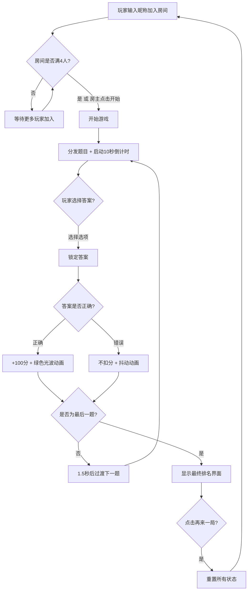

## 1. 产品概述

BuzzWise 是一款实时多人在线答题对战游戏，面向团队活动、聚会娱乐和知识竞赛场景。通过 WebSocket 模拟实时通信，支持最多4名玩家同时在线抢答，配合计时、积分与排名系统，打造紧张刺激的知识竞技体验。

- 核心目的：为团队提供轻量级的实时互动答题工具，解决线上活动中缺少计时抢答和积分排名工具的问题
- 目标用户：团队活动组织者、聚会参与者、知识竞赛爱好者
- 市场价值：零部署成本、即开即玩的在线答题竞技平台

## 2. 核心功能

### 2.1 用户角色

| 角色 | 加入方式 | 核心权限 |
|------|----------|----------|
| 房主 | 输入昵称创建房间 | 开始游戏、控制回合 |
| 玩家 | 输入昵称加入房间 | 答题、查看排名 |

### 2.2 功能模块

1. **等待房间**：玩家昵称输入、玩家列表展示（头像+昵称）、房主开始游戏按钮
2. **答题回合**：题目分发、10秒倒计时进度条、选项按钮抢答、答题反馈动画
3. **积分排名**：实时积分计算、排名更新动画、皇冠标识、回合过渡动画
4. **游戏总结**：最终排名展示、金银铜色卡片、详细统计数据、再来一局

### 2.3 页面详情

| 页面名称 | 模块名称 | 功能描述 |
|----------|----------|----------|
| 等待房间 | 玩家面板 | 玩家输入昵称加入房间，显示已加入玩家头像（圆形首字母+随机背景色）和昵称，最多4人，房主可开始游戏 |
| 等待房间 | 房间标题 | BuzzWise霓虹渐变标题 + "在线知识竞技场"副标题 |
| 答题界面 | 题目卡片 | 显示题干+4个选项按钮，选项水平排列（间距24px），点击锁定答案 |
| 答题界面 | 倒计时进度条 | 顶部6px进度条，从绿→黄→红渐变，宽度100%→0%，动画10秒 |
| 答题界面 | 玩家列表 | 右侧固定240px宽度，显示头像+昵称+积分，当前玩家高亮 |
| 答题界面 | 得分动画 | 答对：绿色光波+飘浮数字；答错：按钮抖动+红色闪烁+进度条加速清空 |
| 回合过渡 | 排名翻牌 | 3秒过渡，排名翻牌效果，积分数字跳动向上滚动 |
| 游戏总结 | 最终排名 | 前三名金银铜色卡片，显示正确题数/总得分/平均用时，卡片依次滑入 |
| 游戏总结 | 再来一局按钮 | 圆角24px，背景#6C63FF，白色文字，重置所有状态 |

## 3. 核心流程

1. 玩家输入昵称加入等待房间，首个加入者为房主
2. 房主点击"开始游戏"，触发第一回合
3. 每回合：服务器分发题目 → 倒计时10秒 → 玩家选择答案 → 锁定并显示结果 → 1.5秒后过渡下一题
4. 答对+100分，答错不扣分，回合结束后排名更新
5. 共10回合，结束后显示最终排名界面
6. 点击"再来一局"重置所有状态

## 4. 用户界面设计

### 4.1 设计风格

- 主题：深色太空风格，主背景渐变 #0F0C29 → #302B63 → #24243E
- 主色调：#6C63FF（按钮/强调色）、#00FF88（正确/绿色反馈）、#FF4444（错误/红色反馈）
- 标题字体：BuzzWise 霓虹渐变（#00DBDE → #FC00FF）
- 副标题：灰色 #A0A0A0，字号 0.9em
- 按钮样式：圆角12px，背景#6C63FF，白色文字，悬停亮度+缩放1.05（transition 0.2s）
- 卡片样式：玻璃态（backdrop-filter: blur 8px，半透明背景#FFFFFF20，圆角16px）
- 布局：居中游戏面板 + 右侧玩家列表
- 图标风格：皇冠👑标识排名第一，首字母头像+随机背景色

### 4.2 页面设计概览

| 页面名称 | 模块名称 | UI元素 |
|----------|----------|--------|
| 等待房间 | 玻璃态玩家面板 | 居中布局，blur 8px，半透明背景，圆角16px |
| 等待房间 | 标题区 | 霓虹渐变BuzzWise + 灰色副标题 |
| 等待房间 | 玩家头像列表 | 圆形首字母头像+随机背景色+昵称 |
| 答题界面 | 题目卡片 | 题干文本+4选项按钮，选项水平排列间距24px |
| 答题界面 | 进度条 | 6px高，绿→黄→红渐变，100%→0%宽度 |
| 答题界面 | 玩家列表 | 右侧固定240px，半透明深色背景#1A1A2E80，每条目60px高 |
| 答题界面 | 答对动画 | 绿色光波从中心扩散0.6s + 得分数字上浮1s |
| 答题界面 | 答错动画 | 按钮抖动0.3s + 红色闪烁 + 进度条0.5s加速清空 |
| 回合过渡 | 翻牌动画 | 排名翻牌效果0.4s + 积分数字跳动3s |
| 游戏总结 | 排名卡片 | 金#FFD700/银#C0C0C0/铜#CD7F32背景，从下滑入stagger 0.15s |
| 游戏总结 | 再来一局按钮 | 圆角24px，#6C63FF背景，白色文字 |

### 4.3 响应式设计

- 桌面端（>1024px）：房间面板居中，右侧玩家列表始终可见
- 平板端（768px-1024px）：布局紧凑，玩家列表收窄
- 移动端（<768px）：右侧列表折叠为右上角手风琴图标，题目卡片全宽，选项按钮2x2网格布局

### 4.4 动画规格

- 回合切换：QuestionCard向左滑出0.3s + 从右侧滑入0.3s
- 排名更新：玩家条目排位变化带transform排序动画，transition 0.4s ease
- 卡片入场：依次从下方滑入，stagger延迟0.15s
- 得分飘浮：数字从原位置向上+10px后消失，持续1s
- 绿色光波：从中心向外扩散，持续0.6s
- 按钮抖动：0.3s
- 进度条：线性过渡，10秒完成
