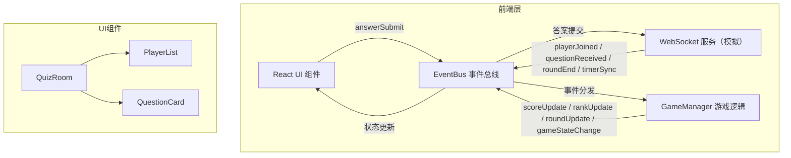

## 1. 架构设计



### 数据流向

1. **WebSocket → EventBus → GameManager**：模拟服务器推送玩家加入、题目分发、计时同步、回合结束等事件
2. **GameManager → EventBus → UI**：游戏逻辑处理后发出积分更新、排名更新、回合状态变更等事件驱动UI渲染
3. **UI → EventBus → WebSocket**：玩家操作（如答案提交）通过EventBus传递给WebSocket服务

## 2. 技术说明

- 前端框架：React@18 + TypeScript
- 构建工具：Vite
- 状态管理：Zustand（管理游戏全局状态）
- 样式方案：Tailwind CSS + CSS Modules（动画和主题）
- 事件通信：自定义EventBus（发布订阅模式）
- WebSocket：前端模拟（websocketService.ts）
- 初始化工具：vite-init
- 后端：无（纯前端项目，WebSocket为模拟服务）
- 数据库：无（内存状态管理）

## 3. 路由定义

| 路由 | 用途 |
|------|------|
| / | 游戏主页面（等待房间 → 答题 → 总结，通过状态切换无需多路由） |

## 4. 文件结构与调用关系

```
├── package.json                    # 依赖：react@18, react-dom@18, typescript, uuid
├── vite.config.js                  # Vite构建配置
├── tsconfig.json                   # TypeScript严格模式，target es2020
├── index.html                      # 入口页面
└── src/
    ├── main.tsx                    # 入口，初始化React应用
    ├── eventBus.ts                 # 全局事件总线（发布订阅模式）
    ├── buzzer/
    │   └── websocketService.ts     # 模拟WebSocket服务
    ├── game/
    │   └── gameManager.ts          # 游戏逻辑管理
    └── components/
        ├── QuizRoom.tsx            # 主游戏房间组件
        ├── PlayerList.tsx          # 玩家列表与积分排名
        └── QuestionCard.tsx        # 题目卡片组件
```

### 模块间调用关系

| 源模块 | 目标模块 | 调用方式 | 说明 |
|--------|----------|----------|------|
| websocketService.ts | eventBus.ts | emit事件 | 推送playerJoined、questionReceived、timerSync、roundEnd事件 |
| gameManager.ts | eventBus.ts | on监听 + emit事件 | 监听WebSocket事件，处理后发出scoreUpdate、rankUpdate、roundUpdate事件 |
| QuizRoom.tsx | eventBus.ts | on监听 | 订阅gameStateChange事件切换界面状态 |
| PlayerList.tsx | eventBus.ts | on监听 | 订阅rankUpdate事件实时渲染排名 |
| QuestionCard.tsx | eventBus.ts | emit事件 | 玩家点击选项后发出answerSubmit事件 |
| main.tsx | eventBus.ts / gameManager.ts / websocketService.ts | 初始化 | 启动EventBus、注册GameManager监听器、启动WebSocket模拟服务 |

## 5. 事件总线协议

### WebSocket发出的事件

| 事件名 | 数据格式 | 触发时机 |
|--------|----------|----------|
| playerJoined | `{ playerId, nickname, avatar }` | 玩家加入房间 |
| questionReceived | `{ questionId, text, options[], correctIndex, roundIndex }` | 新回合题目分发 |
| timerSync | `{ remaining, total }` | 倒计时同步（每秒） |
| roundEnd | `{ roundIndex, correctIndex, playerAnswers[] }` | 回合结束 |

### GameManager发出的事件

| 事件名 | 数据格式 | 触发时机 |
|--------|----------|----------|
| scoreUpdate | `{ playerId, score, delta }` | 积分更新 |
| rankUpdate | `{ rankings[] }` | 排名变更 |
| roundUpdate | `{ roundIndex, totalRounds, question }` | 回合状态更新 |
| gameStateChange | `'waiting' \| 'playing' \| 'result'` | 游戏阶段切换 |

### UI发出的事件

| 事件名 | 数据格式 | 触发时机 |
|--------|----------|----------|
| answerSubmit | `{ playerId, questionId, selectedIndex }` | 玩家提交答案 |
| joinRoom | `{ nickname }` | 玩家加入房间 |
| startGame | `{}` | 房主开始游戏 |
| resetGame | `{}` | 再来一局 |

## 6. 数据模型

### 内存数据结构

```typescript
interface Player {
  id: string
  nickname: string
  avatarColor: string
  score: number
  correctCount: number
  totalTime: number
  isHost: boolean
}

interface Question {
  id: string
  text: string
  options: string[]
  correctIndex: number
}

interface GameState {
  phase: 'waiting' | 'playing' | 'roundEnd' | 'result'
  players: Player[]
  currentQuestion: Question | null
  currentRound: number
  totalRounds: number
  timeRemaining: number
  answeredPlayers: Set<string>
  rankings: Player[]
}
```

### 题库数据

内置10道知识竞赛题目，涵盖科学、历史、地理、文化等领域，每题4个选项，标明正确答案索引。
