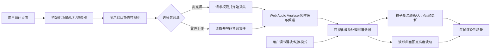

## 1. 产品概述

SoundVortex是一款沉浸式3D音乐可视化Web应用，通过Web Audio API采集实时频谱数据，在Three.js构建的三维空间中生成动态粒子漩涡与波形曲面，将音乐节奏转化为视觉艺术。

- 面向音乐爱好者、视觉创作者和追求沉浸式体验的用户
- 核心价值：将抽象的音频信号转化为可感知、可交互的三维视觉艺术

## 2. 核心特性

### 2.1 用户角色

| 角色 | 注册方式 | 核心权限 |
|------|----------|----------|
| 普通用户 | 无需注册，直接访问 | 选择音频源、调节可视化参数、切换可视化模式 |

### 2.2 功能模块

1. **主场景**：3D粒子漩涡、波形曲面、自动旋转相机
2. **音频输入模块**：麦克风采集、本地音频文件上传、波形预览
3. **可视化控制模块**：灵敏度调节、旋转速度、粒子扩散度、模式切换

### 2.3 页面详情

| 页面名称 | 模块名称 | 功能描述 |
|----------|----------|----------|
| 主场景 | 3D渲染区 | 全屏沉浸式Three.js场景，黑色背景，渲染粒子漩涡和波形曲面 |
| 主场景 | 顶部音频源选择 | 麦克风/文件切换按钮，波形预览Canvas |
| 主场景 | 左上角音频源标签 | 悬浮显示当前音频源名称 |
| 主场景 | 右下角控制面板 | 三个调节滑块 + 三种模式切换按钮，支持自动隐藏/显示 |

## 3. 核心流程

用户打开页面 → 自动初始化3D场景和默认可视化 → 用户选择音频源（麦克风请求权限/上传文件）→ 音频开始播放 → 频谱数据实时更新 → 3D粒子和波形随音乐动态变化 → 用户通过控制面板调节参数或切换模式

## 4. 用户界面设计

### 4.1 设计风格

- **主色调**：纯黑背景 `#000000`，霓虹色系——低频红 `#FF3366`、中频绿 `#33FF66`、高频蓝 `#3366FF`、高亮强调色 `#00FF88`
- **按钮风格**：圆角8px，半透明深色背景，选中状态使用强调色填充
- **字体**：无衬线 sans-serif，正文12-14px，颜色 `#aaa` / 白色
- **布局风格**：全屏沉浸式场景，UI控件悬浮式布局，最小化视觉干扰
- **视觉动效**：控件fadeIn/fadeOut过渡（0.3秒），粒子/波形实时动态变化

### 4.2 页面设计概览

| 页面名称 | 模块名称 | UI元素 |
|----------|----------|--------|
| 主场景 | 3D渲染区 | 全屏黑色，粒子漩涡（5000粒子螺旋分布），下方波形网格平面（20×20），渐变材质 |
| 主场景 | 顶部音频控制 | 麦克风按钮/文件按钮，波形预览Canvas（曲线#00FF88，透明背景） |
| 主场景 | 左上标签 | 14px `#aaa` 半透明0.6，显示当前音频源名 |
| 主场景 | 控制面板 | 背景`rgba(20,20,30,0.8)`，圆角12px，16px内边距；滑块轨道4px圆角2px`#333`，滑块16px圆形`#00FF88`；80×36px模式按钮，选中反色 |

### 4.3 响应式适配

- 桌面端（≥768px）：控制面板悬浮右下角，水平紧凑布局
- 移动端（<768px）：控制面板改为半屏底部滑出式，所有控件垂直排列，滑块宽度80%；粒子数自动降为2000以保证性能

### 4.4 3D场景指导

- **环境**：纯黑色背景，无雾效或HDRI，突出粒子发光效果
- **光照**：基础环境光 + 轻微方向光，主要依靠粒子自发光和材质颜色
- **相机**：PerspectiveCamera，初始距离漩涡中心约12单位，带轻微自动环绕旋转
- **构图**：粒子漩涡居上（半径4，高度6），波形曲面居下，相机略带俯角
- **交互**：鼠标移出控制面板1秒后自动fadeOut；灵敏度/速度/扩散度实时生效
- **后期**：无复杂后期，使用基础渲染保证60fps流畅度
- **性能预算**：60fps帧率，桌面5000粒子/移动2000粒子，频谱更新≥30Hz
