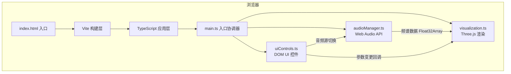

## 1. 架构设计



## 2. 技术描述

- **前端框架**：原生 TypeScript（无React/Vue），按需模块化
- **构建工具**：Vite 5.x（快速冷启动 + HMR）
- **3D引擎**：Three.js `^0.160.0`（精确版本锁定）
- **音频处理**：Web Audio API（`AudioContext` + `AnalyserNode` + `getByteFrequencyData`）
- **DOM渲染**：原生HTML/CSS，无UI框架
- **后端**：无，纯前端应用
- **数据库**：无，所有状态在内存中

## 3. 路由定义

| 路由 | 用途 |
|------|------|
| / | 单页应用主入口，无多路由 |

## 4. 文件结构与职责

| 文件路径 | 职责边界 | 关键导出 |
|----------|----------|----------|
| `package.json` | 依赖声明与脚本（`npm run dev`） | three@0.160, vite, typescript |
| `vite.config.js` | Vite构建配置（服务器端口、构建目标） | — |
| `tsconfig.json` | TypeScript严格模式，target es2020 | — |
| `index.html` | 全屏入口页面，引入样式与脚本 | — |
| `src/main.ts` | 初始化Scene/Camera/Renderer，绑定AudioManager/Visualization/UIControls，主循环 | `App`类 |
| `src/audioManager.ts` | 封装Web Audio API：麦克风权限请求、文件解码、Analyser节点、频谱数据获取 | `AudioManager`类，提供`getFrequencyData()`、`getWaveformData()` |
| `src/visualization.ts` | Three.js场景构建：粒子系统（螺旋5000/2000粒子）、波形曲面（20×20平面）、频谱到视觉映射、每帧更新 | `Visualization`类，`update(freqData, params)`、`setMode()` |
| `src/uiControls.ts` | DOM UI生成：顶部音频按钮+波形Canvas、左上标签、右下控制面板（3滑块+3模式按钮）、fadeIn/Out动画、响应式适配 | `UIControls`类，提供参数变更与音频源切换的回调接口 |

## 5. 核心数据结构与接口

### 5.1 AudioManager

```typescript
interface AudioManager {
  constructor();
  init(): Promise<void>;
  startMicrophone(): Promise<void>;
  startFile(file: File): Promise<void>;
  stop(): void;
  getFrequencyData(): Uint8Array;   // 长度通常为 analyser.frequencyBinCount
  getWaveformData(): Uint8Array;    // 时域波形，用于Canvas预览
  getCurrentSourceName(): string;
  isPlaying: boolean;
}
```

### 5.2 Visualization

```typescript
interface VisualParams {
  sensitivity: number;   // 0.5 - 2.0
  rotationSpeed: number; // 0 - 2
  spread: number;        // 0 - 1
  mode: 'particles' | 'waveform' | 'both';
  isMobile: boolean;
}

interface Visualization {
  constructor(scene: THREE.Scene, camera: THREE.Camera);
  update(freqData: Uint8Array, params: VisualParams, deltaTime: number): void;
  resize(width: number, height: number): void;
}
```

### 5.3 UIControls

```typescript
type AudioSourceType = 'microphone' | 'file' | 'none';

interface UIControlsCallbacks {
  onAudioSourceChange: (type: AudioSourceType, file?: File) => void;
  onParamsChange: (params: Partial<VisualParams>) => void;
}

interface UIControls {
  constructor(callbacks: UIControlsCallbacks);
  setAudioSourceName(name: string): void;
  drawWaveformPreview(data: Uint8Array): void;
  getCurrentParams(): VisualParams;
}
```

## 6. 关键实现要点

1. **粒子系统**：使用`THREE.Points` + `BufferGeometry`，position/color/size属性全部放在BufferAttribute中，每帧直接修改`attributes.array`并标记`needsUpdate = true`，避免GC压力
2. **螺旋分布算法**：`theta = i * k * PI * 2 / N`，`r = baseR + sin(theta * m) * spread`，`y = (i/N - 0.5) * height`，频率-颜色映射为三段RGB混合
3. **波形曲面**：`PlaneGeometry(6, 6, 20, 20)`，每帧将`position.y`按`freqData[binIdx]`更新，使用`ShaderMaterial`实现中心→边缘渐变+0.6透明度
4. **性能优化**：单次draw call更新粒子；频谱数据复用TypedArray；移动端粒子数降至2000；避免每帧创建新对象
5. **响应式**：监听`window.resize`更新renderer尺寸；CSS媒体查询`<768px`切换控制面板样式
6. **自动隐藏**：鼠标进入控制面板区域重置1秒计时器，移出后启动计时，到期触发0.3s fadeOut
