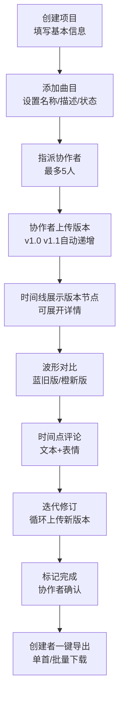

## 1. 产品概述

SoundFlow Studio 是一款面向独立音乐人和小型录音棚的在线音频项目协作管理平台，旨在解决音频文件版本混乱、修改意见回溯困难、多人协作进度同步不及时等行业痛点。

- 核心用户：独立音乐人、小型录音棚团队、音乐制作人、混音工程师
- 核心价值：通过结构化的版本管理、可视化时间线、实时协作批注，让音频项目协作更高效、更可控

## 2. 核心功能

### 2.1 用户角色
| 角色 | 核心权限 |
|------|----------|
| 项目创建者 | 创建/归档项目、指派协作者、导出定稿、管理所有曲目 |
| 协作者 | 查看已分配曲目、上传版本、添加评论、标记任务完成 |

### 2.2 功能模块
1. **项目列表页**：项目卡片网格、进度可视化、新建项目表单
2. **项目详情页**：曲目管理、版本时间线、波形对比、评论批注
3. **导出对话框**：定稿曲目选择、文件预览、批量下载队列

### 2.3 页面详情
| 页面名称 | 模块名称 | 功能描述 |
|-----------|-------------|---------------------|
| 项目列表页 | 项目卡片网格 | 平铺展示所有项目卡片（300px宽，渐变背景，悬停动效），显示进度条和协作者头像 |
| 项目列表页 | 新建项目表单 | 项目名称（≤40字）、客户名称、风格标签（多选）、BPM范围（60-200） |
| 项目详情页 | 曲目管理 | 创建曲目（名称/描述/状态四选）、指派协作者、标记完成按钮 |
| 项目详情页 | 版本时间线 | 纵向时间线（#4B5563垂直线+#F59E0B圆点节点），版本号自动递增v1.0/v1.1 |
| 项目详情页 | 波形对比 | 并排双波形（蓝#3B82F6旧版/橙#F97316新版），支持版本间差异比较 |
| 项目详情页 | 评论批注 | 对话气泡（#1F2937背景+#F59E0B左侧条），支持5种表情，作者可删除 |
| 项目详情页 | 指派通知 | 顶部状态提示条（#10B981背景，5秒自动消失） |
| 导出对话框 | 曲目勾选列表 | 显示文件名称+大小，支持单选/全选 |
| 导出对话框 | 预览播放器 | 嵌入式音频播放器（#1F2937控制条，#F59E0B进度条） |

## 3. 核心流程

用户创建项目 → 添加曲目与指派协作者 → 协作者上传版本并添加备注 → 团队成员在时间点上批注评论 → 多版本波形对比迭代 → 曲目标记完成 → 创建者批量导出归档

## 4. 用户界面设计

### 4.1 设计风格
- **主色调**：深灰背景 #111827，卡片 #1F2937，导航栏 #0F172A
- **强调色**：琥珀金 #F59E0B（进度条/时间节点/品牌色）、绿色 #10B981（成功/完成）、蓝色 #3B82F6（旧版本）、橙色 #F97316（新版本）、红色 #EF4444（删除/警告）
- **按钮样式**：圆角 8px-16px，悬停状态过渡 0.2s ease，强调按钮使用品牌色填充
- **字体排版**：现代无衬线字体，主文字 #F9FAFB，次要文字 #9CA3AF，层级分明
- **布局风格**：左侧固定导航（260px宽）+ 右侧动态内容区，卡片式布局
- **图标风格**：Emoji 表情符号（👍❤️🔧💡❓），简约矢量感

### 4.2 页面设计概览
| 页面名称 | 模块名称 | UI 元素 |
|-----------|-------------|-------------|
| 项目列表页 | 项目卡片 | 渐变背景#1F2937→#111827、圆角16px、边框#374151、阴影悬停上浮4px、进度条#F59E0B高6px |
| 项目详情页 | 版本时间线 | 左侧垂直线#4B5563、节点圆点#F59E0B直径12px、展开详情含上传者/时间/200字备注 |
| 项目详情页 | 评论气泡 | #1F2937背景圆角12px、左侧4px色条#F59E0B、倒序排列、作者可见红色删除按钮 |
| 全局 | 导航栏 | 桌面端常驻260px宽#0F172A、平板端汉堡折叠40px圆形按钮、移动端全屏覆盖半透明#0F172A |
| 全局 | 加载状态 | 骨架屏灰色渐变#334155闪烁动画 |
| 全局 | 动效 | 视口进入时底部20px渐入（0.4s）、卡片悬停阴影加深上浮（0.3s） |

### 4.3 响应式设计
- 桌面端（≥1024px）：左侧导航栏常驻，内容区网格布局自适应
- 平板端（768-1023px）：导航栏可折叠为汉堡菜单按钮（直径40px，悬停背景#374151）
- 移动端（<768px）：导航栏全屏覆盖（#0F172A透明度0.95），点击外部或菜单项自动关闭，卡片单列排布

### 4.4 性能基准
| 指标 | 要求 |
|------|------|
| 页面首次渲染 | ≤500ms |
| 音频播放 FPS | ≥55 |
| 导出操作阻塞 | ≤1s（超时显示旋转加载动画#F59E0B 32px） |
| 下载并发数 | 最大3个并行 |
