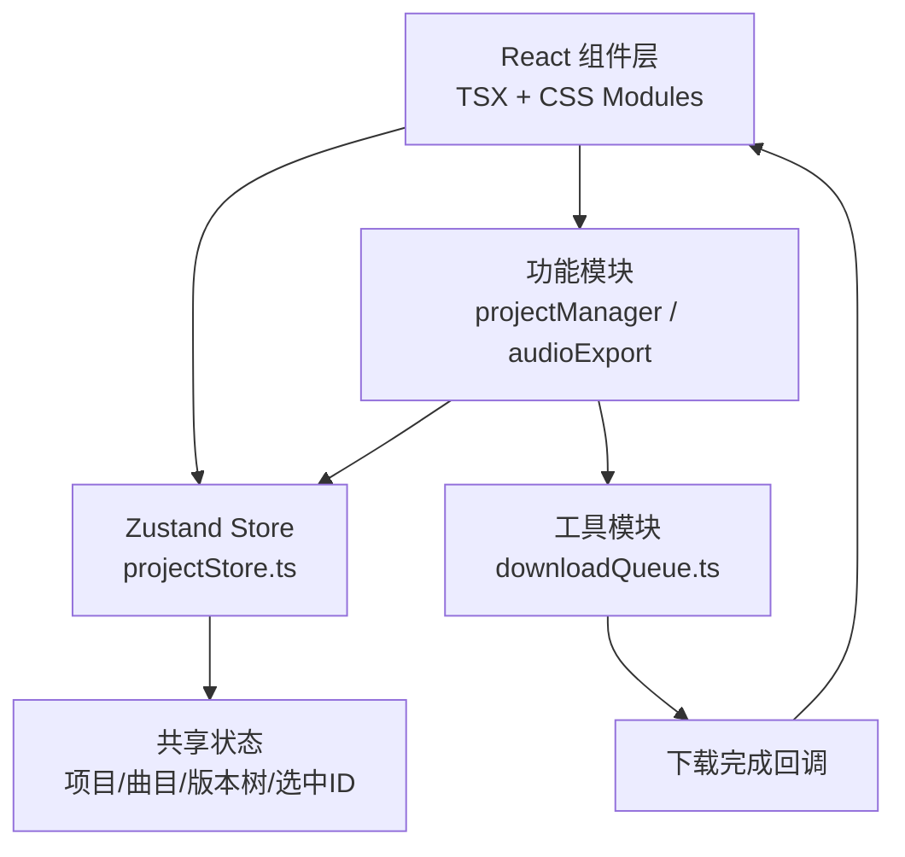
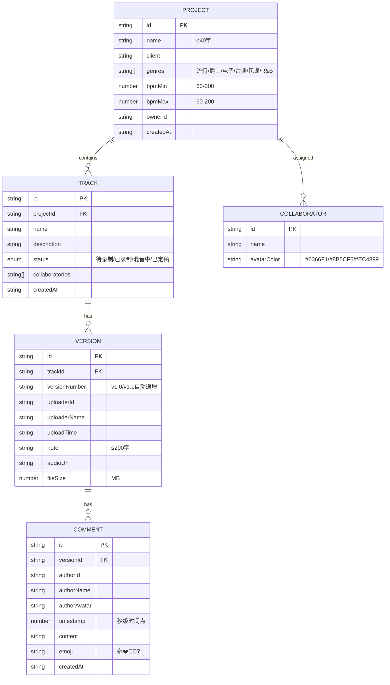

## 1. 架构设计



## 2. 技术描述

- **前端框架**：React@18 + TypeScript（严格模式，target es2020，jsx: react-jsx）
- **构建工具**：Vite 6.x + @vitejs/plugin-react
- **状态管理**：Zustand（轻量级，直接订阅 store 变化）
- **路由方案**：React Router（项目列表 ↔ 项目详情页跳转）
- **工具库**：uuid（生成唯一ID）、date-fns（日期格式化）
- **音频处理**：Web Audio API（波形可视化）+ HTML5 Audio（试听播放）
- **样式方案**：原生 CSS + CSS 变量（深色主题变量集中管理）
- **后端/数据库**：纯前端 Mock 数据（Zustand store 中预置演示数据），localStorage 持久化

## 3. 路由定义
| Route | 页面 | 组件 |
|-------|------|------|
| `/` | 项目列表页 | `ProjectList` |
| `/project/:id` | 项目详情页 | `ProjectDetail` |

## 4. 数据模型

### 4.1 ER 关系图



### 4.2 Zustand Store 状态定义

```typescript
interface ProjectState {
  projects: Project[]
  tracks: Record<string, Track[]>
  versions: Record<string, Version[]>
  comments: Record<string, Comment[]>
  collaborators: Collaborator[]
  selectedProjectId: string | null
  selectedTrackId: string | null
  
  // Actions
  addProject(data: Omit<Project, 'id' | 'createdAt'>): void
  addTrack(projectId: string, data: Omit<Track, 'id' | 'projectId' | 'createdAt'>): void
  addVersion(trackId: string, data: Omit<Version, 'id' | 'trackId'>): void
  addComment(versionId: string, data: Omit<Comment, 'id' | 'versionId' | 'createdAt'>): void
  deleteComment(commentId: string, versionId: string): void
  selectProject(id: string | null): void
  selectTrack(id: string | null): void
  assignCollaborators(trackId: string, collaboratorIds: string[]): void
  markTrackComplete(trackId: string): void
  addCollaborator(name: string): Collaborator
}
```

## 5. 文件目录结构

```
auto78/
├── package.json
├── vite.config.js
├── tsconfig.json
├── index.html
└── src/
    ├── main.tsx                          # 应用入口
    ├── App.tsx                           # 根组件 + 路由
    ├── index.css                         # 全局样式 + CSS变量
    ├── store/
    │   └── projectStore.ts               # Zustand状态管理
    ├── modules/
    │   ├── projectManager/
    │   │   ├── ProjectList.tsx           # 项目列表页
    │   │   ├── ProjectDetail.tsx         # 项目详情页
    │   │   ├── ProjectCard.tsx           # 项目卡片组件
    │   │   ├── TrackItem.tsx             # 曲目卡片组件
    │   │   ├── VersionTimeline.tsx       # 版本时间线组件
    │   │   ├── WaveformCompare.tsx       # 波形对比组件
    │   │   └── CommentBubble.tsx         # 评论气泡组件
    │   ├── audioExport/
    │   │   └── AudioExportDialog.tsx     # 导出对话框
    │   └── layout/
    │       ├── Sidebar.tsx               # 左侧导航栏
    │       ├── MobileOverlay.tsx         # 移动端导航覆盖层
    │       ├── NotificationBar.tsx       # 顶部通知条
    │       └── SkeletonLoader.tsx        # 骨架屏
    └── utils/
        └── downloadQueue.ts              # 下载队列管理器
```

## 6. 关键模块说明

### 6.1 downloadQueue.ts 下载队列
```typescript
interface DownloadTask {
  id: string
  url: string
  fileName: string
  onProgress?: (percent: number) => void
  onComplete?: (fileSizeMB: number, audioUrl: string) => void
  onError?: (err: Error) => void
}

class DownloadQueue {
  private maxConcurrent = 3
  private queue: DownloadTask[] = []
  private running = 0
  
  enqueue(task: DownloadTask): void
  private processNext(): Promise<void>
  cancel(taskId: string): boolean
}
```

### 6.2 性能优化策略
- **首屏渲染**：懒加载项目详情页组件（React.lazy + Suspense）
- **波形渲染**：使用 OffscreenCanvas 离屏绘制波形，requestAnimationFrame 节流
- **状态订阅**：Zustand shallow selector 避免不必要重渲染
- **骨架屏**：数据加载前显示 shimmer 动画占位，减少白屏感知
- **导出非阻塞**：下载任务放入 Web Worker 或 setTimeout(0) 分帧，UI 不冻结
