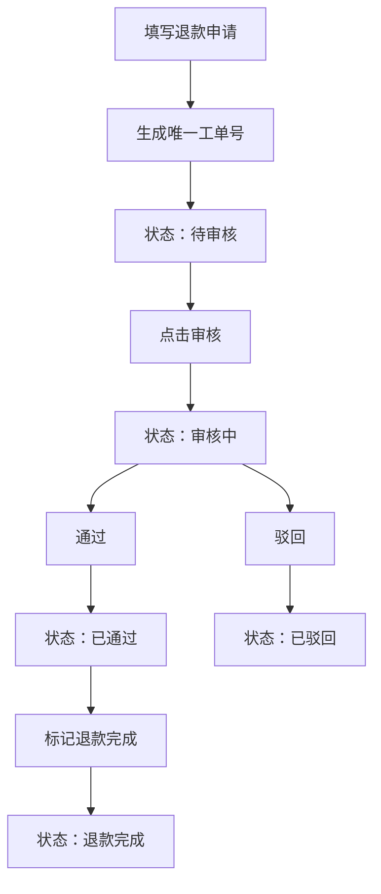

## 1. 产品概述
RefundFlow是一款面向小型电商团队的售后退款工单管理工具，解决跨系统手动退款操作效率低、易出错的问题。通过标准化的工单流程和状态机管理，实现退款申请的快速创建、审批追踪和状态可视化。

- 目标用户：电商售后客服、财务审核人员
- 核心价值：减少人工操作失误，提高退款处理效率，实现全流程可追溯

## 2. 核心功能

### 2.1 功能模块
1. **工单创建模块**：表单录入退款信息，自动生成唯一工单号
2. **工单看板模块**：卡片列表展示，状态筛选，审批操作，状态流转

### 2.2 页面详情
| 页面名称 | 模块名称 | 功能描述 |
|-----------|-------------|---------------------|
| 主页面 | 工单创建表单 | 录入订单号、商品名称、退款金额、退款原因，提交生成工单 |
| 主页面 | 工单看板 | 展示所有工单卡片，支持状态筛选，执行审批操作 |

## 3. 核心流程

用户填写退款申请表单 → 系统自动生成唯一工单号（RF+时间戳后8位+随机4位）→ 工单状态初始化为"待审核" → 工单出现在看板中 → 审核人员点击"审核"将状态改为"审核中" → 审核通过/驳回 → 已通过工单可标记为"退款完成"

## 4. 用户界面设计

### 4.1 设计风格
- 主色调：靛蓝色 #4F46E5
- 背景色：浅灰色 #F3F4F6
- 状态色：待审核#F59E0B、审核中#3B82F6、已通过#10B981、已驳回#EF4444、退款完成#8B5CF6
- 卡片风格：白色背景、圆角12px、阴影0 2px 8px rgba(0,0,0,0.06)
- 按钮风格：圆角8px，hover状态颜色过渡

### 4.2 页面设计概述
| 页面名称 | 模块名称 | UI Elements |
|-----------|-------------|-------------|
| 主页面 | 工单创建表单 | 左栏固定420px，输入框聚焦边框#4F46E5，提交按钮背景#4F46E5 |
| 主页面 | 工单看板 | 右栏flex-1，卡片flex wrap布局，悬停上浮4px+阴影加深，状态标签动画切换 |

### 4.3 响应式
- 桌面端：左右两栏布局，左栏420px，右栏flex-1
- 移动端（<768px）：上下排列，两栏均为全宽

### 4.4 交互细节
- 卡片悬停：向上平移4px，阴影加深，显示退款原因预览
- 状态变更：审核中时卡片边缘蓝色脉冲动画（#3B82F6，0.6s）
- 状态标签切换：0.3s ease淡入动画
- 按钮和输入框：0.2s-0.25s颜色过渡

## 5. 性能约束
- 状态切换和列表更新：≤16ms渲染完成
- 表单提交到卡片显示：≤100ms响应时间
