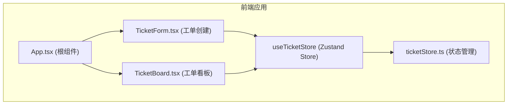

## 1. 架构设计



## 2. 技术描述
- 前端框架：React@18 + TypeScript
- 构建工具：Vite
- 状态管理：Zustand
- 唯一ID生成：uuid
- 样式方案：Tailwind CSS 3（内联样式结合）

## 3. 项目文件结构

```
d:\P\tasks\auto79\
├── package.json
├── vite.config.js
├── tsconfig.json
├── index.html
└── src/
    ├── main.tsx
    ├── App.tsx
    ├── store/
    │   └── ticketStore.ts
    └── components/
        ├── TicketForm.tsx
        └── TicketBoard.tsx
```

### 文件调用关系和数据流向：
1. **index.html** → 加载 **src/main.tsx**
2. **src/main.tsx** → 渲染 **App.tsx**，应用入口
3. **src/App.tsx** → 布局组件，包含：
   - 左栏：**TicketForm.tsx**（工单创建表单）
   - 右栏：**TicketBoard.tsx**（工单看板）
4. **src/store/ticketStore.ts** → Zustand Store，被两个组件共享：
   - **TicketForm.tsx** → 调用 `createTicket` action 写入数据
   - **TicketBoard.tsx** → 读取 `filteredTickets`，调用 `updateStatus/approve/reject` actions

## 4. 数据模型

### Ticket 接口定义
```typescript
interface Ticket {
  id: string;           // 唯一工单编号：RF + 时间戳后8位 + 随机4位
  orderId: string;      // 订单号（16位数字）
  itemName: string;     // 商品名称（最多60字）
  amount: number;       // 退款金额（小数点后两位）
  reason: string;       // 退款原因（最多500字）
  status: TicketStatus; // 工单状态
  createdAt: Date;      // 创建时间
}

type TicketStatus = 'pending' | 'reviewing' | 'approved' | 'rejected' | 'completed';
```

### Store State & Actions
```typescript
interface TicketStore {
  tickets: Ticket[];
  statusFilter: TicketStatus | 'all';
  
  // Actions
  createTicket: (data: Omit<Ticket, 'id' | 'status' | 'createdAt'>) => void;
  updateStatus: (id: string, status: TicketStatus) => void;
  updateFilter: (filter: TicketStatus | 'all') => void;
  approve: (id: string) => void;
  reject: (id: string) => void;
  
  // Derived
  filteredTickets: Ticket[];
}
```

### 状态流转规则
```
待审核(pending) → 审核中(reviewing) → 已通过(approved) / 已驳回(rejected) → 退款完成(completed)
```

## 5. 性能优化策略
- 使用 Zustand 选择性订阅，避免不必要的重渲染
- 列表渲染使用 React.memo 优化卡片组件
- 状态更新使用不可变数据模式
- 所有动画使用 CSS transition，避免 JS 阻塞
