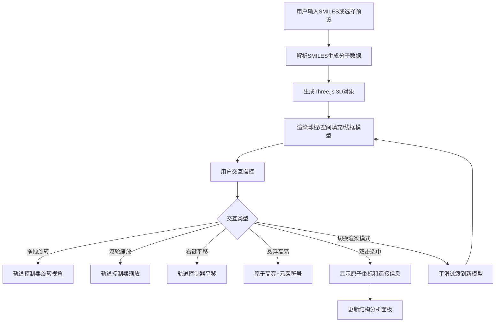

## 1. 产品概述

三维分子结构查看器（MolViewer3D）是一个面向化学学习者和科研人员的浏览器端应用，解决复杂分子空间构型难以直观理解的问题。用户通过输入SMILES字符串或选择预设分子，即可在3D场景中实时查看、操控和分析分子结构。

## 2. 核心功能

### 2.1 用户角色
| 角色 | 注册方式 | 核心权限 |
|------|----------|----------|
| 匿名用户 | 无需注册 | 全部功能 |

### 2.2 功能模块
1. **分子载入与显示页**：SMILES输入框、预设分子选择、3D渲染视图、结构分析面板

### 2.3 页面详情
| 页面名称 | 模块名称 | 功能描述 |
|----------|----------|----------|
| 分子查看器 | SMILES输入 | 文本框输入SMILES字符串，回车或点击按钮载入 |
| 分子查看器 | 预设分子选择 | 下拉或按钮组选择苯环、咖啡因、葡萄糖等预设分子 |
| 分子查看器 | 3D渲染视图 | 球体表示原子、圆柱体表示键、CPK标准着色、悬浮高亮、双击选中 |
| 分子查看器 | 轨道控制 | 鼠标拖拽旋转、滚轮缩放、右键平移 |
| 分子查看器 | 渲染模式切换 | 球棍模型、空间填充模型（范德华半径×1.2）、线框模型三种模式，0.5秒easeInOut过渡 |
| 分子查看器 | 结构分析面板 | 右侧可折叠侧边栏，显示选中原子信息、分子式、分子量、旋转/缩放速度滑块 |
| 分子查看器 | HUD显示 | 右上角半透明帧率和分子名称 |
| 分子查看器 | 浮动按钮组 | 左下角操作按钮（载入、切换模式、重置视角等） |

## 3. 核心流程

用户打开应用 → 输入SMILES或选择预设分子 → 解析SMILES生成原子和键数据 → 3D场景渲染分子模型 → 用户交互（旋转/缩放/平移/选中/高亮）→ 查看结构分析信息 → 切换渲染模式

## 4. 用户界面设计

### 4.1 设计风格
- **主色调**：深色太空科技风，背景中灰渐变到深蓝（#1a1a2e → #0f0f23）
- **强调色**：霓虹蓝 #00d4ff，悬停亮度提升20%并伴有发光效果（box-shadow: 0 0 8px #00d4ff）
- **按钮样式**：圆角12px，背景#2a2a3e，阴影0 4px 15px rgba(0,0,0,0.5)
- **侧边栏**：暗色毛玻璃效果，背景rgba(20,20,30,0.85)，圆角16px，内边距20px
- **字体**：系统默认字体
- **布局**：全屏3D视图+右侧可折叠面板+左下角浮动按钮+右上角HUD

### 4.2 页面设计概述
| 页面名称 | 模块名称 | UI元素 |
|----------|----------|--------|
| 分子查看器 | 3D视图 | 全屏深色背景，Three.js Canvas，中灰到深蓝渐变 |
| 分子查看器 | SMILES输入 | 顶部居中输入框，霓虹蓝边框聚焦 |
| 分子查看器 | 预设选择 | 输入框下方按钮组，霓虹蓝高亮选中 |
| 分子查看器 | 侧边栏 | 右侧毛玻璃面板，可折叠，可拖拽分离浮窗 |
| 分子查看器 | HUD | 右上角半透明文字，帧率+分子名称 |
| 分子查看器 | 浮动按钮 | 左下角圆形/圆角矩形按钮组 |

### 4.3 响应式设计
- 桌面优先（>768px）：完整布局，侧边栏常驻右侧
- 移动端（≤768px）：侧边栏自动折叠为顶部下拉菜单，按钮组紧凑排列

### 4.4 3D场景指引
- **环境**：深色太空背景，无HDRI，简洁光照
- **光照**：环境光 + 方向光，确保原子颜色清晰可辨
- **相机**：透视相机，轨道控制器，默认45度俯视角
- **原子表示**：球体，CPK标准着色（碳#909090，氢白色，氧#FF0D0D，氮#3050F8）
- **键表示**：圆柱体连接两原子
- **交互**：悬浮高亮+元素符号、双击选中显示坐标
- **动画**：渲染模式切换0.5秒easeInOut平滑过渡
- **性能**：50原子以内稳定55fps+
