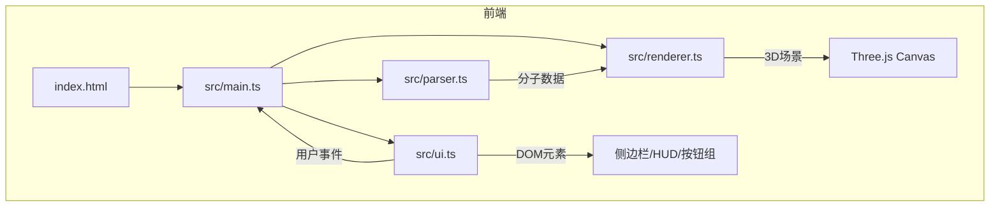

## 1. 架构设计



## 2. 技术描述
- **前端**：TypeScript + Three.js@0.160 + Vite
- **初始化工具**：Vite（vanilla-ts模板）
- **后端**：无
- **数据库**：无

## 3. 路由定义
| 路由 | 用途 |
|------|------|
| / | 单页应用，分子查看器主界面 |

## 4. 模块职责与数据流

### 4.1 src/main.ts（入口协调模块）
- 初始化Three.js场景、WebGL渲染器、轨道控制器
- 协调parser与renderer模块
- 暴露接口给ui模块调用
- 管理渲染循环和帧率统计

### 4.2 src/parser.ts（分子解析模块）
- 输入：SMILES字符串
- 输出：分子数据对象 `{ atoms: Atom[], bonds: Bond[] }`
- Atom：`{ element: string, position: Vector3, color: string }`
- Bond：`{ from: number, to: number, type: number }`
- 预设分子数据内置
- CPK颜色映射表

### 4.3 src/renderer.ts（3D渲染模块）
- 接收分子数据生成Three.js对象（球体原子、圆柱体键）
- 公共方法：`loadMolecule(data)`、`setRenderMode(mode)`、`highlightAtom(index)`
- 渲染模式：球棍/空间填充/线框
- 模式切换动画（0.5秒easeInOut）
- 高亮和选中效果

### 4.4 src/ui.ts（UI控制模块）
- 构建侧边栏、HUD、按钮组DOM
- 绑定事件监听器
- 通过回调与main.ts通信
- 响应式适配

## 5. 数据模型

### 5.1 Atom
```typescript
interface Atom {
  element: string;
  position: { x: number; y: number; z: number };
  color: string;
  vdwRadius: number;
}
```

### 5.2 Bond
```typescript
interface Bond {
  from: number;
  to: number;
  type: number;
}
```

### 5.3 MoleculeData
```typescript
interface MoleculeData {
  atoms: Atom[];
  bonds: Bond[];
  formula: string;
  molecularWeight: number;
  name: string;
}
```

## 6. 文件结构
```
├── package.json          # 依赖：three@0.160，启动脚本：npm run dev
├── vite.config.js        # 构建配置
├── tsconfig.json         # 严格模式，target es2020，moduleResolution bundler
├── index.html            # 入口，全屏深色背景#0f0f23
└── src/
    ├── main.ts           # 入口，初始化场景、渲染器、轨道控制器和UI
    ├── parser.ts         # 分子解析模块
    ├── renderer.ts       # 3D渲染模块
    └── ui.ts             # UI控制模块
```
