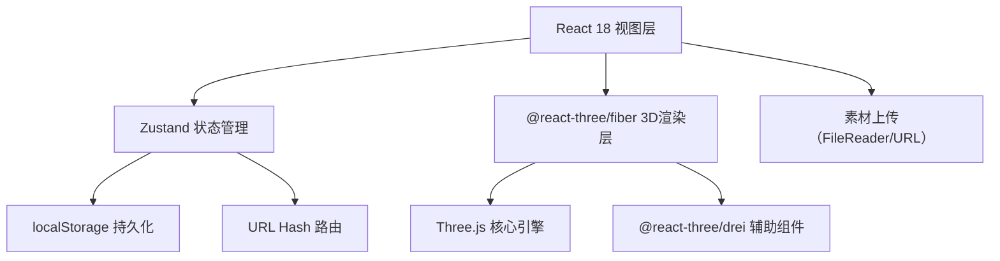
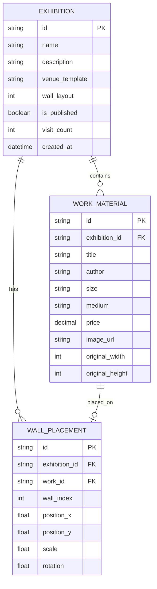

## 1. 架构设计
纯前端单页应用，无后端依赖，展览数据存储于浏览器localStorage，分享链接使用URL哈希携带展览ID。



## 2. 技术描述
- **前端框架**：React@18 + TypeScript@5
- **构建工具**：Vite@5（含React插件、Path Alias @/）
- **3D渲染**：Three@0.160 + @react-three/fiber@8 + @react-three/drei@9
- **状态管理**：Zustand@4
- **唯一ID生成**：uuid@9
- **后端服务**：无（纯前端，localStorage存储）
- **数据持久化**：localStorage（展览配置）+ URL Hash（分享标识）

## 3. 路由定义
| 路由 | 用途 |
|------|------|
| / | 策展人编辑首页（新建/选择展览） |
| /#exhibition/:id | 展览编辑页（根据ID加载） |
| /#view/:id | 访客公开页（只读漫游模式） |

## 4. 数据模型
### 4.1 数据模型定义


### 4.2 TypeScript 类型定义
```typescript
// 场馆模板类型
type VenueTemplate = 'white_gallery' | 'industrial_warehouse' | 'outdoor_park';

// 作品素材
interface WorkMaterial {
  id: string;
  exhibitionId: string;
  title: string;
  author: string;
  size: string;
  medium: string;
  price: number;
  imageUrl: string;
  originalWidth: number;
  originalHeight: number;
}

// 墙面放置状态
interface WallPlacement {
  id: string;
  exhibitionId: string;
  workId: string;
  wallIndex: number;
  positionX: number;
  positionY: number;
  scale: number;
  rotation: number;
}

// 展览对象
interface Exhibition {
  id: string;
  name: string;
  description: string;
  venueTemplate: VenueTemplate;
  wallLayout: number; // 0-8
  isPublished: boolean;
  visitCount: number;
  createdAt: number;
}

// Store 状态
interface ExhibitionState {
  exhibitions: Exhibition[];
  currentExhibitionId: string | null;
  workMaterials: WorkMaterial[];
  wallPlacements: WallPlacement[];
  selectedWorkId: string | null;
  isTourMode: boolean;
  tourSpeed: 0.5 | 1 | 1.5;
  tourPaused: boolean;
}
```

## 5. 文件组织
```
src/
├── main.tsx                    # React入口，全局样式
├── App.tsx                     # 根组件，路由分发
├── store/
│   └── useExhibitionStore.ts   # Zustand全局状态
├── components/
│   ├── ExhibitionSpace.tsx     # 3D场景渲染组件
│   ├── MaterialPanel.tsx       # 左侧素材面板
│   ├── TourController.tsx      # 导览控制器
│   ├── Toolbar.tsx             # 顶部工具栏
│   ├── ExhibitionForm.tsx      # 新建展览表单
│   ├── WorkCard.tsx            # 可拖拽作品卡片
│   ├── WorkInfoPopup.tsx       # 导览作品信息弹窗
│   ├── ResizeRotatePanel.tsx   # 尺寸旋转调整面板
│   └── VisitorPage.tsx         # 访客公开页
├── types/
│   └── index.ts                # 类型定义
├── utils/
│   ├── venueConfigs.ts         # 场馆模板配置（9种墙面布局）
│   ├── tourPath.ts             # 导览路径计算
│   ├── snapAlgorithm.ts        # 拖拽吸附算法
│   └── storage.ts              # localStorage封装
└── styles/
    └── globals.css             # 全局样式
```
