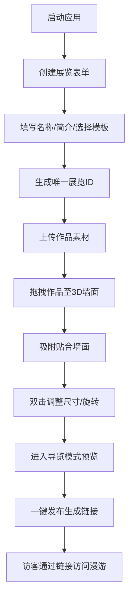

## 1. 产品概述
虚拟艺术展览平台——帮助独立策展人或小型艺术团体在线创建、分享和发布虚拟艺术展览，解决实体展览受场地和地域限制、策展人难以低成本快速呈现策展构思的痛点。

- **核心目的**：提供易用的3D虚拟展览创建工具，让艺术作品以沉浸式方式在线展示
- **目标用户**：独立策展人、小型艺术团体、画廊、艺术院校师生
- **市场价值**：降低策展门槛，突破物理空间限制，扩大艺术作品受众范围

## 2. 核心功能

### 2.1 用户角色
| 角色 | 注册方式 | 核心权限 |
|------|----------|----------|
| 策展人 | 无需注册，本地创建 | 创建展览、布展、导览、发布/下架、复制分享链接 |
| 访客 | 无需注册，链接访问 | 自由漫游3D展厅、查看作品详情、浏览访问计数 |

### 2.2 功能模块
1. **展览创建模块**：新建展览表单、场馆模板选择器、展览ID与分享链接生成
2. **3D场景渲染模块**：Three.js虚拟空间渲染、墙面系统、光照环境
3. **素材管理模块**：作品上传（本地/URL）、可拖拽素材卡片列表
4. **布展交互模块**：拖拽吸附上墙、作品尺寸调整、旋转调节
5. **虚拟导览模块**：相机自动漫游、速度调节、暂停/继续、作品信息弹窗
6. **发布分享模块**：一键发布、复制链接、下架展览、访客页面、访问计数器

### 2.3 页面详情
| 页面名称 | 模块名称 | 功能描述 |
|----------|----------|----------|
| 主编辑页 | 展览创建表单 | 填写展览名称（≤50字）、简介（≤200字）、选择场馆模板（白色画廊/工业仓库/露天公园）及9种墙面布局 |
| 主编辑页 | 左侧素材面板 | 深色面板（#1E293B），展示可拖拽作品卡片（120px宽、8px圆角、阴影），支持本地上传和URL添加 |
| 主编辑页 | 3D场景区域 | 右侧全屏展示虚拟空间，支持拖拽作品吸附上墙，双击墙面作品调整大小（300px-1200px等比缩放）和旋转（15°步长） |
| 主编辑页 | 顶部工具栏 | 发布、下架、复制链接按钮，访问计数器显示 |
| 主编辑页 | 导览控制栏 | 速度调节（0.5x/1x/1.5x）、暂停/继续（空格键）、退出（ESC），每个作品前停留2秒展示信息 |
| 访客公开页 | 3D漫游场景 | 鼠标拖拽旋转视角、滚轮缩放，页面底部访问计数器 |

## 3. 核心流程
策展人启动应用 → 创建新展览（填写信息+选择模板）→ 上传艺术作品素材 → 拖拽作品到3D墙面自动吸附 → 双击调整尺寸与旋转 → 进入导览模式预览 → 一键发布生成公开链接 → 访客通过链接访问漫游

## 4. 用户界面设计
### 4.1 设计风格
- **主色调**：暖灰与墨绿（#334155、#475569、#A3E635），背景深靛蓝（#0F172A）
- **按钮风格**：墨绿色渐变（#4F46E5 → #22C55E），悬停时提升亮度和阴影
- **字体**：现代无衬线字体，标题加粗，正文常规
- **布局**：左右分栏（≥1024px），移动端折叠为顶部导航
- **动效**：拖拽弹性动画（cubic-bezier(0.34,1.56,0.64,1) 0.2s），吸附脉冲光效（opacity 0.8→1→0.8，0.6s）

### 4.2 页面设计概述
| 页面名称 | 模块名称 | UI元素 |
|----------|----------|--------|
| 主编辑页 | 左侧素材面板 | 深色背景（#1E293B）、作品卡片网格（120px宽、圆角8px、投影）、上传按钮、属性编辑区 |
| 主编辑页 | 3D场景区域 | Three.js Canvas全屏、环境光照、墙面网格高亮、吸附脉冲动画 |
| 主编辑页 | 顶部工具栏 | 固定顶部、渐变按钮组、计数器徽章、毛玻璃背景 |
| 主编辑页 | 导览控制栏 | 底部浮层、速度切换按钮组、播放/暂停图标、进度指示 |
| 访客公开页 | 漫游场景 | 全屏3D、操作提示浮层、底部计数器条 |

### 4.3 响应式
- **桌面端（≥1024px）**：左右分栏布局，左侧面板固定宽度320px，右侧自适应
- **平板/移动端（<1024px）**：左侧面板折叠为顶部横向导航栏，3D场景全屏显示
- **触摸优化**：素材卡片长按触发拖拽，双指缩放3D场景

### 4.4 3D场景指导
- **环境氛围**：根据模板切换——白色画廊（明亮柔和白光）、工业仓库（暖黄聚光灯+阴影）、露天公园（HDRI自然光+天空盒）
- **光照设置**：AmbientLight基础光 + DirectionalLight主光 + 点光源补光，阴影开启softShadow
- **相机设置**：PerspectiveCamera（fov 60），导览模式使用CatmullRomCurve3计算平滑路径，OrbitControls用于访客自由漫游
- **构图焦点**：墙面居中区域为主要布展区，作品间距均匀
- **交互动画**：墙面hover高亮边框、吸附时脉冲发光、作品选中描边发光
- **后处理效果**：轻微Bloom辉光、ACES电影色调映射
- **性能预算**：单场景面数≤5万，帧率≥30fps，材质使用压缩纹理
