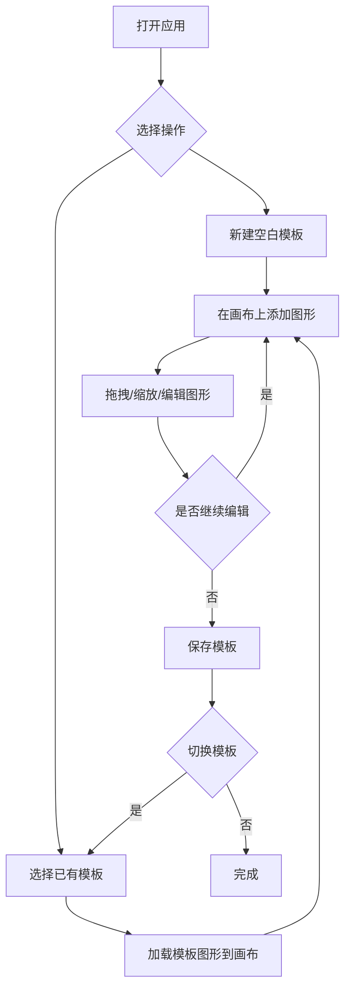

## 1. 产品概述

TemplateCanvas 是一款面向文档协作团队的在线白板模板库应用，旨在解决共享白板缺乏模板复用能力的问题。用户可以创建、编辑、保存和管理白板模板，每个模板包含矩形、圆形、连线等基础图形元素，支持在交互式画布上拖拽、缩放和旋转图形，从而大幅提升流程图等常用图形的创建效率。

- 目标用户：需要频繁绘制流程图、架构图的文档协作团队成员
- 核心价值：通过模板复用消除重复绘制工作，将白板图形创建效率提升 3 倍以上

## 2. 核心功能

### 2.1 用户角色

| 角色 | 注册方式 | 核心权限 |
|------|----------|----------|
| 普通用户 | 无需注册 | 创建、编辑、保存和删除白板模板 |

### 2.2 功能模块

1. **白板画布页面**：图形绘制与编辑画布、画布缩放/平移、图形属性编辑面板、模板保存与载入
2. **模板管理面板**：模板列表展示、模板搜索过滤、模板创建/切换/删除

### 2.3 页面详情

| 页面名称 | 模块名称 | 功能描述 |
|----------|----------|----------|
| 白板画布页面 | 白板渲染区域 | 使用 Canvas 2D API 绘制矩形（圆角 8px）、圆形和贝塞尔曲线连线，支持鼠标拖拽移动图形、滚轮缩放画布（0.5-3x）、空格+拖拽平移画布、双击图形弹出编辑面板、图形选中显示 8 个拖拽手柄 |
| 白板画布页面 | 图形编辑面板 | 双击图形弹出，支持调整填充色（蓝/橙/红三色预设互换）、坐标、宽高（矩形）或半径（圆形），编辑后实时更新画布 |
| 白板画布页面 | 缩放指示器 | 右上角显示当前缩放比例，停止缩放 2 秒后淡出（opacity 1→0，0.5s ease 过渡） |
| 白板画布页面 | 保存模板按钮 | 右下角绿色按钮，将当前画布内容以 JSON 格式保存到 store |
| 模板管理面板 | 模板列表 | 左侧面板展示模板缩略图、名称和编辑/删除按钮，点击切换当前模板 |
| 模板管理面板 | 模板搜索 | 按名称模糊匹配过滤模板列表 |
| 模板管理面板 | 新建模板 | 创建空白模板并切换到编辑状态 |

## 3. 核心流程

用户打开应用后，左侧面板展示已有模板列表，右侧为空白画布。用户可以点击已有模板加载其图形元素到画布，也可以新建空白模板。在画布上，用户通过工具栏添加矩形或圆形，拖拽移动图形位置，双击图形弹出编辑面板调整属性。编辑完成后点击保存按钮将模板保存到 store。切换模板时画布清空并加载新模板的图形数据。

## 4. 用户界面设计

### 4.1 设计风格

- 主色调：深灰色 #1E1E2E（背景）、#2D2D3F（面板）
- 强调色：#3B82F6（蓝色-选中/手柄）、#10B981（绿色-保存按钮）、#F59E0B（橙色-圆形默认色）、#EF4444（红色-预设色）
- 文字颜色：#E0E0E0（主文字）、#FFFFFF（缩放指示器）
- 按钮风格：圆角 8px，保存按钮背景 #10B981 悬停变亮
- 字体：系统默认 sans-serif，缩放指示器 12px
- 布局风格：左侧 280px 管理面板 + 右侧 flex:1 画布区域，1px solid #444444 分割线
- 图形样式：矩形圆角 8px，选中时蓝色虚线框（间距 4px，1px 宽），8 个蓝色拖拽手柄（8px）

### 4.2 页面设计概览

| 页面名称 | 模块名称 | UI 元素 |
|----------|----------|---------|
| 白板画布页面 | 白板渲染区域 | 深灰背景 #1E1E2E，Canvas 全区域，图形拖拽时 opacity 0.8 |
| 白板画布页面 | 图形编辑面板 | 背景 #2D2D3F，圆角 8px，内边距 12px，阴影 0 4px 12px rgba(0,0,0,0.4) |
| 白板画布页面 | 缩放指示器 | 白字 12px，背景 #00000080，内边距 4px 8px，圆角 4px |
| 白板画布页面 | 保存模板按钮 | 右下角，圆角 8px，背景 #10B981，悬停变亮 |
| 模板管理面板 | 模板列表 | 宽 280px，背景 #2D2D3F，内边距 8px，每项含缩略图+名称+操作按钮 |
| 模板管理面板 | 搜索框 | 按名称模糊匹配过滤 |
| 模板管理面板 | 新建按钮 | 创建空白模板 |

### 4.3 响应式适配

- 桌面端（≥768px）：左侧 280px 模板管理面板 + 右侧 flex:1 画布
- 移动端（<768px）：左侧面板折叠为顶部横幅（高度 60px，水平滚动），画布占满剩余高度

### 4.4 性能约束

- 画布重绘帧率不低于 30FPS（50 个图形时）
- 使用 requestAnimationFrame 控制渲染循环
- 仅在图形属性变化时触发重绘（比较 store 中图形元素数组引用）
