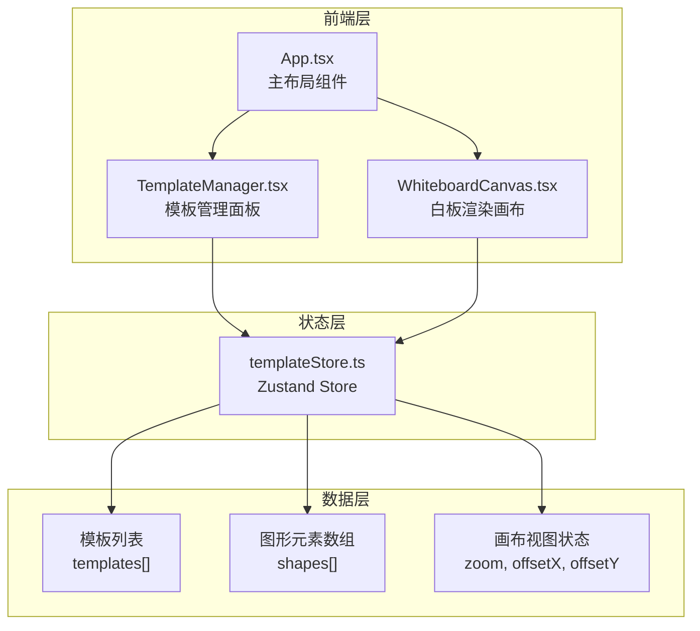
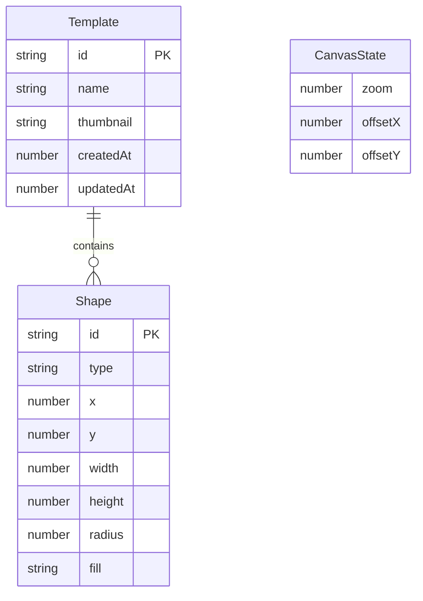

## 1. 架构设计



**数据流向**：
- TemplateManager 通过 store 读取模板列表、触发模板切换和增删操作
- WhiteboardCanvas 通过 store 读取当前模板图形元素和画布视图状态，写入图形变更和视图变更
- 两个模块不直接通信，全部通过 Zustand store 中转

## 2. 技术说明

- 前端框架：React@18 + TypeScript（严格模式，target es2020）
- 构建工具：Vite + @vitejs/plugin-react
- 状态管理：Zustand
- 图形渲染：原生 Canvas 2D API（无第三方图形库）
- 唯一标识：uuid
- 向量运算：vec2
- 初始化工具：vite-init（react-ts 模板）
- 后端：无（纯前端应用，数据存储在内存/store 中）
- 数据库：无

## 3. 路由定义

| 路由 | 用途 |
|------|------|
| / | 应用主页面，包含模板管理面板和白板画布 |

## 4. 数据模型

### 4.1 数据模型定义



### 4.2 类型定义

```typescript
interface Template {
  id: string;
  name: string;
  thumbnail: string;
  shapes: Shape[];
  createdAt: number;
  updatedAt: number;
}

interface Shape {
  id: string;
  type: 'rect' | 'circle';
  x: number;
  y: number;
  width: number;
  height: number;
  radius: number;
  fill: string;
}

interface CanvasState {
  zoom: number;
  offsetX: number;
  offsetY: number;
}
```

## 5. 文件结构与调用关系

```
TemplateCanvas/
├── package.json              # 依赖管理，启动脚本 npm run dev
├── vite.config.js            # Vite 配置，含 React 插件
├── tsconfig.json             # TypeScript 严格模式，target es2020
├── index.html                # 入口页面，深灰色背景 #1E1E2E
├── src/
│   ├── main.tsx              # 应用入口，挂载 App 到 DOM
│   ├── App.tsx               # 主布局：左侧面板(280px) + 右侧画布(flex:1)
│   │                         # ← 调用 TemplateManager, WhiteboardCanvas
│   │                         # ← 读取 store 的 templates, currentTemplateId
│   ├── templateStore.ts      # Zustand store
│   │                         # → 被 App, TemplateManager, WhiteboardCanvas 读写
│   │                         # 存储: templates[], shapes[], zoom, offsetX, offsetY
│   │                         # 方法: addShape, updateShape, deleteShape, setZoom,
│   │                         #        saveTemplate, loadTemplate, deleteTemplate
│   ├── TemplateManager.tsx   # 模板管理面板
│   │                         # ← 读取 store: templates, currentTemplateId
│   │                         # → 写入 store: addTemplate, deleteTemplate, switchTemplate
│   └── WhiteboardCanvas.tsx  # 白板渲染画布
│                              # ← 读取 store: shapes, zoom, offsetX, offsetY
│                              # → 写入 store: addShape, updateShape, deleteShape, setZoom
│                              # Canvas 2D 渲染 + 鼠标/滚轮事件处理
```

**调用关系**：
1. `App.tsx` 组合 `TemplateManager` 和 `WhiteboardCanvas`，不传递 props，两者各自直接读取 store
2. `TemplateManager` 通过 store 的 `switchTemplate()` 方法切换模板，`WhiteboardCanvas` 监听 store 的 shapes 变化自动重绘
3. `WhiteboardCanvas` 的缩略图截图功能通过 `canvas.toDataURL()` 获取，写入 store 的 `template.thumbnail`
4. 所有状态变更通过 Zustand store 的 action 方法触发，保证单一数据源
