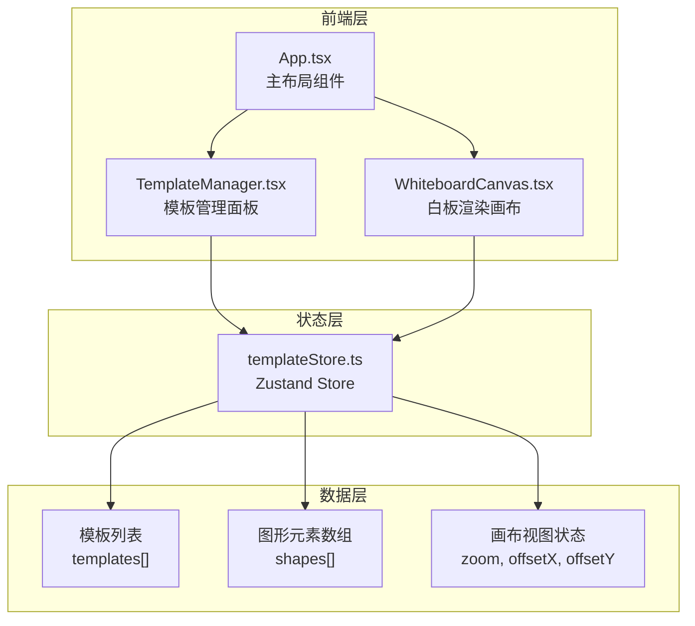
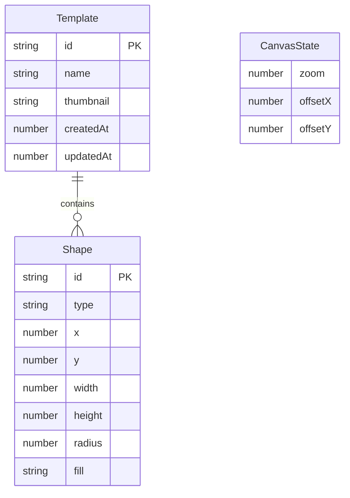

## 1. 架构设计



**数据流向**：
- TemplateManager 通过 store 读取模板列表、触发模板切换和增删操作
- WhiteboardCanvas 通过 store 读取当前模板图形元素和画布视图状态，写入图形变更和视图变更
- 两个模块不直接通信，全部通过 Zustand store 中转

## 2. 技术说明

- 前端框架：React@18 + TypeScript（严格模式，target es2020）
- 构建工具：Vite + @vitejs/plugin-react
- 状态管理：Zustand
- 图形渲染：原生 Canvas 2D API（无第三方图形库）
- 唯一标识：uuid
- 向量运算：vec2
- 初始化工具：vite-init（react-ts 模板）
- 后端：无（纯前端应用，数据存储在内存/store 中）
- 数据库：无

## 3. 路由定义

| 路由 | 用途 |
|------|------|
| / | 应用主页面，包含模板管理面板和白板画布 |

## 4. 数据模型

### 4.1 数据模型定义



### 4.2 类型定义

```typescript
interface Template {
  id: string;
  name: string;
  thumbnail: string;
  shapes: Shape[];
  createdAt: number;
  updatedAt: number;
}

interface Shape {
  id: string;
  type: 'rect' | 'circle';
  x: number;
  y: number;
  width: number;
  height: number;
  radius: number;
  fill: string;
}

interface CanvasState {
  zoom: number;
  offsetX: number;
  offsetY: number;
}
```

## 5. 文件结构与调用关系

```
TemplateCanvas/
├── package.json              # 依赖管理，启动脚本 npm run dev
├── vite.config.js            # Vite 配置，含 React 插件
├── tsconfig.json             # TypeScript 严格模式，target es2020
├── index.html                # 入口页面，深灰色背景 #1E1E2E
├── src/
│   ├── main.tsx              # 应用入口，挂载 App 到 DOM
│   ├── App.tsx               # 主布局：左侧面板(280px) + 右侧画布(flex:1)
│   │                         # ← 调用 TemplateManager, WhiteboardCanvas
│   │                         # ← 响应式：768-1024px 面板缩为 230px，<768px 转为顶部 60px 横幅
│   ├── templateStore.ts      # Zustand store
│   │                         # → 被 App, TemplateManager, WhiteboardCanvas 读写
│   │                         # 存储: templates[], shapes[], zoom, offsetX, offsetY
│   │                         # Shape.connections: string[] (存储目标图形ID数组)
│   │                         # 方法: addShape, updateShape, deleteShape, setZoom,
│   │                         #        saveTemplate, switchTemplate, deleteTemplate
│   ├── TemplateManager.tsx   # 模板管理面板
│   │                         # ← 读取 store: templates, currentTemplateId
│   │                         # → 写入 store: createTemplate, deleteTemplate, switchTemplate, renameTemplate
│   │                         # 支持: 模板搜索过滤、模板重命名(最多30字)
│   └── WhiteboardCanvas.tsx  # 白板渲染画布
│                              # ← 读取 store: shapes, zoom, offsetX, offsetY
│                              # → 写入 store: addShape, updateShape, deleteShape, setZoom, setOffset, setSelectedShape, saveTemplate
│                              # Canvas 2D 渲染 + 鼠标/滚轮事件处理
│                              # 图形连接: 通过 shapes[i].connections → drawBezierConnections()
│                              # 编辑防抖: handleEditChange() 300ms debounce + 输入校验
```

**调用关系与数据流向**：

1. **templateStore → TemplateManager（单向数据流）
   - TemplateManager 渲染时通过 `useTemplateStore()` 订阅 `templates` 数组和 `currentTemplateId`
   - 用户点击模板卡片 → 调用 `switchTemplate(id)` → store 更新 `currentTemplateId` 与 `shapes` → WhiteboardCanvas 读取新的 shapes 自动重绘
   - 用户点击"新建模板" → `createTemplate()` → store 生成新 Template 并切换
   - 用户重命名 → `renameTemplate(id, name)` → 截断 30 字
   - 用户删除 → `deleteTemplate(id)` → store 清理引用

2. **templateStore → WhiteboardCanvas（双向数据流）**
   - **读**：订阅 `shapes`、`zoom`、`offsetX/Y`、`selectedShapeId` → 驱动 Canvas 渲染
   - **写（画布操作）**：
     - `addShape({type, x, y, width, height, radius, fill, connections: []`
     - `updateShape(id, patch)` → 图形拖拽时实时更新坐标；编辑面板 onChange 触发（防抖 300ms）
     - `setZoom(zoom, centerX, centerY)` → 滚轮缩放，缩放中心为鼠标位置，范围 0.5-3
     - `setOffset(offsetX, offsetY)` → 空格+拖拽平移画布
     - `setSelectedShape(id)` → 单击选中/取消选中
     - `saveTemplate(name, thumbnail)` → 把 shapes 深拷贝 + canvas 缩略图写入 templates 对应 Template

3. **TemplateManager 与 WhiteboardCanvas 之间的间接通信**
   - 两模块从不直接 import 或传递 props，全部通过 Zustand store 作为单一数据源中转
   - TemplateManager 的 `switchTemplate()` 改变 store.shapes → WhiteboardCanvas 的 shapes 订阅自动触发画布清空并重新 `render()`

4. **图形连接（贝塞尔曲线）数据流向**
   - Shape.connections 字段存储目标图形 ID 数组
   - WhiteboardCanvas 的 `drawBezierConnections(ctx, shapes)`
     - 边界校验 shapes.length < 2 时直接 return
     - 遍历所有 shape.connections 中每个 targetId
     - 查 shapeMap.get(targetId) 获取目标图形，计算中心点
     - 用 pairKey `[id,targetId].sort().join('|') 防重复绘制
     - 贝塞尔控制点：起点中心+50px 偏移绘制曲线

5. **编辑面板防抖与校验数据流**
   - `handleEditChange(patch)` → 先校验：
     - 数值字段 x/y/width/height/radius：必须是有限数值，width/height/radius 必须 >0
     - 文本 fill：非空字符串
   - 校验通过后本地 `setEditingShape(updated)` 立刻响应面板输入框
   - 防抖 300ms → `updateShape(id, patch)` 写入 store → shapes 引用变化 → 触发 requestAnimationFrame 重绘

6. **缩放指示器显示流程**
   - `triggerZoomIndicator()` → `setZoomIndicatorVisible(true), setZoomIndicatorOpacity(1)`
   - setTimeout 2000ms → requestAnimationFrame 触发浏览器重绘 → `setZoomIndicatorOpacity(0)`
   - 再 setTimeout 500ms → `setZoomIndicatorVisible(false)` 从 DOM 移除
   - useEffect cleanup 清理定时器，避免多次缩放竞态

7. **重绘性能优化**
   - `getShapeSig(shapes)` 生成签名 `length:id1,id2,...`
   - requestAnimationFrame 循环中比较 `curSig !== lastSig`，引用+拖拽/平移标志 → 决定是否 render()
   - render() 内调用 drawBezierConnections + drawShape 逐个图形

8. **响应式布局数据流**
   - ≥1024px：左侧面板 280px
   - 768-1024px：面板 230px，缩略图高度 70px
   - <768px：面板转为顶部 60px 横幅，内部水平滚动 overflow-x:auto + white-space:nowrap

