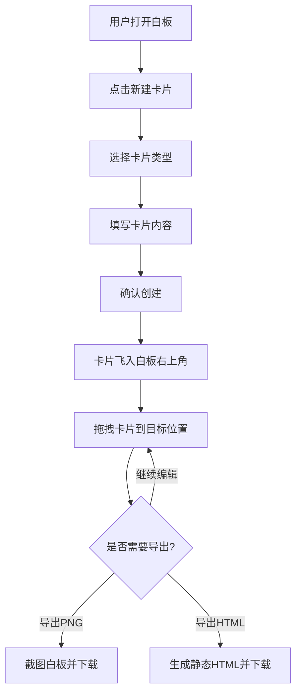

## 1. 产品概述

MosaicNote 是一款碎片化信息可视化拼贴白板应用，让用户像拼贴画一样将网页截图、书摘、语音转文字片段、待办事项等不同来源的信息快速组合到虚拟白板上，整理成可视化的知识网格或思维导图，方便回顾和分享。

- 目标用户：知识工作者、学生、创意人员等需要整理碎片化信息的人群
- 核心价值：将零散信息通过可视化拼贴方式快速聚合，降低信息整理的认知负担

## 2. 核心功能

### 2.1 功能模块

1. **白板页面**：卡片管理模块 + 导出与分享模块，所有功能集中在一个全屏白板页面中

### 2.2 页面详情

| 页面名称 | 模块名称 | 功能描述 |
|----------|----------|----------|
| 白板页面 | 卡片管理 | 创建、编辑、拖拽排列和删除不同类型的卡片（文本/图片/语音/待办），每种卡片样式不同，支持网格吸附 |
| 白板页面 | 新建卡片浮层 | 点击新建后弹出浮层，根据卡片类型展示不同表单字段，确认后卡片出现在白板右上角并伴随飞入动画 |
| 白板页面 | 卡片拖拽 | 所有卡片自由拖拽，拖拽时半透明区分，松开后吸附到最近网格交点 |
| 白板页面 | 卡片操作 | 每张卡片右下角有删除按钮（悬停变红）和复制按钮（复制卡片偏移5px叠加） |
| 白板页面 | 导出工具栏 | 顶部工具栏，含导出PNG、导出HTML、清空白板按钮 |
| 白板页面 | 缩放控制器 | 白板底部滑动条，25%-200%缩放，缩放低于80%时隐藏网格 |

## 3. 核心流程

## 4. 用户界面设计

### 4.1 设计风格

- 整体采用深色模式，背景 #111827，卡片区域背景 #1F2937
- 主色调：深灰/暗蓝，强调色为蓝色 #3B82F6、紫色 #7C3AED、红色 #EF4444
- 圆角风格：统一圆角设计，卡片圆角 8-16px
- 字体：系统无衬线字体
- 布局：全屏白板，自由拖拽定位

### 4.2 卡片样式设计

| 卡片类型 | 圆角 | 边框/背景 | 特殊元素 |
|----------|------|-----------|----------|
| 文本卡片 | 8px | 蓝色边框 #3B82F6 | 无 |
| 图片卡片 | 12px | 无边框，带阴影 | 图片展示 |
| 语音卡片 | 16px | 紫色背景 #7C3AED | 播放按钮 |
| 待办卡片 | 默认 | 左边红色竖条 #EF4444 | 复选框 |

### 4.3 新建浮层设计

- 浮层背景：白色，圆角 16px
- 遮罩背景：rgba(0,0,0,0.4)，过渡 0.3s ease-in
- 文本卡片表单：textarea，宽100%高120px圆角8px，聚焦边框 #3B82F6
- 图片卡片表单：文件上传区，虚线边框 #D1D5DB，拖入时边框变 #3B82F6 背景变 #EFF6FF
- 语音卡片表单：录音按钮，圆形红色 #EF4444（开始），圆形灰色 #6B7280（停止）
- 待办卡片表单：文本输入 + 复选框

### 4.4 工具栏设计

- 背景 #1F2937，圆角 12px，固定高度 48px
- 导出PNG按钮（悬停变亮）
- 导出HTML按钮（悬停变亮）
- 清空白板按钮（红色渐变）

### 4.5 缩放控制器

- 底部滑动条，范围 25%-200%
- 当前值显示在左侧
- 拖动时白板整体缩放过渡 0.15s ease
- 缩放低于 80% 时隐藏网格

### 4.6 响应式设计

- 桌面优先，全屏白板布局
- 拖拽使用鼠标事件实现
