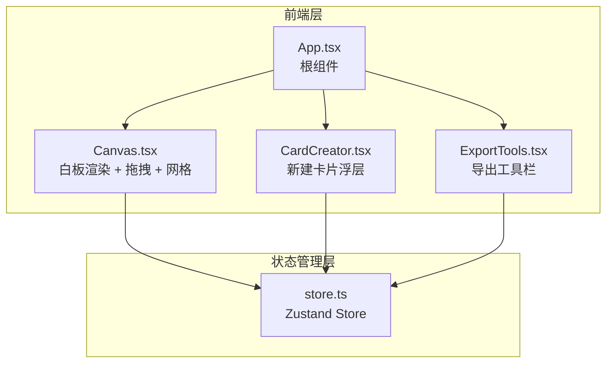

## 1. 架构设计



## 2. 技术说明

- 前端：React@18 + TypeScript + Vite
- 状态管理：Zustand
- 截图导出：html2canvas@1.4
- 文件下载：file-saver
- ID生成：uuid
- 初始化工具：vite-init (react-ts 模板)
- 后端：无
- 数据库：无（纯前端，数据存在内存/Zustand store中）

## 3. 路由定义

| 路由 | 用途 |
|------|------|
| / | 白板主页面，所有功能集中于此 |

## 4. 数据模型

### 4.1 Card 数据模型

```typescript
interface Card {
  id: string;
  type: 'text' | 'image' | 'voice' | 'todo';
  content: string;
  position: { x: number; y: number };
  rotation: number;
  imageUrl?: string;
  audioUrl?: string;
  checked?: boolean;
}
```

### 4.2 Store 数据模型

```typescript
interface CardStore {
  cards: Card[];
  gridEnabled: boolean;
  addCard: (card: Omit<Card, 'id'>) => void;
  removeCard: (id: string) => void;
  moveCard: (id: string, position: { x: number; y: number }) => void;
  toggleGrid: () => void;
  clearCards: () => void;
  updateCard: (id: string, updates: Partial<Card>) => void;
}
```

## 5. 文件结构

```
├── package.json
├── vite.config.js
├── tsconfig.json
├── index.html
└── src/
    ├── App.tsx        # 根组件
    ├── store.ts       # Zustand store
    ├── Canvas.tsx     # 白板渲染组件
    ├── CardCreator.tsx # 新建卡片浮层
    └── ExportTools.tsx # 导出工具栏
```

## 6. 性能要求

- 拖拽时帧率不低于 30 FPS
- 使用 requestAnimationFrame 优化拖拽性能
- 卡片创建动画 0.2s ease 飞入
- 缩放过渡 0.15s ease
