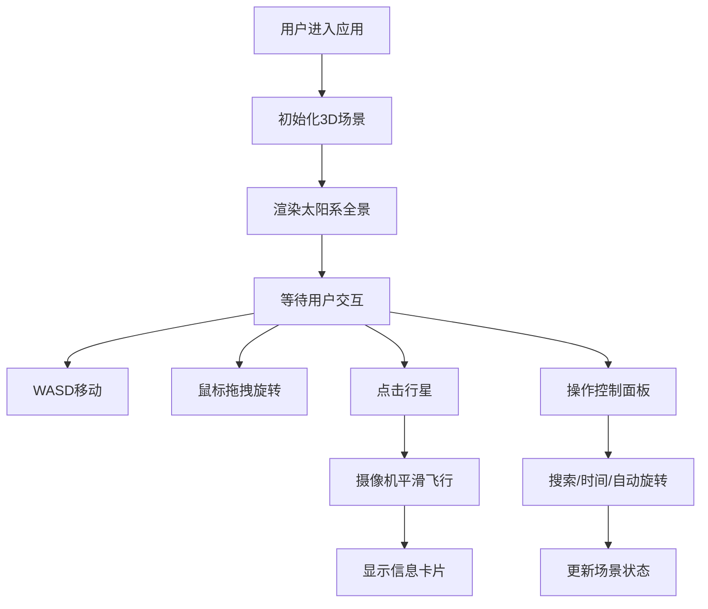

## 1. 产品概述

SunTrail是一个沉浸式3D太阳系模拟与交互探索应用，让用户在浏览器中以第一人称视角自由漫游太阳系，实时查看行星轨道、自转和天文数据。

- 面向天文爱好者、教育工作者和普通用户，提供直观的太阳系可视化体验
- 目标是通过交互式3D渲染降低天文知识的学习门槛，提升宇宙探索的趣味性

## 2. 核心 Features

### 2.1 Feature Module

1. **3D场景渲染模块**：太阳、八大行星、轨道线、特殊效果的实时渲染
2. **第一人称交互模块**：鼠标视角控制、键盘移动、行星点击聚焦
3. **时间模拟模块**：多档时间倍速调节、行星公转与自转模拟
4. **信息展示模块**：行星信息卡片、名称标签、控制面板
5. **控制面板模块**：行星搜索跳转、时间倍速切换、自动旋转开关

### 2.2 Page Details

| Page Name | Module Name | Feature description |
|-----------|-------------|---------------------|
| 主场景页面 | 3D场景渲染 | 太阳自发光动态纹理、八大行星按比例渲染、半透明虚线轨道 |
| 主场景页面 | 第一人称交互 | 鼠标拖拽旋转视角、滚轮缩放、WASD移动、点击行星平滑飞近 |
| 主场景页面 | 时间模拟 | 1x/10x/100x/1000x四档时间倍速、行星公转自转同步模拟 |
| 主场景页面 | 特殊效果 | 土星光环、地球云层、太阳辉光粒子效果 |
| 主场景页面 | 信息展示 | 行星信息卡片淡入动画、名称标签跟随显示 |
| 主场景页面 | 控制面板 | 行星搜索下拉、倍速按钮组高亮、自动旋转Toggle开关 |

## 3. Core Process

用户进入应用后，首先看到完整的太阳系全景。用户可以通过WASD键在场景中自由移动，鼠标拖拽旋转视角，滚轮缩放场景。点击任意行星，摄像机会平滑飞向该行星并显示详细信息卡片。通过左下角控制面板可以搜索特定行星、调节时间流速或开启自动旋转视角。

## 4. User Interface Design

### 4.1 Design Style

- **主色调**：宇宙深空黑（#000000）、半透明深蓝灰（rgba(10,10,30,0.85)）
- **强调色**：紫色高亮（#4F46E5和#7C3AED）、太阳暖光（#FFAA00）
- **文字色**：白色（#E2E8F0）
- **行星配色**：地球蓝绿（#2E86AB）、火星红橙（#C0392B）、木星条纹（#D4AC0D）
- **UI元素**：圆角12px、内边距16px、半透明背景
- **动画**：信息卡片0.3秒ease-out淡入、控制面板0.2秒平滑过渡

### 4.2 3D Scene Guidance

- **环境**：纯黑背景，营造宇宙深空氛围
- **光照**：太阳作为点光源，行星表面使用PBR材质
- **相机**：PerspectiveCamera，fov 75°，初始位置距离太阳中心150单位
- **交互**：OrbitControls辅助视角控制，自定义WASD移动逻辑
- **后处理**：无额外后处理，保持高性能
- **性能优化**：InstancedMesh复用几何体，总面数控制在5000以内
