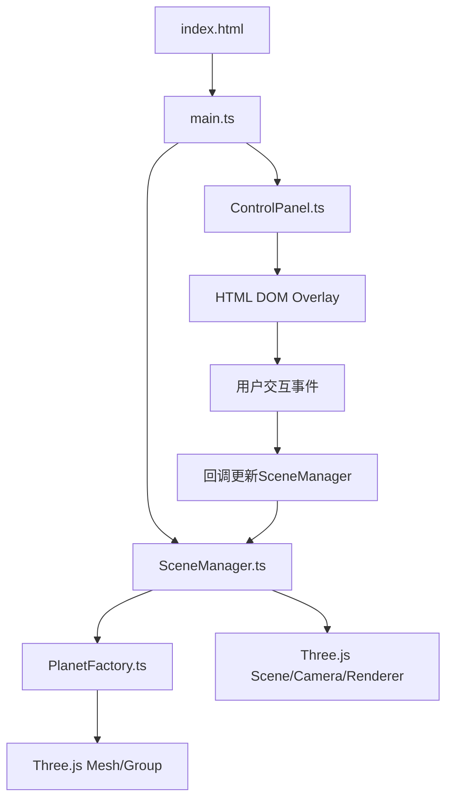

## 1. Architecture Design



## 2. Technology Description

- **前端框架**：原生TypeScript，无UI框架
- **3D引擎**：Three.js@0.160.0
- **控制组件**：OrbitControls（Three.js内置）
- **构建工具**：Vite@5.x
- **编程语言**：TypeScript@5.x（严格模式，target es2020）

**项目结构**：
```
/
├── package.json          # 依赖配置
├── vite.config.js        # Vite构建配置
├── tsconfig.json         # TypeScript配置
├── index.html            # 入口页面
└── src/
    ├── main.ts           # 入口文件
    ├── SceneManager.ts   # 场景管理器
    ├── PlanetFactory.ts  # 行星工厂
    └── ControlPanel.ts   # 控制面板
```

## 3. 核心模块设计

### 3.1 PlanetFactory.ts - 行星工厂

**数据流向**：接收天文参数 → 创建Mesh和LineLoop组合 → 返回Group

| 函数 | 功能 | 参数 | 返回值 |
|------|------|------|--------|
| createSun | 创建太阳 | radius, color | THREE.Group |
| createPlanet | 创建行星 | name, radius, orbitRadius, color, data | THREE.Group |
| createOrbit | 创建轨道线 | radius | THREE.LineLoop |
| createRing | 创建光环 | innerRadius, outerRadius, color | THREE.Mesh |
| createClouds | 创建云层 | radius | THREE.Mesh |
| createLabel | 创建名称标签 | text | THREE.Sprite |
| createGlowParticles | 创建辉光粒子 | count, radius | THREE.Points |

### 3.2 SceneManager.ts - 场景管理器

**职责**：管理场景中所有天体的创建、位置更新和销毁，接收控制模块的视角切换指令

| 方法 | 功能 |
|------|------|
| init | 初始化场景、相机、渲染器、光照 |
| createSolarSystem | 创建整个太阳系 |
| update | 每帧更新（公转、自转、动画） |
| focusOnPlanet | 平滑飞向指定行星 |
| setTimeScale | 设置时间倍速 |
| setAutoRotate | 设置自动旋转开关 |
| handleClick | 处理点击事件 |
| resize | 处理窗口大小变化 |
| dispose | 资源清理 |

### 3.3 ControlPanel.ts - 控制面板

**数据流向**：用户交互 → 通过回调更新SceneManager状态

| 方法 | 功能 |
|------|------|
| createPanel | 创建控制面板DOM |
| createPlanetSelector | 创建行星搜索下拉框 |
| createTimeControls | 创建时间倍速按钮组 |
| createAutoRotateToggle | 创建自动旋转开关 |
| showInfoCard | 显示行星信息卡片 |
| hideInfoCard | 隐藏行星信息卡片 |
| updateTimeScaleButton | 更新时间倍速按钮高亮 |

## 4. 行星数据定义

| 行星 | 半径(相对) | 轨道半径(相对) | 公转周期(地球日) | 自转周期(小时) | 颜色 | 卫星数 |
|------|-----------|---------------|-----------------|---------------|------|--------|
| 太阳 | 20 | 0 | - | 609.12 | #FFAA00 | - |
| 水星 | 1.5 | 35 | 88 | 1407.6 | #8C7853 | 0 |
| 金星 | 3.7 | 50 | 225 | 5832.5 | #FFC649 | 0 |
| 地球 | 4 | 70 | 365 | 24 | #2E86AB | 1 |
| 火星 | 2.1 | 90 | 687 | 24.6 | #C0392B | 2 |
| 木星 | 10 | 130 | 4333 | 9.9 | #D4AC0D | 95 |
| 土星 | 8.5 | 175 | 10759 | 10.7 | #F4D03F | 146 |
| 天王星 | 5 | 220 | 30687 | 17.2 | #73C6B6 | 27 |
| 海王星 | 4.8 | 260 | 60190 | 16.1 | #3498DB | 16 |

## 5. 性能优化策略

1. **InstancedMesh复用**：所有行星基础球体使用共享几何体
2. **面数控制**：总面数≤5000，球体分段数合理控制
3. **材质共享**：相同类型材质复用，减少Draw Call
4. **视锥剔除**：Three.js内置自动视锥剔除
5. **帧率保证**：近处行星时≥45fps，简化远处行星渲染细节
