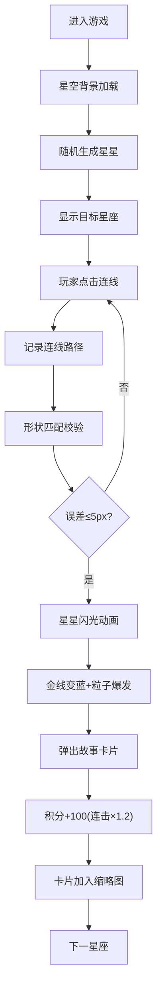

## 1. 产品概述

ConstellationCross是一款沉浸式星座连线益智游戏，玩家在浩瀚星空背景中通过点击和连线将散落的星星连接成经典星座图案，解锁对应的希腊神话故事卡片。

- 核心玩法：连线匹配星座，探索神话故事，挑战积分和时间限制
- 目标用户：休闲游戏爱好者、天文爱好者、神话文化爱好者
- 产品价值：结合知识性与娱乐性，在游戏中学习星座知识和神话故事

## 2. 核心功能

### 2.1 功能模块

1. **星空画布模块**：随机生成星星、闪烁动画、连线渲染、粒子特效
2. **星座匹配模块**：连线路径记录、星座形状匹配校验、误差计算
3. **HUD信息面板**：积分显示、倒计时、已解锁卡片缩略图
4. **故事卡片模块**：卡片弹出动画、神话故事展示、插图浏览
5. **游戏状态管理**：全局状态、事件总线、连击系统

### 2.2 页面详情

| 页面名称 | 模块名称 | 功能描述 |
|----------|----------|----------|
| 游戏主界面 | 星空画布 | 全屏星空背景，随机生成60颗以内星星，支持点击连线 |
| 游戏主界面 | 连线系统 | 发光金线连接选中星星，0.1秒拖尾动画 |
| 游戏主界面 | 信息面板 | 显示当前星座、积分、倒计时、已解锁卡片 |
| 游戏主界面 | 卡片模态框 | 展示解锁的神话故事卡片，带插图和文字 |
| 游戏主界面 | 匹配反馈 | 连线成功时星星闪光、金线变蓝、粒子爆发 |

## 3. 核心流程

玩家进入游戏 → 星空背景加载并随机生成星星 → 显示当前目标星座名称 → 玩家点击星星开始连线 → 系统实时记录连线路径 → 连线完成后与预设星座形状匹配（误差5像素内判定成功）→ 触发星星闪光动画（0.3秒）→ 金线变蓝并爆发粒子效果 → 弹出神话故事卡片 → 积分增加100分（连击加成0.2倍）→ 倒计时继续 → 解锁卡片加入缩略图列表 → 进入下一个星座挑战。

## 4. 用户界面设计

### 4.1 设计风格

- **主色调**：深邃蓝紫色系，主色#1A1B41，辅色#2D2F6E
- **强调色**：金色#FFD700，青色#00E5FF，警示红#EF4444
- **背景**：#0B0E2A深紫蓝色星空渐变
- **卡片风格**：圆角16px，深蓝到紫色渐变背景，半透明玻璃效果
- **字体**：优雅衬线体用于标题，清晰无衬线体用于正文
- **动画**：0.3秒淡入动画，悬停上浮4px，金线0.1秒拖尾

### 4.2 页面设计概述

| 页面名称 | 模块名称 | UI元素 |
|----------|----------|--------|
| 游戏主界面 | 星空画布 | 全屏Canvas，大小不一白色星星，每0.5秒随机闪烁 |
| 游戏主界面 | 连线效果 | #FFD700到#FFA500渐变金线，2px线宽，0.1秒拖尾 |
| 游戏主界面 | 信息面板 | 260px宽竖排，rgba(15,23,42,0.7)半透明，圆角16px，内边距20px |
| 游戏主界面 | 积分显示 | 数字滚动动画，0.1秒完成 |
| 游戏主界面 | 倒计时 | 红色#EF4444，每秒跳动 |
| 游戏主界面 | 卡片缩略图 | 48px正方形，圆角8px，点击展开 |
| 游戏主界面 | 卡片模态框 | 圆角20px，#1A1B41到#2D2F6E渐变，大图+故事文字 |

### 4.3 响应式

- **设计优先**：桌面端优先，移动端自适应
- **布局策略**：使用flex-wrap实现响应式布局
- **移动端适配**：信息面板改为底部横排，缩小触控区域尺寸
- **触控优化**：增加星星点击区域，优化移动端连线体验

### 4.4 性能要求

- 动画帧率≥50FPS
- 最多60颗星星无卡顿
- 使用requestAnimationFrame优化动画循环
- Canvas分层渲染提升性能
