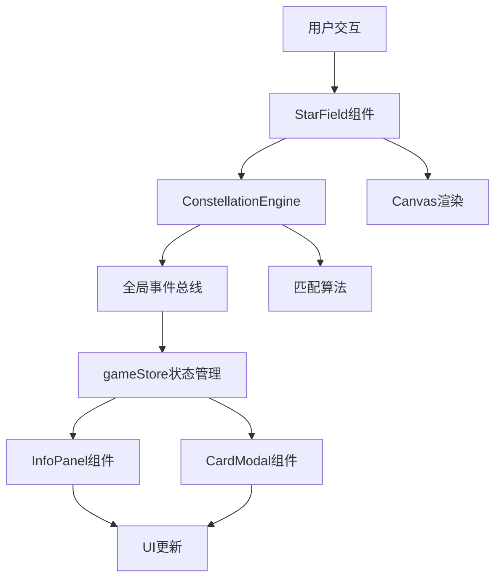

## 1. 架构设计



## 2. 技术描述

- **前端框架**：React@18 + TypeScript + Vite
- **状态管理**：Zustand
- **唯一ID**：uuid
- **初始化工具**：vite-init
- **后端**：无（纯前端应用）
- **数据库**：无（内存状态存储）

## 3. 项目结构

```
├── package.json
├── vite.config.js
├── tsconfig.json
├── index.html
└── src/
    ├── main.tsx
    ├── game/
    │   ├── StarField.tsx
    │   └── ConstellationEngine.ts
    ├── ui/
    │   ├── InfoPanel.tsx
    │   └── CardModal.tsx
    └── store/
        └── gameStore.ts
```

## 4. 核心模块定义

### 4.1 数据模型

```typescript
interface Star {
  id: string;
  x: number;
  y: number;
  size: number;
  brightness: number;
  isTwinkling: boolean;
}

interface Constellation {
  id: string;
  name: string;
  stars: { x: number; y: number }[];
  connections: [number, number][];
  story: {
    title: string;
    content: string;
    image: string;
  };
}

interface ConnectionPath {
  starIds: string[];
  points: { x: number; y: number }[];
}

interface UnlockedCard {
  id: string;
  constellationName: string;
  image: string;
  title: string;
}

interface GameState {
  stars: Star[];
  currentConstellation: Constellation | null;
  selectedStars: string[];
  connectionPath: { x: number; y: number }[];
  score: number;
  combo: number;
  timeRemaining: number;
  unlockedCards: UnlockedCard[];
  isCardModalOpen: boolean;
  currentCard: UnlockedCard | null;
  matchAnimation: boolean;
}
```

### 4.2 事件总线

```typescript
// 星星模块抛出事件
- starSelected: (starId: string) => void
- constellationMatched: (constellation: Constellation) => void

// HUD模块监听事件
- onStarSelected: 更新连线状态
- onConstellationMatched: 触发动画、更新积分、弹出卡片
```

### 4.3 核心算法

**星座匹配算法**：
1. 收集玩家连线路径的所有坐标点
2. 与预设星座的连线坐标进行比较
3. 计算每个点的欧氏距离误差
4. 所有点误差≤5px则判定匹配成功

**性能优化**：
- Canvas分层：背景层、星星层、连线层、特效层
- requestAnimationFrame驱动动画循环
- 对象池复用粒子对象
- 离屏渲染静态星空背景
