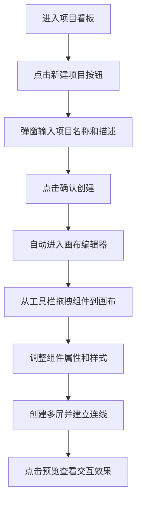
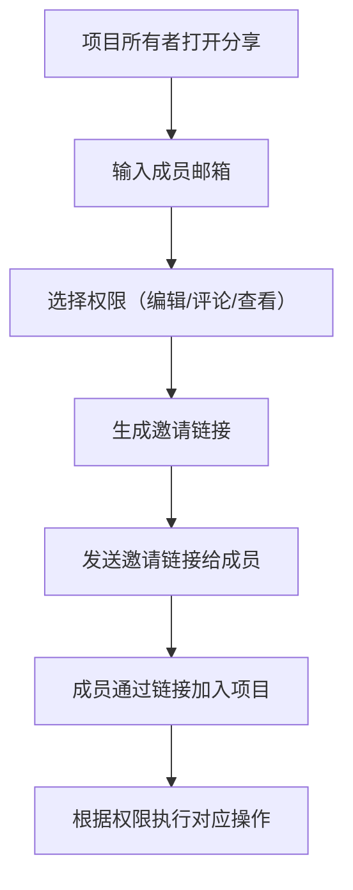

## 1. 产品概述

ProtoFlow 是一款面向小团队的在线交互式产品演示原型工具，旨在解决传统产品需求文档枯燥难懂、开发与产品之间沟通效率低下的问题。

- 目标用户：产品经理、设计师、开发团队、产品评审人员
- 核心价值：通过可视化、可交互的原型，让团队成员直观理解产品设计，降低沟通成本，加速产品迭代

## 2. 核心功能

### 2.1 用户角色

| 角色 | 注册方式 | 核心权限 |
|------|----------|----------|
| 项目所有者 | 默认创建者 | 完全控制、邀请成员、管理权限 |
| 编辑者 | 邀请链接 | 编辑原型、添加组件、创建连线 |
| 评论者 | 邀请链接 | 查看原型、添加评论、@提及他人 |
| 查看者 | 邀请链接 | 只读预览原型 |

### 2.2 功能模块

1. **项目看板页**：项目导航栏、项目卡片网格、新建项目弹窗
2. **画布编辑器**：无限滚动画布、左侧工具栏、右侧属性面板、底部屏幕标签栏
3. **协作模块**：成员邀请、权限管理、评论系统
4. **预览模式**：原型播放、交互跳转、多屏切换

### 2.3 页面详情

| 页面名称 | 模块名称 | 功能描述 |
|---------|---------|----------|
| 项目看板页 | 导航栏 | 深色背景 #1E293B，显示项目名称、分享按钮、用户头像 |
| 项目看板页 | 项目卡片网格 | 卡片宽 280px 高 180px，白色背景圆角 12px，阴影 0 4px 12px rgba(0,0,0,0.08)，展示项目名、修改时间、3 个缩略图 |
| 项目看板页 | 新建项目弹窗 | 输入项目名（必填）和描述（200 字内） |
| 画布编辑器 | 无限画布 | 背景网格 #E2E8F0，间距 20px，支持无限滚动 |
| 画布编辑器 | 左侧工具栏 | 宽 64px，暗色 #334155，包含矩形/圆形/文本/图片/按钮/连线模式 |
| 画布编辑器 | 组件操作 | 拖拽吸附网格 10px，右下角缩放拖柄，右键菜单（删除/复制/设置交互） |
| 画布编辑器 | 右侧属性面板 | 宽 260px，背景 #F8FAFC，圆角 12px，显示位置/尺寸/样式/交互属性 |
| 画布编辑器 | 底部屏幕标签 | 标签宽 120px，圆角 8px，选中时紫色 #7C3AED 下划线，支持新增/删除/重命名 |
| 画布编辑器 | 连线系统 | 箭头线颜色 #6366F1，宽度 2px，平滑曲线，箭头流动光效 0.5s 循环 |
| 协作模块 | 邀请弹窗 | 输入邮箱生成邀请链接，设置成员权限 |
| 协作模块 | 评论气泡 | 黄色气泡图标，点击展开输入框，支持 @ 提及 |
| 预览模式 | 原型播放 | 从头播放，点击交互元素跳转，按 Esc 退出 |

## 3. 核心流程

### 3.1 项目创建流程

### 3.2 协作邀请流程

## 4. 用户界面设计

### 4.1 设计风格

- **主色调**：紫色 #7C3AED（强调选中状态）、靛蓝 #6366F1（连线和交互元素）
- **中性色**：深色侧边栏 #1E293B / #334155，浅色主体 #F8FAFC / 白色
- **功能色**：黄色 #EAB308（评论气泡）
- **按钮风格**：圆角 8px，悬停有轻微缩放和阴影变化
- **字体**：系统默认无衬线字体，最小字号 12px
- **布局风格**：深色侧边栏 + 浅色主体，卡片式设计，充足留白
- **图标风格**：线性简洁图标，使用 lucide-react

### 4.2 动画与交互

- **组件拖拽**：0.15s 弹性缩放动画 transform: scale(1.05)
- **连线绘制**：箭头流动光效 0.5s 循环
- **组件点击**：0.1s 脉冲高亮
- **右键菜单**：0.2s 渐入
- **响应式**：宽度 < 1024px 时，属性面板折叠为底部抽屉
- **性能**：画布渲染 60FPS，支持最多 50 个组件同时显示

### 4.3 页面设计概述

| 页面名称 | 模块名称 | UI 元素 |
|---------|---------|---------|
| 项目看板 | 导航栏 | #1E293B 深色背景，16px 内边距，无圆角 |
| 项目看板 | 项目卡片 | 白色背景，圆角 12px，阴影 0 4px 12px rgba(0,0,0,0.08)，悬停轻微上浮 |
| 画布编辑器 | 工具栏 | #334155 暗色，64px 宽，垂直布局，图标高亮选中 |
| 画布编辑器 | 组件 | 默认 120x60px，边框 1px solid #CBD5E1，圆角 8px，悬停边框变 #6366F1 |
| 画布编辑器 | 属性面板 | #F8FAFC 背景，圆角 12px，表单标签右对齐，输入框圆角 6px |
| 画布编辑器 | 屏幕标签 | 白色背景，圆角 8px，选中时底部紫色 2px 下划线 |

### 4.4 响应式设计

- **桌面端（≥1024px）**：左侧工具栏 + 中央画布 + 右侧属性面板三栏布局
- **平板端（768px-1023px）**：属性面板折叠为底部抽屉，点击展开
- **移动端（<768px）**：工具栏折叠为浮动按钮，画布全屏显示
