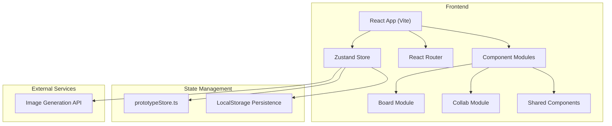
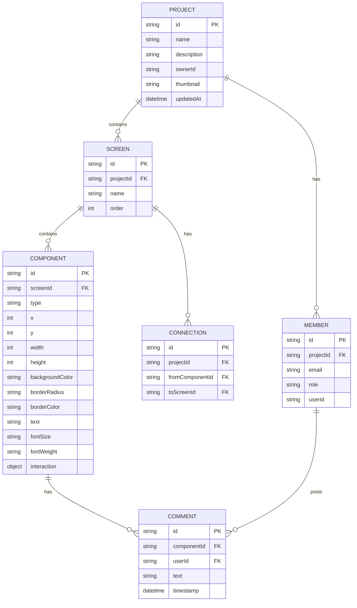

## 1. 架构设计



## 2. 技术描述

- **前端框架**：React@18 + TypeScript + Vite
- **状态管理**：Zustand（轻量级、高性能）
- **路由**：React Router DOM
- **样式方案**：TailwindCSS 3 + 自定义 CSS 变量
- **图标库**：lucide-react
- **唯一 ID**：uuid
- **拖拽库**：react-beautiful-dnd（用于屏幕标签排序）
- **数据持久化**：LocalStorage（本地演示用）
- **构建工具**：Vite 5.x

## 3. 路由定义

| 路由路径 | 页面组件 | 功能描述 |
|---------|---------|----------|
| `/` | `ProjectBoard.tsx` | 项目看板页，展示所有项目卡片 |
| `/project/:id` | `ProjectEditor.tsx` | 画布编辑器，包含工具栏、画布、属性面板 |
| `/project/:id/preview` | `ProjectPreview.tsx` | 原型预览模式，全屏播放 |
| `/invite/:token` | `InviteAccept.tsx` | 接受邀请加入项目 |

## 4. 数据模型

### 4.1 数据模型定义



### 4.2 TypeScript 类型定义

```typescript
// 项目
interface Project {
  id: string;
  name: string;
  description: string;
  ownerId: string;
  thumbnail?: string;
  updatedAt: string;
}

// 屏幕
interface Screen {
  id: string;
  projectId: string;
  name: string;
  order: number;
}

// 组件类型
type ComponentType = 'rectangle' | 'circle' | 'text' | 'image' | 'button';

// 组件交互
interface ComponentInteraction {
  type: 'navigate' | 'modal' | 'animation';
  targetScreenId?: string;
  modalContent?: string;
  animationType?: string;
}

// 组件
interface Component {
  id: string;
  screenId: string;
  type: ComponentType;
  x: number;
  y: number;
  width: number;
  height: number;
  backgroundColor: string;
  borderRadius: number;
  borderColor: string;
  text?: string;
  fontSize?: number;
  fontWeight?: string;
  imageUrl?: string;
  interaction?: ComponentInteraction;
}

// 连线
interface Connection {
  id: string;
  projectId: string;
  fromComponentId: string;
  toScreenId: string;
}

// 成员角色
type MemberRole = 'owner' | 'editor' | 'commenter' | 'viewer';

// 成员
interface Member {
  id: string;
  projectId: string;
  email: string;
  role: MemberRole;
  userId?: string;
}

// 评论
interface Comment {
  id: string;
  componentId: string;
  userId: string;
  text: string;
  timestamp: string;
}

// Store 状态
interface PrototypeStore {
  projects: Project[];
  currentProjectId: string | null;
  currentScreenId: string | null;
  selectedComponentId: string | null;
  components: Component[];
  screens: Screen[];
  connections: Connection[];
  members: Member[];
  comments: Comment[];
  // 操作方法
  setCurrentProject: (id: string) => void;
  setCurrentScreen: (id: string) => void;
  selectComponent: (id: string | null) => void;
  addProject: (name: string, description: string) => Project;
  updateProject: (id: string, data: Partial<Project>) => void;
  deleteProject: (id: string) => void;
  addScreen: (projectId: string, name: string) => Screen;
  updateScreen: (id: string, data: Partial<Screen>) => void;
  deleteScreen: (id: string) => void;
  addComponent: (component: Omit<Component, 'id'>) => Component;
  updateComponent: (id: string, data: Partial<Component>) => void;
  deleteComponent: (id: string) => void;
  addConnection: (fromComponentId: string, toScreenId: string) => Connection;
  deleteConnection: (id: string) => void;
  addMember: (projectId: string, email: string, role: MemberRole) => Member;
  updateMember: (id: string, role: MemberRole) => void;
  removeMember: (id: string) => void;
  addComment: (componentId: string, userId: string, text: string) => Comment;
  deleteComment: (id: string) => void;
}
```

## 5. 文件结构

```
d:\P\tasks\auto93/
├── package.json
├── vite.config.js
├── tsconfig.json
├── index.html
├── src/
│   ├── main.tsx
│   ├── App.tsx
│   ├── routes/
│   │   └── index.tsx
│   ├── pages/
│   │   ├── ProjectBoard.tsx
│   │   ├── ProjectEditor.tsx
│   │   └── ProjectPreview.tsx
│   ├── stores/
│   │   └── prototypeStore.ts
│   ├── modules/
│   │   ├── board/
│   │   │   ├── BoardCanvas.tsx
│   │   │   ├── PropertyPanel.tsx
│   │   │   ├── ScreenManager.tsx
│   │   │   └── Toolbar.tsx
│   │   └── collab/
│   │       ├── InviteDialog.tsx
│   │       └── CommentBubble.tsx
│   ├── components/
│   │   ├── ProjectCard.tsx
│   │   ├── NewProjectDialog.tsx
│   │   ├── ContextMenu.tsx
│   │   └── ConnectionLine.tsx
│   ├── hooks/
│   │   ├── useDragDrop.ts
│   │   └── useCanvasPan.ts
│   ├── types/
│   │   └── index.ts
│   └── utils/
│       └── helpers.ts
```

## 6. 核心性能优化

1. **组件虚拟化**：使用 React.memo 避免不必要的重渲染
2. **画布渲染优化**：使用 requestAnimationFrame 确保 60FPS
3. **状态选择器**：Zustand 使用 selectors 精确订阅状态
4. **事件节流**：拖拽和缩放操作使用 throttle 限制触发频率
5. **批量更新**：多个状态更新合并为一次 commit
