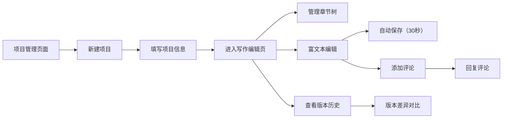

## 1. 产品概述
InkFlow是一款面向创意写作者和故事创作者的在线协作写作平台，支持多人实时协作、版本历史追踪和结构化章节管理。
- 主要解决创意写作过程中版本管理混乱、协作效率低下、故事结构难以组织的问题
- 目标用户包括小说作者、编剧、内容创作者、学生和写作爱好者
- 产品价值在于提供专业、优雅、高效的写作体验，让创作者专注于内容本身

## 2. 核心特性

### 2.1 用户角色
| 角色 | 注册方式 | 核心权限 |
|------|----------|----------|
| 普通用户 | 无需注册（本地使用） | 创建/编辑/删除项目、管理章节、使用编辑器、查看版本历史、添加评论 |

### 2.2 功能模块
1. **项目管理页面**：项目列表展示、新建项目、编辑项目、删除项目
2. **写作编辑页面**：章节树导航、富文本编辑器、版本历史对比、评论协作

### 2.3 页面详情
| 页面名称 | 模块名称 | 功能描述 |
|----------|----------|----------|
| 项目管理页 | 项目卡片网格 | 以网格布局展示项目卡片，支持新建/编辑/删除操作，卡片包含封面、标题、最后编辑时间 |
| 项目管理页 | 新建项目模态框 | 填写项目名称（30字内）和简介（200字内），提交后创建新项目 |
| 写作编辑页 | 章节树导航 | 左侧可折叠章节树，支持添加、重命名、拖拽排序、删除章节 |
| 写作编辑页 | 富文本编辑器 | 中央编辑区域，支持加粗、斜体、下划线、标题、列表、引用等格式，工具栏悬停效果，底部字数统计和自动保存状态 |
| 写作编辑页 | 版本历史面板 | 右侧时间轴展示历史版本，支持选择两个版本进行差异对比，删除内容红色高亮，新增内容绿色高亮 |
| 写作编辑页 | 评论协作 | 选择文本可添加评论，支持回复评论，显示作者头像和时间戳 |

## 3. 核心流程

用户从项目管理页面开始，点击新建项目创建写作项目，进入项目后在左侧章节树添加章节，在中央编辑器进行写作，每30秒自动保存一次。写作过程中可查看右侧版本历史，选择版本进行对比。选中段落可添加评论与协作者讨论。

## 4. 用户界面设计

### 4.1 设计风格
- 主色调：#6366F1（靛蓝色），用于主要按钮、激活状态、品牌标识
- 辅助色：#F59E0B（琥珀色），用于高亮提示、通知标记
- 背景色：#F8FAFC（浅灰蓝），页面整体背景
- 卡片背景：#FFFFFF（纯白），配合微阴影增强层次感
- 按钮样式：圆角8px，悬停背景#E2E8F0，点击时scale(0.96)缩放反馈
- 字体：系统字体栈，正文14px，标题18px-24px
- 布局：三栏布局（左侧200px章节树 + 中央编辑器 + 右侧版本面板）
- 图标风格：线性简约风格，使用lucide-react图标库

### 4.2 页面设计概述
| 页面名称 | 模块名称 | UI元素 |
|----------|----------|----------|
| 项目管理页 | 项目卡片网格 | 渐变背景（#F8FAFC到#E2E8F0）、圆角16px、阴影0 4px 12px rgba(0,0,0,0.05)、悬停阴影加深+scale(1.02) |
| 项目管理页 | 新建模态框 | 白色背景、圆角16px、表单输入、提交按钮靛蓝色 |
| 写作编辑页 | 章节树 | 白色背景、圆角12px、1px边框#E2E8F0、内边距12px、可折叠箭头、拖拽排序 |
| 写作编辑页 | 富文本编辑器 | 工具栏按钮圆角4px、悬停#E2E8F0、底部状态栏显示字数和保存时间、保存成功绿色对勾动画 |
| 写作编辑页 | 版本历史 | 时间轴布局、版本项圆角8px、内边距12px、背景#F1F5F9、灰色时间戳 |
| 写作编辑页 | 版本对比 | 删除内容#FEE2E2背景、新增内容#D1FAE5背景、0.2秒闪烁过渡 |
| 写作编辑页 | 评论气泡 | 白色背景、圆角8px、阴影0 2px 8px rgba(0,0,0,0.08)、圆形头像24px |

### 4.3 响应式设计
- 桌面端（>768px）：三栏完整布局
- 平板端（≤768px）：右侧版本面板折叠为浮动按钮，点击展开
- 移动端（≤480px）：导航栏变为汉堡菜单，章节树变为全屏抽屉，单栏布局
- 触摸优化：按钮最小44px点击区域，滑动手势支持

### 4.4 动效设计
- 卡片悬停：scale(1.02) + 阴影加深，0.2秒过渡
- 按钮点击：scale(0.96)，0.15秒过渡
- 保存成功：绿色对勾淡入淡出动画
- 版本差异：高亮内容闪烁0.2秒
- 拖拽排序：透明跟随预览，放下0.3秒弹性过渡
- 页面切换：淡入淡出0.3秒过渡
