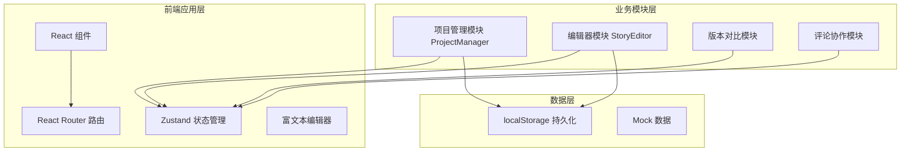
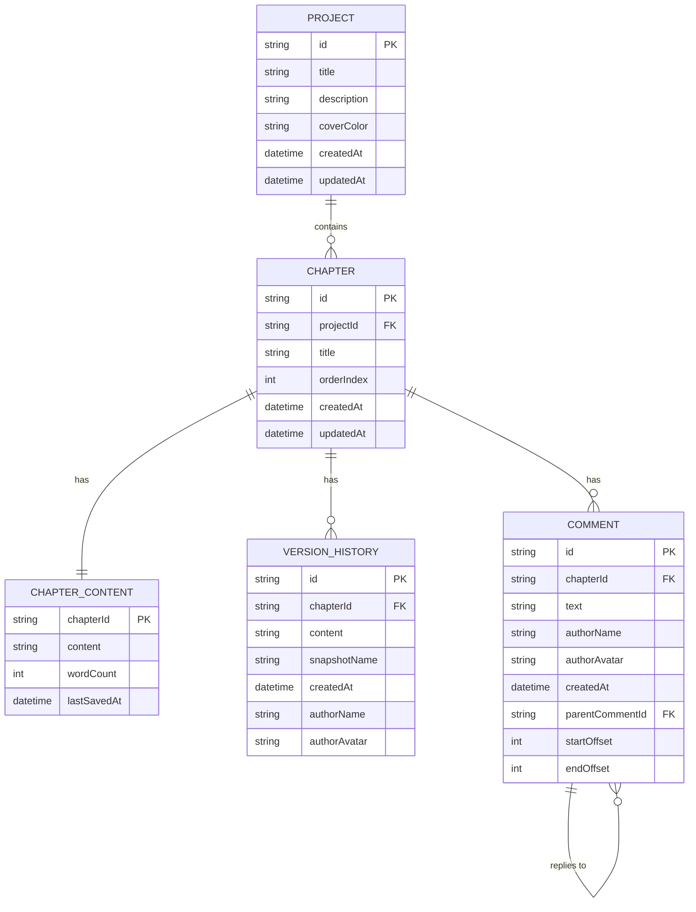

## 1. 架构设计



## 2. 技术描述
- 前端框架：React@18 + TypeScript
- 构建工具：Vite
- 状态管理：Zustand
- 路由管理：react-router-dom@6
- 唯一ID生成：uuid
- 图标库：lucide-react
- 样式方案：Tailwind CSS 3 + CSS变量
- 数据持久化：localStorage
- 后端：无（纯前端应用，本地存储）
- 数据库：无（使用localStorage模拟）

## 3. 路由定义
| 路由 | 页面 | 说明 |
|------|------|------|
| / | 项目管理页 | 展示项目列表，新建/编辑/删除项目 |
| /project/:projectId | 写作编辑页 | 章节管理、富文本编辑、版本历史、评论 |

## 4. 数据模型

### 4.1 数据模型定义



### 4.2 TypeScript 类型定义

```typescript
interface Project {
  id: string;
  title: string;
  description: string;
  coverColor: string;
  createdAt: string;
  updatedAt: string;
}

interface Chapter {
  id: string;
  projectId: string;
  title: string;
  orderIndex: number;
  createdAt: string;
  updatedAt: string;
}

interface ChapterContent {
  chapterId: string;
  content: string;
  wordCount: number;
  lastSavedAt: string;
}

interface VersionHistory {
  id: string;
  chapterId: string;
  content: string;
  snapshotName: string;
  createdAt: string;
  authorName: string;
  authorAvatar: string;
}

interface Comment {
  id: string;
  chapterId: string;
  text: string;
  authorName: string;
  authorAvatar: string;
  createdAt: string;
  parentCommentId: string | null;
  startOffset: number;
  endOffset: number;
}

interface InkFlowStore {
  projects: Project[];
  currentProjectId: string | null;
  chapters: Chapter[];
  chapterContents: Record<string, ChapterContent>;
  versionHistories: VersionHistory[];
  comments: Comment[];
  
  // Actions
  setCurrentProject: (projectId: string | null) => void;
  createProject: (title: string, description: string) => Project;
  updateProject: (projectId: string, updates: Partial<Project>) => void;
  deleteProject: (projectId: string) => void;
  
  addChapter: (projectId: string, title: string) => Chapter;
  updateChapter: (chapterId: string, updates: Partial<Chapter>) => void;
  deleteChapter: (chapterId: string) => void;
  reorderChapters: (projectId: string, fromIndex: number, toIndex: number) => void;
  
  updateChapterContent: (chapterId: string, content: string) => void;
  createVersionSnapshot: (chapterId: string, snapshotName?: string) => VersionHistory;
  
  addComment: (chapterId: string, text: string, startOffset: number, endOffset: number, parentCommentId?: string) => Comment;
  deleteComment: (commentId: string) => void;
}
```

## 5. 文件结构

```
d:\P\tasks\auto94/
├── package.json
├── vite.config.js
├── tsconfig.json
├── index.html
├── .trae/documents/
│   ├── PRD-InkFlow.md
│   └── TechArch-InkFlow.md
└── src/
    ├── main.tsx
    ├── App.tsx
    ├── index.css
    ├── store/
    │   └── useInkFlowStore.ts
    ├── types/
    │   └── index.ts
    ├── utils/
    │   ├── diff.ts
    │   ├── debounce.ts
    │   └── mockData.ts
    ├── components/
    │   ├── ui/
    │   │   ├── Button.tsx
    │   │   ├── Modal.tsx
    │   │   ├── Input.tsx
    │   │   └── Textarea.tsx
    │   ├── ProjectCard.tsx
    │   ├── CreateProjectModal.tsx
    │   ├── ChapterTree.tsx
    │   ├── ChapterTreeItem.tsx
    │   ├── RichTextEditor.tsx
    │   ├── EditorToolbar.tsx
    │   ├── VersionHistoryPanel.tsx
    │   ├── VersionCompare.tsx
    │   └── CommentPanel.tsx
    ├── pages/
    │   ├── ProjectManager.tsx
    │   └── StoryEditor.tsx
    └── hooks/
        ├── useAutoSave.ts
        └── useDragDrop.ts
```

## 6. 性能优化策略

1. **编辑器输入延迟优化**：
   - 使用防抖（debounce）保存，延迟300ms
   - 内容更新采用不可变更新，避免不必要的重渲染
   - 编辑器使用contenteditable或轻量级富文本方案

2. **项目列表渲染优化**：
   - 使用React.memo优化项目卡片组件
   - 100个项目采用虚拟滚动（可选，视性能情况）
   - 图片懒加载

3. **状态管理优化**：
   - Zustand store采用选择器模式，避免全量重渲染
   - 章节内容和版本历史按需加载
   - localStorage读写异步化

4. **版本对比性能**：
   - 差异算法采用轻量级实现，避免大文本卡顿
   - 对比结果采用懒渲染
