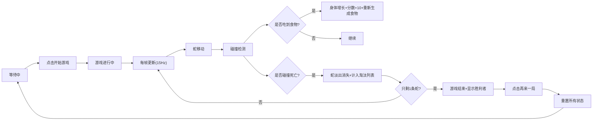

## 1. 产品概述

SlitherArena是一款轻量级多人贪吃蛇对战游戏，专为线上朋友聚会设计，无需下载安装，即开即玩。解决了现有多人联机游戏过于复杂或需要安装的痛点，提供简单有趣的即时对战体验。

- **核心目标**：提供即开即玩的多人贪吃蛇对战体验
- **目标用户**：线上聚会的朋友群体
- **市场价值**：填补轻量级多人即时对战小游戏的空白

## 2. 核心功能

### 2.1 用户角色

| 角色 | 参与方式 | 核心权限 |
|------|---------|---------|
| 人类玩家 | 方向键控制 | 控制蛇移动、开始/结束游戏 |
| AI玩家 | 自动控制 | 随机转向、自动移动、参与对战 |

### 2.2 功能模块

1. **游戏主界面**：标题显示、游戏画布、排行榜、控制按钮
2. **蛇逻辑系统**：移动、转向、身体增长、碰撞检测
3. **游戏循环系统**：15FPS帧更新、食物生成、分数管理
4. **渲染系统**：Canvas绘制蛇、食物、网格、动画效果
5. **HUD界面**：玩家榜、得分区、淘汰列表、游戏控制按钮

### 2.3 页面详情

| 页面名称 | 模块名称 | 功能描述 |
|---------|---------|----------|
| 游戏主页 | 标题区域 | 显示"SlitherArena"游戏标题，像素字体 |
| 游戏主页 | 游戏画布 | 800x800 Canvas，绘制蛇、食物、网格 |
| 游戏主页 | 排行榜 | 左侧显示玩家排名，按分数降序，存活/淘汰颜色区分 |
| 游戏主页 | 控制区域 | 开始/结束游戏按钮，游戏状态显示 |
| 游戏主页 | 得分区 | 底部中央显示当前玩家分数 |
| 游戏主页 | 淘汰列表 | 右侧显示已淘汰玩家 |

## 3. 核心流程

## 4. 用户界面设计

### 4.1 设计风格

- **主色调**：纯黑背景#0A0A0A，深灰画布#1A1A2E
- **强调色**：霓虹绿#00FF00（边框、食物），金色#FFD700（分数），红色#FF4444（淘汰）
- **按钮风格**：绿色圆角8px，白色文字，hover效果
- **字体**：标题使用Press Start 2P像素字体，正文使用系统无衬线字体
- **布局**：桌面端三栏布局（左-排行榜，中-画布，右-淘汰列表），移动端自适应
- **视觉效果**：霓虹发光边框、食物发光效果、死亡淡出动画

### 4.2 页面设计概述

| 页面名称 | 模块名称 | UI元素 |
|---------|---------|--------|
| 游戏主页 | 标题区域 | Press Start 2P字体，32px，白色，居中，阴影效果 |
| 游戏主页 | 游戏画布 | 800x800px，深灰背景，霓虹绿边框带发光，网格线 |
| 游戏主页 | 排行榜 | 200px宽，深色背景#111827，圆角12px，1px边框，内边距16px |
| 游戏主页 | 控制按钮 | 绿色#22C55E，圆角8px，白色文字，右上对齐 |
| 游戏主页 | 得分显示 | 金色#FFD700，24px，底部中央 |
| 游戏主页 | 淘汰列表 | 红色#FF4444字体，右对齐 |

### 4.3 响应式设计

- **桌面端**（≥1100px）：三栏布局，排行榜在左，淘汰列表在右，画布居中
- **平板端**（<1100px）：排行榜移至画布下方，标题缩小至24px
- **小屏端**：画布缩小至600x600px，食物和蛇尺寸按比例缩放
- **触控优化**：按钮最小尺寸44x44px，便于触控

### 4.4 动画效果

- **食物出现**：0.2秒缩放动画（从0到1）
- **蛇死亡**：0.3秒ease-out淡出动画
- **排行榜新增**：0.2秒从上方滑入
- **按钮hover**：背景色加深，轻微缩放
