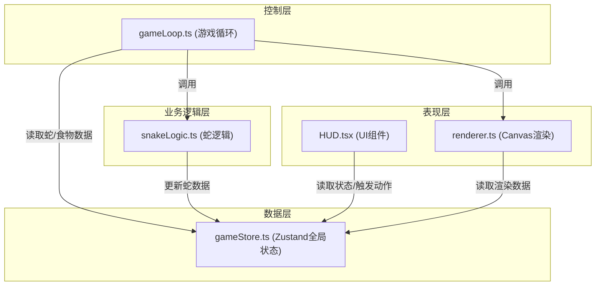

## 1. 架构设计



## 2. 技术描述

- **前端框架**：React@18 + TypeScript
- **构建工具**：Vite（端口3000）
- **状态管理**：Zustand
- **唯一标识**：uuid
- **渲染技术**：Canvas 2D + OffscreenCanvas优化
- **字体**：Google Fonts - Press Start 2P
- **包管理器**：npm

## 3. 文件结构

```
d:\P\tasks\auto95\
├── index.html                    # 入口HTML
├── package.json                  # 依赖配置
├── vite.config.js               # Vite配置
├── tsconfig.json                # TypeScript配置
└── src/
    ├── main.tsx                 # React入口
    ├── App.tsx                  # 根组件
    ├── gameStore.ts             # Zustand全局状态
    ├── snakeLogic.ts            # 蛇逻辑模块
    ├── gameLoop.ts              # 游戏循环模块
    ├── renderer.ts              # Canvas渲染模块
    ├── HUD.tsx                  # HUD UI组件
    └── types.ts                 # 类型定义
```

### 模块职责与调用关系

| 文件 | 职责 | 输入 | 输出 | 被调用方 |
|------|------|------|------|---------|
| [gameStore.ts](file:///d:/P/tasks/auto95/src/gameStore.ts) | 全局状态管理 | 蛇移动/碰撞/食物数据 | 蛇数组/食物数组/游戏阶段 | HUD、gameLoop、snakeLogic |
| [snakeLogic.ts](file:///d:/P/tasks/auto95/src/snakeLogic.ts) | 蛇移动/转向/碰撞/增长 | store中的蛇数据 | 新坐标/存活状态 | gameLoop |
| [gameLoop.ts](file:///d:/P/tasks/auto95/src/gameLoop.ts) | 15FPS帧更新/食物生成 | store状态 | 触发更新/渲染 | HUD（按钮触发） |
| [renderer.ts](file:///d:/P/tasks/auto95/src/renderer.ts) | Canvas绘制 | 蛇/食物数据 | 画面渲染 | gameLoop |
| [HUD.tsx](file:///d:/P/tasks/auto95/src/HUD.tsx) | 界面渲染/用户交互 | store状态 | 开始/结束动作 | store、renderer |

### 数据流向

```
用户输入 → HUD.tsx → gameStore.ts → gameLoop.ts
                                         ↓
                                  snakeLogic.ts → 更新store
                                         ↓
                                  renderer.ts → 绘制画面
```

## 4. 核心数据结构

### 4.1 类型定义

```typescript
// 方向枚举
type Direction = 'up' | 'down' | 'left' | 'right';

// 坐标点
interface Point {
  x: number;
  y: number;
}

// 蛇数据
interface Snake {
  id: string;
  name: string;
  body: Point[];
  direction: Direction;
  alive: boolean;
  score: number;
  color: string;
  isPlayer: boolean;
  deathOpacity?: number; // 死亡动画透明度
}

// 食物数据
interface Food {
  id: string;
  position: Point;
  scale: number; // 出现动画缩放比例
}

// 游戏阶段
type GameStage = 'waiting' | 'playing' | 'ended';

// 游戏状态
interface GameState {
  snakes: Snake[];
  foods: Food[];
  gameStage: GameStage;
  winnerId: string | null;
}
```

### 4.2 调色板

8色预设调色板（每条蛇分配一个）：
- #FF0000 (红)
- #00FF00 (绿)
- #0000FF (蓝)
- #FFFF00 (黄)
- #FF00FF (品红)
- #00FFFF (青)
- #FFA500 (橙)
- #FF69B4 (粉)

## 5. 性能约束实现

### 5.1 游戏循环稳定性
- 使用`requestAnimationFrame`驱动
- 每帧检查时间戳，确保15Hz（≈66.67ms间隔）
- 允许±10%波动（13.5-16.5 FPS）

### 5.2 计算优化
- AI转向计算：每2-3秒随机改变方向，而非每帧
- 碰撞检测：仅检测蛇头与其他蛇身体的碰撞
- 总耗时约束：每帧逻辑计算≤5ms

### 5.3 渲染优化
- 使用OffscreenCanvas进行离屏渲染
- 脏矩形检测：仅在蛇/食物状态变化时重绘
- 缓存静态元素：网格线预渲染

## 6. 关键算法

### 6.1 蛇移动算法
```
新蛇头 = 当前蛇头 + 方向向量
新身体 = [新蛇头, ...原身体.slice(0, -1)]
如果吃到食物：新身体 = [...新身体, 原身体最后一个]
```

### 6.2 碰撞检测
```
边界碰撞：蛇头x < 0 || x >= 800 || y < 0 || y >= 800
身体碰撞：蛇头坐标与任何蛇的身体坐标重叠
```

### 6.3 食物生成
```
随机生成坐标(x, y)，其中：
  x ∈ [0, 780], step 20
  y ∈ [0, 780], step 20
检查是否与任何蛇身体重叠，重叠则重新生成
```

### 6.4 AI转向逻辑
```
每2000-3000ms随机触发：
  可转向方向 = 所有方向排除反向
  随机选择一个可转向方向
```
