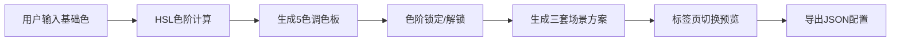

## 1. 产品概述

ColorMaster 是一款面向插画师和设计师的智能色彩工具，帮助用户快速生成色彩协调的品牌色板，并根据色板自动生成不同场景下的UI配色方案。解决设计师在为品牌或项目配色时反复手动调整、难以确保多场景色彩一致性以及缺乏灵感的问题。

- 核心价值：一键生成专业级色彩方案，确保跨场景色彩一致性，提升设计效率
- 目标用户：插画师、UI设计师、品牌设计师、前端开发者

## 2. 核心 Features

### 2.1 功能模块

1. **主色板创建模块**：基础颜色输入、5色阶调和色板自动生成、色块点击复制
2. **场景方案生成模块**：浅色模式、深色模式、毛玻璃模式三套配色方案自动生成
3. **实时预览与切换模块**：标签页切换、CSS过渡动画、全页面颜色平滑过渡
4. **色板锁存与导出模块**：色阶锁定功能、JSON格式导出、一键复制到剪贴板

### 2.2 页面详情

| 页面名称 | 模块名称 | 功能描述 |
|-----------|-------------|---------------------|
| 主页面 | 顶部导航栏 | 应用Logo、基础颜色输入框 |
| 主页面 | 左侧色板面板 | 5个色阶色块展示、锁定按钮、悬停动效 |
| 主页面 | 右侧预览区域 | 标签页切换、三种场景UI卡片预览、配色示例 |
| 主页面 | 导出功能 | 右下角导出按钮、JSON生成与复制 |

## 3. 核心流程

用户输入基础十六进制颜色 → 系统基于HSL自动生成5个色阶 → 展示色板并支持锁定特定色阶 → 自动生成三套场景配色方案 → 用户通过标签页切换预览 → 点击导出获取完整JSON配置

## 4. 用户界面设计

### 4.1 设计风格

- **主色调**：顶部导航 #1E293B，强调色由用户输入的基础色动态生成
- **按钮风格**：Neumorphism 新拟态风格，内阴影（inset 0 2px 4px rgba(0,0,0,0.2)）+ 外阴影（0 4px 8px rgba(0,0,0,0.1)）
- **字体**：现代无衬线字体，标题 weight 600，正文 weight 400
- **布局风格**：两栏布局，左侧固定320px色板面板，右侧自适应预览区
- **动效风格**：0.4秒CSS过渡动画，平滑颜色切换，悬停缩放效果

### 4.2 页面设计概述

| 页面名称 | 模块名称 | UI Elements |
|-----------|-------------|-------------|
| 主页面 | 顶部导航栏 | 80px高深色背景，白色Logo（30px, weight 600），圆角8px颜色输入框 |
| 主页面 | 色板面板 | 垂直排列5个色块（100%宽，48px高，圆角4px），悬停放大102%，金色锁定图标 |
| 主页面 | 预览区域 | 标签页切换（浅色/深色/毛玻璃），卡片圆角12px，内边距24px，阴影0 8px 30px rgba(0,0,0,0.12) |
| 主页面 | 导出按钮 | 右下角固定位置，Neumorphism风格 |

### 4.3 响应式设计

- **桌面端**：两栏布局，左侧320px固定面板，右侧自适应
- **移动端**（<768px）：左侧面板折叠为顶部横向色板，预览区占满宽度
- **触摸优化**：色块点击区域扩大，按钮最小尺寸48px

## 5. 性能要求

- 配色计算和界面渲染：≤80ms
- 过渡动画：0.4秒平滑过渡，无卡顿
- 色板锁定状态更新：实时响应，无延迟
