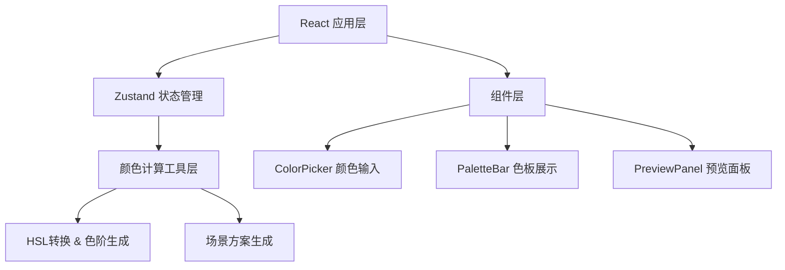

## 1. 架构设计



## 2. 技术描述

- **前端框架**：React@18 + TypeScript
- **构建工具**：Vite
- **状态管理**：Zustand
- **工具库**：uuid
- **不使用额外UI库**，所有组件原生实现

## 3. 项目文件结构

```
d:\P\tasks\auto97\
├── package.json
├── vite.config.js
├── tsconfig.json
├── index.html
└── src/
    ├── main.tsx
    ├── App.tsx
    ├── store.ts
    ├── utils/
    │   └── colorUtils.ts
    └── components/
        ├── ColorPicker.tsx
        ├── PaletteBar.tsx
        └── PreviewPanel.tsx
```

## 4. 数据模型

### 4.1 色板数据结构

```typescript
interface PaletteColor {
  hex: string;
  hsl: { h: number; s: number; l: number };
  locked: boolean;
}

interface ThemeScheme {
  background: string;
  text: string;
  primary: string;
  secondary: string;
  accent: string;
  border: string;
}

interface AppState {
  baseColor: string;
  palette: PaletteColor[];
  currentMode: 'light' | 'dark' | 'glass';
  schemes: {
    light: ThemeScheme;
    dark: ThemeScheme;
    glass: ThemeScheme;
  };
}
```

## 5. 核心功能实现

### 5.1 色阶生成算法

1. 将输入的HEX颜色转换为HSL
2. 保持色相（H）不变，饱和度（S）保持90%以上
3. 亮度（L）从90%到10%均匀分布，生成5个色阶
4. 已锁定的色阶跳过重新计算

### 5.2 场景配色方案

- **浅色模式**：主色作为强调色，背景#FFFFFF，文字#1A1A1A
- **深色模式**：主色作为高亮色，背景#1E1E2E，文字#E0E0E0
- **毛玻璃模式**：主色作为叠加色，15px模糊渐变背景，16px圆角卡片

### 5.3 过渡动画实现

使用CSS变量管理主题颜色，切换时通过 `transition: all 0.4s ease` 实现平滑过渡。

## 6. 性能优化

- 颜色计算函数使用memoization缓存结果
- React.memo优化组件重渲染
- CSS变量实现主题切换，避免全量DOM更新
- 锁定状态变更使用局部状态更新
