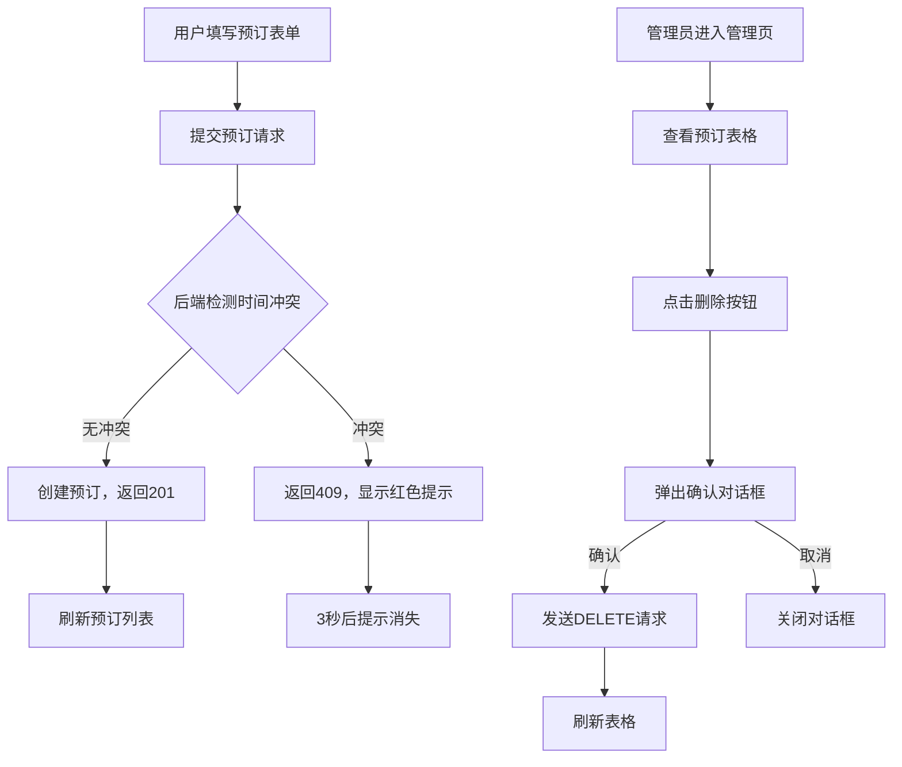

## 1. 产品概述
CoSpace是一个轻量级的共享办公资源在线预订与管理系统，解决工位预订、访客登记和会议室调度过程中的资源冲突和遗漏问题。
- 目标用户：共享办公空间的管理者和使用者
- 核心价值：通过数字化预订流程，避免纸质/表格方式造成的资源冲突，提升办公空间管理效率

## 2. 核心功能

### 2.1 用户角色
| 角色 | 注册方式 | 核心权限 |
|------|----------|----------|
| 普通用户 | 无需注册，填写用户名即可 | 预订工位/会议室、查看预订列表 |
| 管理员 | 无需注册 | 查看所有预订、取消任意预订 |

### 2.2 功能模块
1. **预订页面**：资源预订表单、预订列表卡片展示
2. **管理页面**：预订表格展示、取消预订功能
3. **全局功能**：深色模式切换、响应式布局

### 2.3 页面详情
| 页面名称 | 模块名称 | 功能描述 |
|----------|----------|----------|
| 预订页面 | 预订表单 | 选择资源类型（desk/room）、输入资源编号、用户名、时间段（15分钟间隔）、用途描述（100字限制） |
| 预订页面 | 预订卡片网格 | 按起始时间排序展示所有预订，资源类型彩色边框、emoji图标、时间段格式化显示 |
| 预订页面 | 冲突提示 | 资源冲突时显示红色提示条，3秒后自动消失 |
| 管理页面 | 预订表格 | 交替行背景色，列：资源类型、编号、用户名、时间段、用途、操作 |
| 管理页面 | 删除确认对话框 | 半透明遮罩、圆角卡片、确认/取消按钮 |

## 3. 核心流程
用户在预订页面填写表单→提交预订请求→后端检测资源时间冲突→若冲突返回409显示错误提示→成功则返回201并刷新预订列表。管理员在管理页面查看所有预订，点击删除按钮弹出确认框，确认后删除预订。

## 4. 用户界面设计
### 4.1 设计风格
- 主色调：蓝色#3B82F6（工位）、紫色#8B5CF6（会议室）
- 背景色：浅色#F3F4F6，深色#1F2937
- 按钮风格：圆角8px，表单元素统一圆角
- 字体：系统默认无衬线字体
- 布局风格：卡片式布局，固定顶部导航栏（64px高）
- 图标风格：使用emoji作为资源类型图标（desk用🖥️灰色，room用🏢蓝色）

### 4.2 页面设计概述
| 页面名称 | 模块名称 | UI元素 |
|----------|----------|--------|
| 预订页面 | 导航栏 | 左侧CoSpace Logo，右侧导航链接（预订/管理）+ 深色模式开关 |
| 预订页面 | 表单区 | 双列桌面布局/单列移动布局，输入框悬停变蓝、焦点蓝色阴影 |
| 预订页面 | 卡片网格 | CSS Grid，gap 16px，卡片宽280px高160px圆角12px，悬停上移3px scale 1.02 |
| 管理页面 | 预订表格 | 交替行背景（白色/#F9FAFB），红色删除按钮圆角8px |
| 全局 | 确认对话框 | 圆角12px，阴影0 8px 30px，半透明遮罩#00000080 |

### 4.3 响应式
- 桌面端（>768px）：表单双列布局，卡片网格每行3-4张
- 移动端（<768px）：表单单列布局，卡片网格每行1张
- 深色模式切换：右上角圆形按钮，月亮/太阳图标切换
