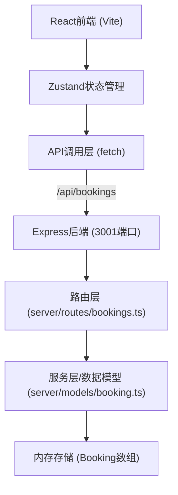
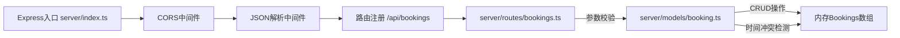
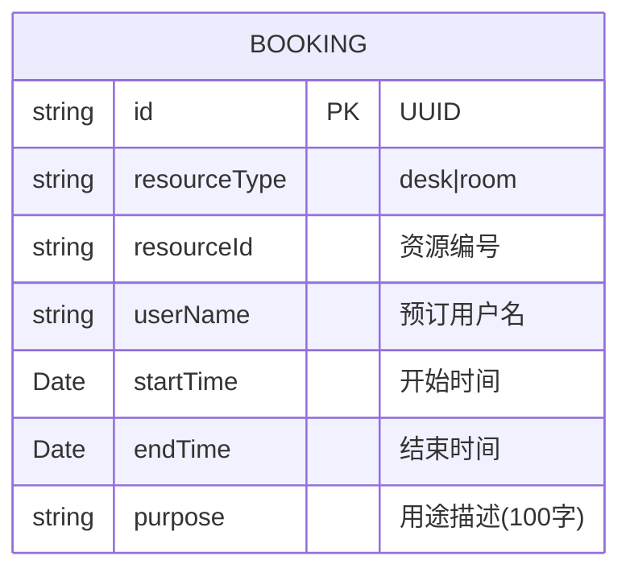
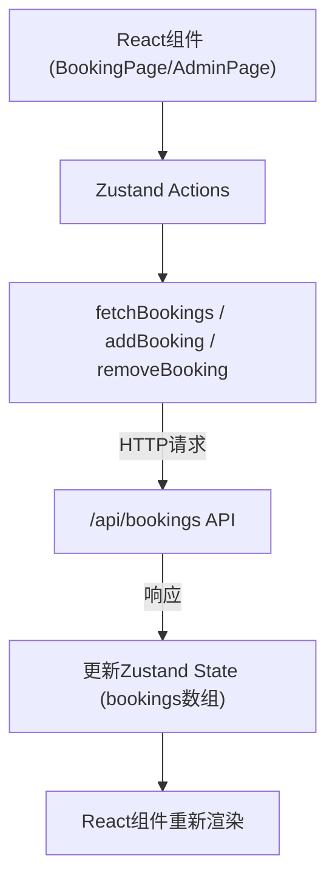

## 1. 架构设计



## 2. 技术说明
- 前端：React@18 + TypeScript + Vite + zustand + react-router-dom@6
- 初始化工具：Vite
- 后端：Express@4 + TypeScript + CORS + uuid
- 数据库：内存数组存储（无需数据库）
- 构建配置：Vite代理/api请求到后端3001端口

## 3. 路由定义
| 路由 | 用途 |
|------|------|
| / | 预订页面（BookingPage） |
| /admin | 管理页面（AdminPage） |

## 4. API定义

### 类型定义
```typescript
interface Booking {
  id: string;
  resourceType: 'desk' | 'room';
  resourceId: string;
  userName: string;
  startTime: Date;
  endTime: Date;
  purpose: string;
}
```

### API端点
| 方法 | 路径 | 请求体 | 响应 | 说明 |
|------|------|--------|------|------|
| POST | /api/bookings | {resourceType, resourceId, userName, startTime, endTime, purpose} | 201 {Booking} / 400 {error} / 409 {error} | 创建预订 |
| GET | /api/bookings | - | 200 Booking[] | 获取所有预订 |
| DELETE | /api/bookings/:id | - | 204 / 404 {error} | 取消预订 |

## 5. 服务端架构图



## 6. 数据模型

### 6.1 数据模型定义



### 6.2 冲突检测逻辑
- 同一资源（resourceType + resourceId）的时间段不能重叠
- 重叠条件：newStartTime < existingEndTime AND newEndTime > existingStartTime
- 若冲突返回409状态码和冲突时间段描述

## 7. 前端数据流向



## 8. 项目文件结构
```
auto98/
├── package.json
├── vite.config.js
├── tsconfig.json
├── index.html
├── server/
│   ├── index.ts          (Express入口，3001端口)
│   ├── routes/
│   │   └── bookings.ts   (路由处理，参数校验)
│   └── models/
│       └── booking.ts    (Booking接口，CRUD服务)
└── src/
    ├── main.tsx          (React入口)
    ├── store/
    │   └── bookingStore.ts (Zustand状态管理)
    └── pages/
        ├── BookingPage.tsx (预订页面)
        └── AdminPage.tsx   (管理页面)
```
