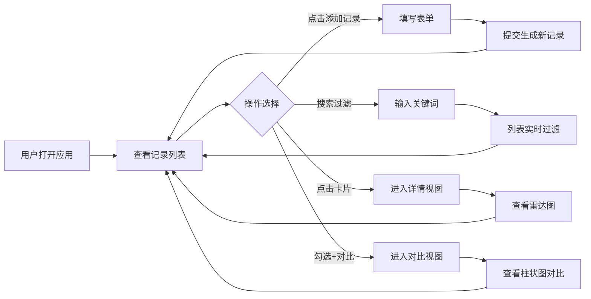

## 1. 产品概述

在线咖啡风味品鉴记录应用，为咖啡爱好者提供系统化的冲泡记录、风味描述、评分与可视化对比工具。帮助用户沉淀个人咖啡品鉴经验，通过数据可视化发现风味偏好，提升品鉴水平。

## 2. 核心功能

### 2.1 用户角色

| 角色 | 注册方式 | 核心权限 |
|------|---------|---------|
| 普通用户 | 无需注册，本地存储 | 录入、浏览、搜索、对比咖啡品鉴记录 |

### 2.2 功能模块

1. **记录列表页**：搜索过滤、卡片网格展示、多选对比、导航栏
2. **记录详情页**：左右分栏布局、静态信息展示、雷达图可视化
3. **添加记录表单**：风味标签多选、多维度评分、笔记录入
4. **对比视图**：多记录柱状图并排对比、数值标签

### 2.3 页面详情

| 页面名称 | 模块名称 | 功能描述 |
|---------|---------|---------|
| 记录列表页 | 搜索框 | 按咖啡名称、烘焙商、风味标签实时过滤，300ms淡入淡出过渡 |
| 记录列表页 | 卡片网格 | 响应式布局（4/2/1列），渐变色条装饰，悬浮动效，点击进入详情 |
| 记录列表页 | 多选对比 | 勾选最多4条记录，点击对比按钮跳转对比视图 |
| 记录列表页 | 导航栏 | 顶部固定，应用标题，添加记录按钮 |
| 记录详情页 | 左侧详情 | 咖啡名称、烘焙商、冲泡方式、风味标签、各维度评分、笔记、日期 |
| 记录详情页 | 右侧雷达图 | 酸度/醇厚度/余韵三维雷达图，半透明网格，hover动画和数值提示 |
| 添加记录表单 | 基础信息 | 咖啡名称、烘焙商、冲泡方式输入 |
| 添加记录表单 | 风味标签 | 从预设列表（花香、果香、坚果、巧克力、焦糖等）多选 |
| 添加记录表单 | 多维度评分 | 酸度(1-5)、醇厚度(1-5)、余韵(1-5)、整体评分(1-10) |
| 添加记录表单 | 笔记 | 自由文本记录品鉴感受 |
| 对比视图 | 柱状图 | 多条记录在酸度、醇厚度、余韵、整体评分上的并排柱状图，顶端数值标签 |

## 3. 核心流程

## 4. 用户界面设计

### 4.1 设计风格

- **主色调**：浅咖啡色 `#d4a574`（导航栏），深咖啡色 `#6b4226`（按钮和强调色）
- **背景色**：暖白色 `#faf3e0`（整体背景），纯白 `#ffffff`（卡片/表单区域）
- **文字色**：深棕色 `#4a3728`
- **评分渐变色**：红色（低分）→ 黄色 → 绿色（高分）
- **圆角**：卡片/表单 12px，按钮 8px
- **布局风格**：顶部导航 + 卡片网格，详情页左右分栏
- **动效**：卡片悬浮上移8px+加深阴影，搜索过滤300ms淡入淡出，所有交互100ms内响应

### 4.2 页面设计概述

| 页面名称 | 模块名称 | UI元素 |
|---------|---------|--------|
| 记录列表页 | 导航栏 | 浅咖啡色背景，深咖啡色按钮，悬浮变亮+轻微放大 |
| 记录列表页 | 搜索框 | 圆角输入框，带搜索图标，实时过滤 |
| 记录列表页 | 卡片 | 渐变顶色条，白色背景，浅阴影，悬浮上移动效，勾选框 |
| 记录列表页 | 对比按钮 | 仅在有勾选时显示，与添加按钮风格一致 |
| 记录详情页 | 左侧面板 | 分块展示信息，评分用进度条或星级显示 |
| 记录详情页 | 右侧雷达图 | 半透明填充，鲜明边框，数据点高亮 |
| 添加记录表单 | 表单字段 | 标签+输入/选择器，垂直布局，合理间距 |
| 添加记录表单 | 风味标签 | 标签式多选，选中状态有背景色变化 |
| 对比视图 | 柱状图 | 每组不同颜色，顶端数值，图例清晰 |

### 4.3 响应式

- **宽屏 (>1024px)**：网格每行4张卡片，详情页左右分栏
- **中屏 (768-1024px)**：网格每行2张卡片，详情页仍左右分栏但比例调整
- **窄屏 (<768px)**：网格每行1张卡片，导航栏收缩为汉堡菜单，详情页上下堆叠
