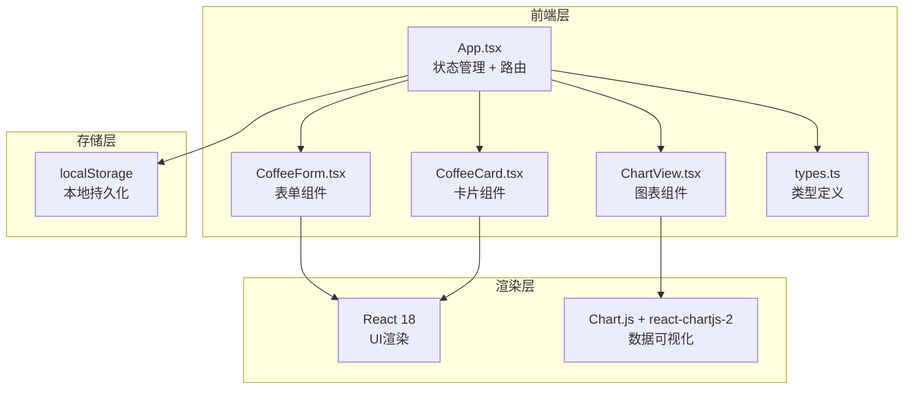
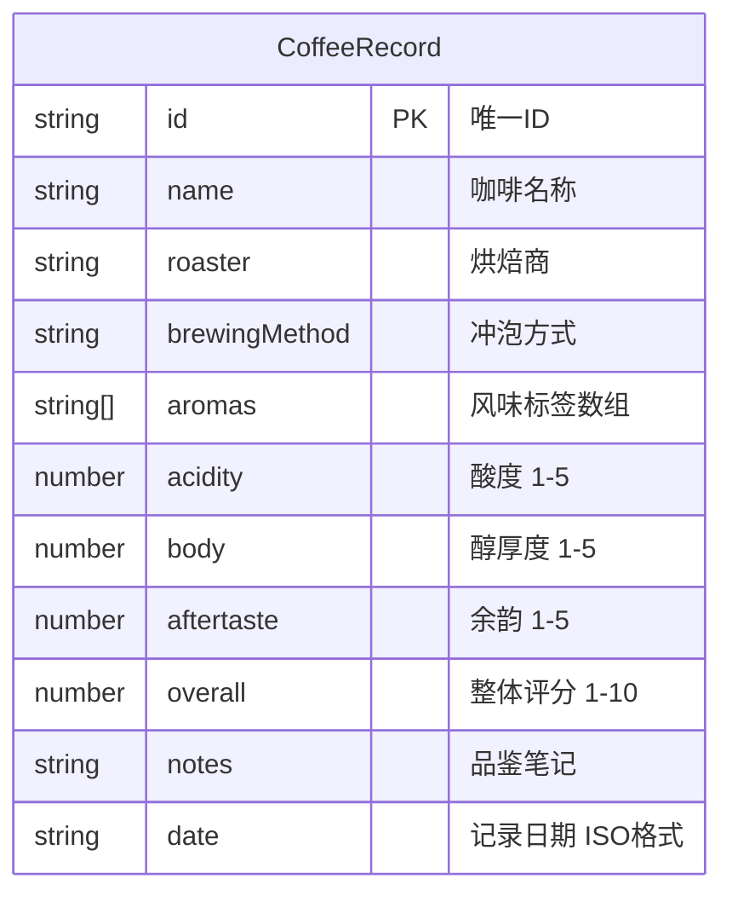

## 1. 架构设计



## 2. 技术描述

- **前端框架**：React 18 + TypeScript
- **构建工具**：Vite（开发服务器端口3000）
- **数据可视化**：Chart.js 4.x + react-chartjs-2 5.x
- **唯一标识**：uuid 9.x
- **状态管理**：React useState/useEffect（应用规模较小，无需额外状态库）
- **路由方案**：条件渲染 + URL Hash（轻量，无需 react-router-dom）
- **数据持久化**：localStorage
- **样式方案**：CSS Modules / 原生CSS（样式内聚，避免全局污染）

## 3. 路由/视图定义

| 视图 | 触发条件 | 渲染内容 |
|------|---------|---------|
| 列表视图 | 默认 / `view=list` | 导航栏 + 搜索框 + 卡片网格 + 对比按钮 |
| 详情视图 | `view=detail&id=xxx` | 导航栏 + 左右分栏（详情 + 雷达图） |
| 添加视图 | `view=add` | 导航栏 + 添加表单 |
| 对比视图 | `view=compare&ids=xxx,yyy` | 导航栏 + 柱状图对比 |

## 4. 数据模型

### 4.1 数据模型定义



### 4.2 TypeScript 类型定义

```typescript
export interface CoffeeRecord {
  id: string;
  name: string;
  roaster: string;
  brewingMethod: string;
  aromas: string[];
  acidity: number;
  body: number;
  aftertaste: number;
  overall: number;
  notes: string;
  date: string;
}

export type ViewType = 'list' | 'detail' | 'add' | 'compare';

export const AROMA_OPTIONS = [
  '花香', '果香', '坚果', '巧克力', '焦糖',
  '柑橘', '浆果', '焦糖', '木质', '草本',
  '香料', '蜂蜜', '奶油', '烟熏', '发酵'
] as const;

export const BREWING_METHODS = [
  '手冲', '意式浓缩', '法压壶', '摩卡壶',
  '爱乐压', '虹吸壶', '冷萃', '胶囊'
] as const;
```

## 5. 性能优化方案

| 优化点 | 方案 | 目标 |
|--------|------|------|
| 图表渲染 | Chart.js 原生 Canvas 渲染，避免不必要的重绘 | ≥55fps |
| 搜索过滤 | useMemo 缓存过滤结果，防抖输入 | ≤150ms 响应 |
| 动画过渡 | CSS transition/opacity，避免 layout thrash | 60fps |
| 列表性能 | 卡片数量预计 <100，无需虚拟滚动 | 直接渲染 |
| 状态管理 | 状态提升至 App，局部状态下沉至组件 | 最小化重渲染 |

## 6. 文件结构

```
auto10/
├── package.json
├── index.html
├── tsconfig.json
├── vite.config.js
└── src/
    ├── App.tsx           # 主组件：状态管理、路由切换、布局
    ├── types.ts          # 类型定义：CoffeeRecord、常量
    ├── CoffeeForm.tsx    # 表单组件：录入新记录
    ├── CoffeeCard.tsx    # 卡片组件：单条记录展示
    ├── ChartView.tsx     # 图表组件：雷达图 + 柱状图
    └── styles/
        └── App.css       # 全局样式
```
