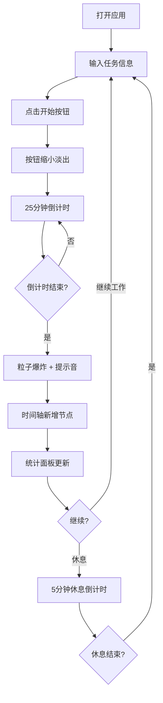

## 1. 产品概述

基于时间片和番茄工作法的个人效率看板应用，帮助用户以25分钟专注+5分钟休息的节奏管理工作与学习节奏。每次完成番茄钟后自动在时间轴记录节点，并通过甘特图/折线图展示每日任务分布与累计时长，实现可视化时间管理。

- 目标用户：需要专注工作、学习时间管理的个人用户
- 核心价值：将抽象的时间投入转化为可视化的成就记录，形成正向反馈循环

## 2. 核心功能

### 2.1 用户角色

| 角色 | 注册方式 | 核心权限 |
|------|----------|----------|
| 个人用户 | 无需注册 | 使用全部功能，数据本地存储 |

### 2.2 功能模块

1. **主页面**：圆形倒计时器、开始/暂停按钮、任务输入、番茄钟序号提示
2. **时间轴区域**：水平滚动时间线、番茄钟记录标签、悬停详情卡片
3. **统计面板**：每小时番茄钟数量折线图、十字辅助线、数据点交互

### 2.3 页面详情

| 页面名称 | 模块名称 | 功能描述 |
|----------|----------|----------|
| 主页面 | 圆形倒计时器 | 25分钟倒计时，外圈渐变弧线（红→绿）指示剩余时间，数字显示分/秒（monospace 48px），鼠标悬停显示番茄钟序号 |
| 主页面 | 控制区 | 开始按钮点击后平滑缩小淡出，倒计时开始；完成后粒子爆炸动画+Web Audio提示音 |
| 主页面 | 任务输入 | 用户输入任务名称和描述，选择任务类型（工作/学习/运动），添加心情评分 |
| 主页面 | 时间轴 | 倒计时下方水平滚动时间线，展示当天所有番茄钟记录，圆角标签含完成时间和任务名 |
| 主页面 | 时间轴详情 | 标签悬停时右侧滑入毛玻璃详情卡片，含任务描述、时长、心情评分 |
| 主页面 | 统计面板 | 右侧折线图显示每小时番茄钟数量，面积填充渐变，十字辅助线，点击数据点弹出详情列表 |

## 3. 核心流程

用户打开应用 → 输入任务名称和类型 → 点击开始按钮 → 按钮缩小淡出，倒计时开始 → 25分钟结束 → 粒子爆炸动画+提示音 → 时间轴新增标签节点 → 统计面板数据更新 → 用户可选择继续下一个番茄钟或休息5分钟

## 4. 用户界面设计

### 4.1 设计风格

- 主色调：深蓝紫色渐变背景（#0f0c29 → #302b63 → #24243e）
- 强调色：红色到绿色渐变（计时弧线），任务类型色（蓝色工作、绿色学习、橙色运动）
- 按钮风格：圆角胶囊按钮，点击时缩放+淡出过渡
- 字体：monospace 用于倒计时数字（48px），正文使用无衬线字体
- 布局：左侧主区域（计时器+时间轴），右侧统计面板
- 图标：lucide-react 图标库
- 动画：弧线进度、粒子爆炸、详情卡片滑入、按钮状态过渡

### 4.2 页面设计概览

| 页面名称 | 模块名称 | UI元素 |
|----------|----------|--------|
| 主页面 | 圆形倒计时器 | 直径300px圆形，深色半透明背景，渐变弧线外圈，中心monospace 48px数字，悬停tooltip显示序号 |
| 主页面 | 任务输入区 | 圆角输入框+类型选择+心情评分滑块，半透明毛玻璃背景 |
| 主页面 | 开始按钮 | 胶囊形按钮，点击后transform: scale(0) + opacity: 0过渡 |
| 主页面 | 时间轴 | 水平滚动容器，圆角小标签（蓝/绿/橙），包含时间和任务名 |
| 主页面 | 详情卡片 | 毛玻璃背景（backdrop-filter: blur(8px)），从右侧滑入动画 |
| 主页面 | 统计面板 | 折线图+面积填充渐变（底部透明→顶部淡蓝），数据点4px圆形标记，十字辅助线 |

### 4.3 响应式设计

- 桌面优先设计，主区域与统计面板并排布局
- 中等屏幕时统计面板移至底部
- 小屏幕时时间轴标签缩小，统计面板折叠

### 4.4 3D场景指引

不适用
