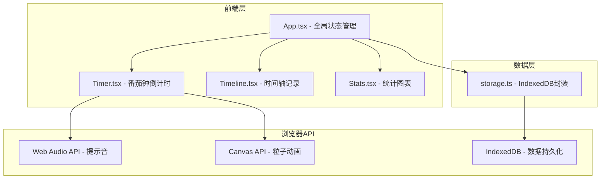
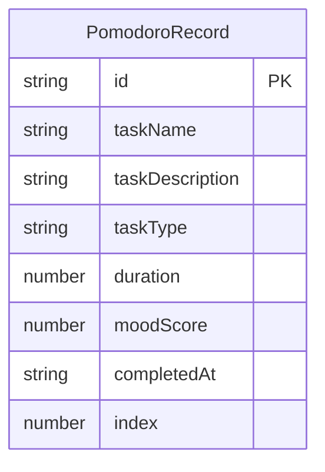

## 1. 架构设计



## 2. 技术说明

- 前端：React 18 + TypeScript + Vite
- 初始化工具：vite-init (react-ts 模板)
- 状态管理：zustand
- 样式：Tailwind CSS
- 图表：recharts
- 数据持久化：IndexedDB（idb库封装）
- 后端：无（纯前端应用）
- 日期工具：date-fns
- ID生成：uuid

## 3. 路由定义

| 路由 | 用途 |
|------|------|
| / | 主页面，包含计时器、时间轴、统计面板 |

## 4. API定义

不适用（纯前端应用，无后端API）

## 5. 服务器架构图

不适用（纯前端应用）

## 6. 数据模型

### 6.1 数据模型定义



### 6.2 数据定义语言

IndexedDB 对象仓库定义：

```javascript
// 数据库名称：pomodoro-db
// 版本：1
// 对象仓库：pomodoros

const pomodoroStore = {
  name: "pomodoros",
  keyPath: "id",
  indexes: [
    { name: "completedAt", keyPath: "completedAt", options: { unique: false } },
    { name: "taskType", keyPath: "taskType", options: { unique: false } }
  ]
};

// 记录结构
interface PomodoroRecord {
  id: string;              // uuid
  taskName: string;        // 任务名称
  taskDescription: string; // 任务描述
  taskType: "work" | "study" | "exercise"; // 任务类型
  duration: number;        // 番茄钟时长（分钟）
  moodScore: number;       // 心情评分 1-5
  completedAt: string;     // 完成时间 ISO字符串
  index: number;           // 当天第几个番茄钟
}
```
