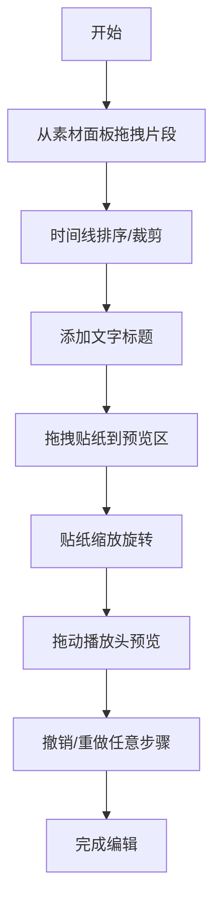

## 1. 产品概述

基于时间轴拖拽交互的短视频编辑工作台，用户可以在时间线上拖拽排列视频片段、添加文字标题和贴纸，并实时预览合成效果。

- 主要目的：提供直观高效的短视频编辑体验，支持片段拖拽排序、裁剪、文字叠加、贴纸装饰等核心功能
- 目标用户：短视频创作者、社交媒体内容制作者
- 产品价值：纯前端实现，无需后端服务，零部署成本，打开即用

## 2. 核心功能

### 2.1 功能模块

1. **素材面板**：预置视频片段库、贴纸库
2. **时间线编辑区**：片段拖拽排序、裁剪调整、标题标记、贴纸标记
3. **预览面板**：实时画面合成、播放控制、贴纸缩放旋转
4. **撤销/重做系统**：20步操作历史记录

### 2.2 页面详情

| 页面名称 | 模块名称 | 功能描述 |
|-----------|-------------|---------------------|
| 主工作台 | 素材面板 | 展示可拖拽的视频片段和贴纸，悬停上浮效果 |
| 主工作台 | 时间线区域 | 横向秒级时间轴，支持拖拽排序、裁剪、弹跳动画 |
| 主工作台 | 预览面板 | 800x500px实时预览，播放头同步，贴纸缩放旋转 |
| 主工作台 | 撤销/重做 | 右上角按钮，支持快捷键Ctrl+Z/Ctrl+Shift+Z |
| 主工作台 | 标题编辑器 | 点击片段弹出输入框，支持字体大小/颜色/对齐设置 |

## 3. 核心流程

用户从素材面板拖拽视频片段到时间线 → 调整片段顺序和裁剪 → 为片段添加文字标题 → 拖拽贴纸到预览区 → 缩放旋转贴纸 → 拖动播放头预览效果 → 可随时撤销/重做操作

## 4. 用户界面设计

### 4.1 设计风格

- 主色调：深色主题背景#1a1a2e，时间线暗蓝灰色#16213e
- 强调色：片段渐变#e94560→#0f3460，亮蓝选中色#00d2ff，亮黄标题#f5c518
- 按钮样式：半透明毛玻璃效果，backdrop-filter: blur(10px)
- 动画：所有交互过渡≤400ms，ease-in-out缓动，拖拽弹跳300ms
- 图标：SVG贴纸图标（星形、心形、箭头、爆炸、云朵）

### 4.2 页面设计概述

| 页面名称 | 模块名称 | UI元素 |
|-----------|-------------|-------------|
| 主工作台 | 素材面板 | 左侧栏，可拖拽卡片，悬停上浮2px+阴影加深 |
| 主工作台 | 时间线区域 | 底部区域，彩色渐变片段条，选中发光边框 |
| 主工作台 | 预览面板 | 右侧800x500px区域，底部毛玻璃播放控制栏 |
| 主工作台 | 撤销/重做 | 右上角按钮，按压缩放微动效 |

### 4.3 响应式设计

- 桌面端（≥1200px）：左右双栏布局（素材:预览 = 1:2），时间线在底部
- 中端（800-1200px）：预览区左侧，时间线右侧
- 移动端（<800px）：单列垂直布局

### 4.4 性能要求

- 拖拽交互≥50fps
- 预览合成≥30fps
- 撤销/重做响应≤100ms
