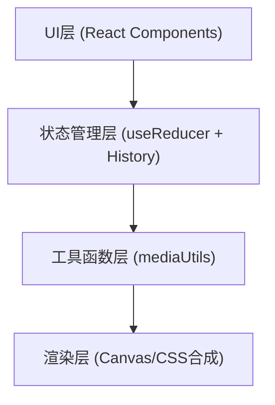

## 1. 架构设计

纯前端单页应用，无后端服务。



## 2. 技术说明

- 前端：React@18 + TypeScript + Vite
- 拖拽：@dnd-kit/core、@dnd-kit/sortable、@dnd-kit/utilities
- 唯一ID：uuid
- 初始化工具：Vite

## 3. 项目文件结构

| 文件路径 | 用途 |
|----------|------|
| package.json | 依赖配置和启动脚本 |
| index.html | 入口HTML页面 |
| tsconfig.json | TypeScript严格模式配置 |
| vite.config.js | Vite基础配置 |
| src/App.tsx | 主应用组件，全局状态管理，布局 |
| src/components/Timeline.tsx | 时间线组件，拖拽排序、缩放、裁剪 |
| src/components/PreviewPanel.tsx | 预览面板，画面合成、播放控制 |
| src/utils/mediaUtils.ts | 时间计算、片段渲染、canvas绘制 |

## 4. 数据模型

```typescript
interface VideoClip {
  id: string;
  name: string;
  color: string;
  duration: number;      // 原始时长(秒)
  startTime: number;      // 时间线起始位置
  trimIn: number;         // 入点裁剪偏移
  trimOut: number;        // 出点裁剪偏移
  title?: ClipTitle;
}

interface ClipTitle {
  text: string;
  fontSize: number;
  color: string;
  align: 'left' | 'center' | 'right';
}

interface Sticker {
  id: string;
  type: 'star' | 'heart' | 'arrow' | 'explosion' | 'cloud';
  startTime: number;
  duration: number;
  x: number;
  y: number;
  scale: number;
  rotation: number;
}

interface EditorState {
  clips: VideoClip[];
  stickers: Sticker[];
  currentTime: number;
  isPlaying: boolean;
  selectedClipId: string | null;
}

interface HistoryState {
  past: EditorState[];
  present: EditorState;
  future: EditorState[];
}
```

## 5. 核心模块说明

### 5.1 Timeline组件
- 使用@dnd-kit/sortable实现片段拖拽排序
- 左右两端裁剪手柄，mousedown→mousemove→mouseup事件链
- 片段选中状态：亮蓝色边框+发光效果
- 拖拽时300ms弹跳动画

### 5.2 PreviewPanel组件
- Canvas 2D API实时合成当前帧
- 播放头通过requestAnimationFrame驱动
- 贴纸支持：鼠标滚轮缩放、旋转手柄拖拽旋转
- 播放控制栏：backdrop-filter毛玻璃效果，图标旋转切换动画

### 5.3 撤销/重做系统
- useReducer + HistoryState模式
- 最多保存20步历史
- Ctrl+Z / Ctrl+Shift+Z快捷键监听
- 按钮按压缩放微动效
