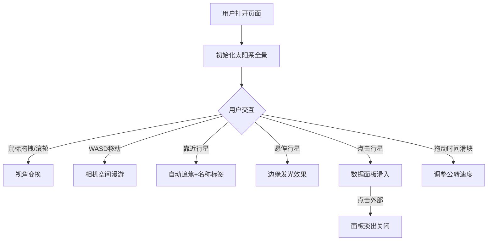

## 1. 产品概述
基于太阳系天体实时轨道的三维天文馆，用户可在浏览器中自由漫游太阳系，观察行星沿椭圆形轨道围绕太阳公转，体验沉浸式的宇宙探索。
- 面向天文爱好者、教育工作者和学生，提供直观的太阳系可视化体验
- 通过交互式3D场景帮助用户理解行星运动规律和天体物理参数

## 2. 核心功能

### 2.1 用户角色
无角色区分，所有用户均可使用全部功能

### 2.2 功能模块
1. **三维太阳系场景**: 太阳、九大行星及其轨道的实时渲染
2. **相机控制系统**: 鼠标拖拽旋转、滚轮缩放、WASD键盘漫游
3. **行星交互系统**: 悬停高亮、点击查看详情、自动追焦
4. **时间流速控制**: 滑块控制天体运动速度
5. **数据面板展示**: 行星详细物理参数的毛玻璃面板

### 2.3 页面详情
| 页面名称 | 模块名称 | 功能描述 |
|---------|---------|---------|
| 主场景 | 太阳系渲染 | 太阳发光效果、行星纹理、轨道环线、星空背景 |
| 主场景 | 相机控制 | 鼠标拖拽旋转、滚轮缩放、WASD移动、Shift加速、自动追焦 |
| 主场景 | 交互系统 | 行星悬停发光、点击显示数据面板、名称标签 |
| 主场景 | 时间控制 | 右上角滑块(0.1x-10x)控制公转速度 |
| 主场景 | 数据面板 | 底部滑入的毛玻璃面板，展示行星物理参数 |

## 3. 核心流程
用户打开页面 → 默认显示太阳系全貌 → 鼠标拖拽/滚轮缩放/WASD漫游探索 → 靠近行星自动追焦显示名称标签 → 悬停行星边缘发光 → 点击行星弹出数据面板 → 拖动时间滑块观察运动速度变化 → 点击面板外部关闭面板

## 4. 用户界面设计

### 4.1 设计风格
- 主色调：深空蓝黑色(#0a0a1a)背景，金色(#ffd700)太阳光源
- 行星材质：程序生成纹理（地球蓝绿带云、火星红褐、木星橙黄条纹等）
- 轨道线：半透明白色发光环线（透明度0.3）
- 数据面板：毛玻璃效果，rgba(0,0,0,0.7)背景，圆角16px
- 字体：白色无衬线字体，名称24px粗体，详情正文常规

### 4.2 页面设计概述
| 页面名称 | 模块名称 | UI元素 |
|---------|---------|-------|
| 主场景 | 太阳系渲染 | 金色发光太阳、彩色行星、白色轨道线、闪烁星点、深空背景 |
| 主场景 | 时间控制 | 右上角水平滑块，0.1x-10x范围，当前值显示 |
| 主场景 | 名称标签 | CSS2DRenderer白色14px标签，始终面向相机 |
| 主场景 | 数据面板 | 中央底部滑入，毛玻璃圆角，列表式参数展示 |

### 4.3 响应性
桌面端全屏Canvas，自适应窗口大小

### 4.4 3D场景指引
- 环境：深空蓝黑背景，半径500球壳内随机闪烁星星粒子
- 光照：太阳光点光源 + 环境光
- 相机：PerspectiveCamera，默认视角俯瞰整个太阳系，支持自由漫游和自动追焦
- 交互：拖拽旋转、滚轮缩放、WASD移动、行星点击/悬停
- 动画：行星公转/自转、太阳噪点流动、星星闪烁、面板滑入滑出
- 性能：Web Worker计算轨道，帧率低于45时自动降级纹理分辨率
