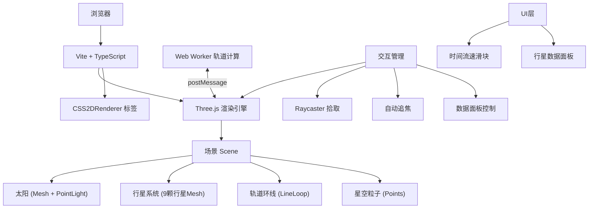

## 1. 架构设计



## 2. 技术描述
- 前端框架：原生 TypeScript
- 构建工具：Vite 5.x
- 3D渲染：Three.js 最新版
- 标签渲染：CSS2DRenderer (Three.js扩展)
- 并发：Web Worker 独立计算行星轨道
- 样式：内联CSS + DOM操作（无CSS框架）

## 3. 目录结构
```
.
├── package.json
├── index.html
├── tsconfig.json
├── vite.config.js
└── src/
    ├── main.ts                      # 应用入口
    ├── planets/
    │   └── PlanetSystem.ts          # 行星数据系统
    ├── renderers/
    │   └── SceneRenderer.ts         # 场景渲染模块
    ├── workers/
    │   └── OrbitWorker.ts           # 轨道计算Worker
    ├── interaction/
    │   └── InteractionManager.ts    # 交互管理
    └── ui/
        └── DataPanel.ts             # 数据面板UI
```

## 4. 数据模型

### 4.1 Planet 数据结构
```typescript
interface PlanetData {
  name: string;              // 行星名称
  color: number;             // 基础颜色
  radius: number;            // 模型半径
  orbitRadius: number;       // 轨道半径
  orbitSpeed: number;        // 公转角速度(弧度/时间单位)
  rotationSpeed: number;     // 自转角速度
  textureType: 'sun' | 'earth' | 'mars' | 'jupiter' | 'gas' | 'rocky' | 'ice';
  // 物理参数
  mass: string;              // 质量(科学计数法 kg)
  realRadius: number;        // 真实半径(km)
  orbitalPeriod: number;     // 公转周期(天)
  rotationPeriod: number;    // 自转周期(小时)
  satellites: number;        // 卫星数量
}
```

## 5. Worker通信协议
```typescript
// 主线程 → Worker
interface WorkerInput {
  time: number;              // 累计时间
  deltaTime: number;         // 帧间隔
  timeScale: number;         // 时间流速倍率
}

// Worker → 主线程
interface WorkerOutput {
  positions: Array<{ x: number; y: number; z: number }>;
  degradeTexture: boolean;   // FPS<45时降级纹理
}
```
