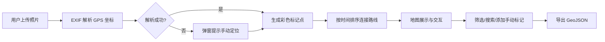

## 1. 产品概述

旅行照片地图应用是一款帮助用户将日常照片按照拍摄地点自动在地图上标记并生成旅行路线图的纯前端应用。主要解决旅行后照片散落各处、难以按地理位置浏览和回顾旅行轨迹的问题。

- 面向热爱旅行和摄影的用户群体，提供直观的地理化照片浏览体验
- 通过 EXIF 解析和交互式地图，将静态照片转化为生动的旅行故事

## 2. 核心功能

### 2.1 功能模块

1. **照片上传模块**：批量上传、EXIF 解析、手动定位补全
2. **地图展示模块**：Leaflet 地图、照片标记点、旅行路线、手动标记
3. **控制面板模块**：时间轴筛选、日期范围筛选、关键词搜索、GeoJSON 导出

### 2.2 页面详情

| 页面名称 | 模块名称 | 功能描述 |
|-----------|-------------|---------------------|
| 主界面 | 左侧照片面板 | 网格瀑布流展示缩略图，懒加载，悬停动效，定位状态指示 |
| 主界面 | 中间地图区域 | Leaflet 地图渲染，彩色标记点，毛玻璃弹窗，流动虚线路线动画 |
| 主界面 | 右侧控制面板 | 金色时间轴滑块、日期筛选、关键词搜索（防抖）、导出按钮 |
| 弹窗 | 手动定位对话框 | EXIF 解析失败时弹出，允许用户在地图上拖拽标记位置 |
| 弹窗 | 添加手动标记对话框 | 双击地图空白处弹出，输入名称和描述 |

## 3. 核心流程

用户上传照片 → 系统解析 EXIF 中的 GPS 坐标 → 成功解析的照片在地图上生成彩色标记点并按时间连线 → 用户可通过时间轴/日期/关键词筛选照片 → 用户可手动添加标记或修正失败的定位 → 导出 GeoJSON 文件

## 4. 用户界面设计

### 4.1 设计风格

- **主色调**：米白色 #faf8f5，金色 #d4a373，浅灰色 #e0dbd5
- **面板布局**：左侧 320px，右侧 280px，中间自适应
- **缩略图**：圆角 8px，悬停上移 4px 并加深阴影，过渡 0.2s
- **地图弹窗**：毛玻璃背景 backdrop-filter: blur(8px)
- **时间轴**：金色滑块，浅灰色未激活部分，渐变激活部分
- **标记点**：从照片左上角 8x8 区域取平均色生成圆形图标，手动标记中心带白色加号
- **路线**：蓝色到红色渐变，流动虚线动画（每帧偏移 2px）

### 4.2 页面设计概述

| 页面名称 | 模块名称 | UI 元素 |
|-----------|-------------|-------------|
| 主界面 | 左侧照片面板 | 瀑布流网格、缩略图懒加载、右上角定位图标、悬停动效 |
| 主界面 | 中间地图区域 | Leaflet 地图、彩色标记点、毛玻璃信息窗、流动虚线 |
| 主界面 | 右侧控制面板 | 时间轴滑块、日期输入框、关键词搜索框、导出按钮 |
| 弹窗 | 手动定位/添加标记 | 表单输入、地图预览、确认取消按钮 |

### 4.3 响应式设计

- 桌面端（>768px）：三栏横向布局（左-中-右）
- 移动端（≤768px）：垂直堆叠（缩略图在上、地图在中、控制面板在下）
- 移动端所有元素间距调整为 8px

### 4.4 性能要求

- 地图 200+ 标记点缩放/平移帧率 ≥ 50fps
- 照片缩略图懒加载，初始只加载视口内 10 张
- 关键词搜索防抖 300ms
- 标记点淡入淡出动画 300ms
