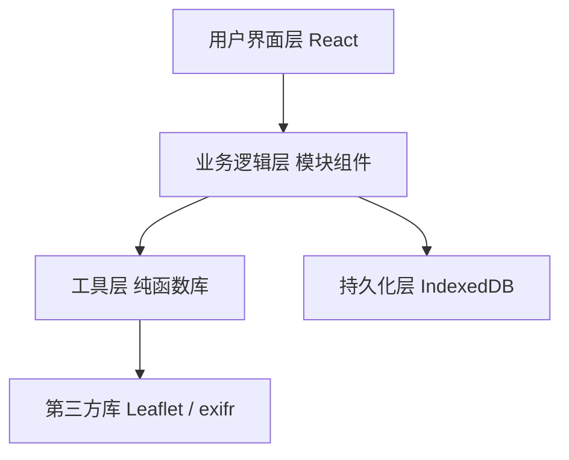
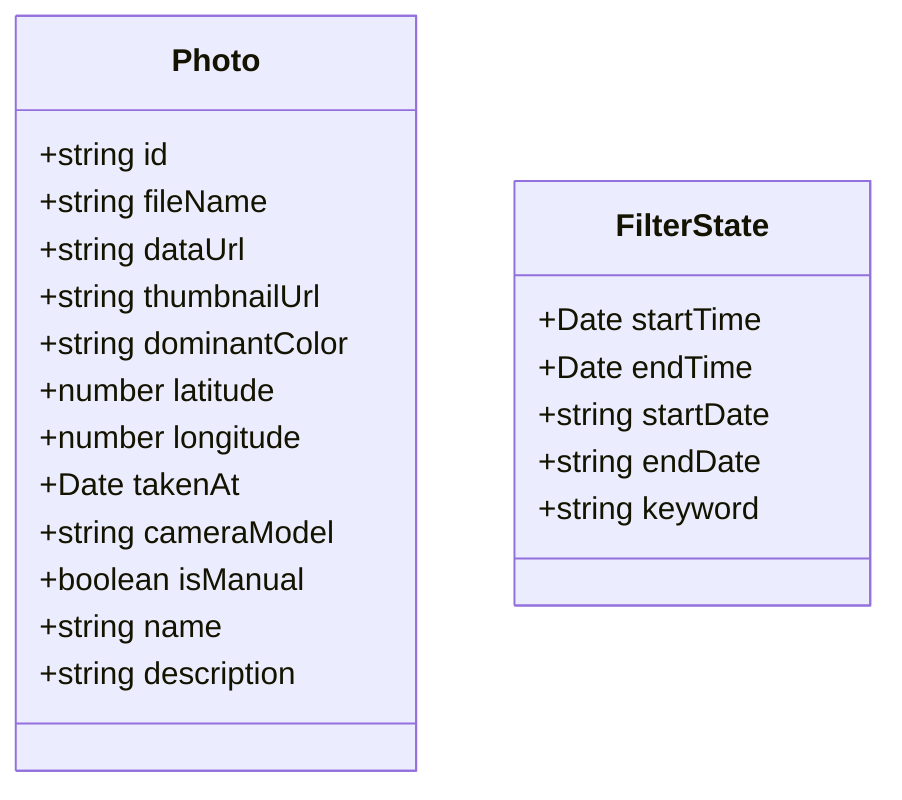

## 1. 架构设计



## 2. 技术栈说明

- **前端框架**：React 18 + TypeScript 严格模式
- **构建工具**：Vite，配置 resolve.alias 指向 src
- **地图库**：Leaflet + @types/leaflet
- **EXIF 解析**：exifr
- **日期处理**：date-fns
- **ID 生成**：uuid
- **持久化**：IndexedDB（前端浏览器本地存储）
- **启动脚本**：npm run dev

## 3. 项目文件结构

```
.
├── package.json
├── index.html
├── tsconfig.json
├── vite.config.js
└── src/
    ├── types.ts                    # Photo、Marker 等接口定义
    ├── App.tsx                     # 主组件，组合三个模块，管理全局状态
    ├── utils/
    │   └── geoJsonExporter.ts      # GeoJSON 生成与下载纯函数
    └── modules/
        ├── upload/
        │   └── PhotoUploader.tsx   # 照片上传、EXIF 解析、手动定位弹窗
        ├── map/
        │   └── MapRenderer.tsx     # Leaflet 地图初始化、标记点、路线管理
        └── control/
            └── ControlPanel.tsx    # 时间轴、筛选、搜索、导出按钮
```

## 4. 数据模型

### 4.1 核心接口定义（src/types.ts）



### 4.2 状态管理

- 使用 React `useState` + `useCallback` 进行模块间通信
- `App.tsx` 作为全局状态容器，持有 photos 列表和筛选条件
- 通过 props 和回调函数在三个模块间传递数据和事件

## 5. 核心模块职责

### 5.1 PhotoUploader 模块
- 接收 FileList，支持 jpg/png 批量上传
- 使用 exifr 解析 GPS 坐标、拍摄时间、相机型号
- 从照片左上角 8x8 区域提取平均主色调
- 解析失败时显示 Modal 弹窗，让用户在地图上手动拖拽标记位置
- 将成功解析的 Photo 对象通过 onPhotosAdded 回调传递给 App

### 5.2 MapRenderer 模块
- 初始化 Leaflet 地图实例
- 为每张 Photo 生成圆形标记点（使用 dominantColor 填充）
- 标记点点击弹出毛玻璃信息窗，显示缩略图和精确到秒的拍摄时间
- 按拍摄时间顺序连接相邻标记，生成蓝→红渐变色流动虚线路线
- 监听筛选条件变化，以 300ms 淡入淡出动画显示/隐藏标记
- 双击地图空白处触发添加手动标记对话框
- 暴露 addManualMarker 方法供上传模块调用

### 5.3 ControlPanel 模块
- 顶部：时间轴滑动条，范围从最早到最晚照片时间，拖动时实时筛选
- 中间：日期范围输入框 + 关键词搜索框（防抖 300ms）
- 搜索范围：文件名和 EXIF 相机型号
- 底部：导出按钮，调用 geoJsonExporter 生成并下载 GeoJSON 文件

### 5.4 geoJsonExporter 工具
- 纯函数：接收 Photo 数组，生成标准 GeoJSON FeatureCollection 字符串
- 每个 Photo 作为 Point Feature，包含全部元数据属性
- 路线作为 LineString Feature，按时间顺序串联所有点
- 使用 Blob + URL.createObjectURL 触发浏览器下载
