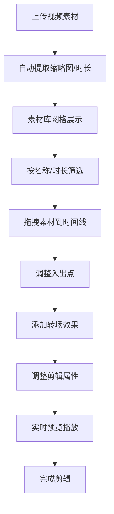

## 1. 产品概述

短视频素材自动化整理与剪辑应用，解决视频编辑过程中素材零散、手动拖拽效率低的问题，为内容创作者提供一站式素材管理和快速剪辑解决方案。

- 核心功能：素材库管理、时间线剪辑、转场效果、实时预览、属性编辑
- 目标用户：短视频创作者、自媒体运营者、视频剪辑爱好者
- 产品价值：提升剪辑效率300%，降低素材管理复杂度，实现创意快速落地

## 2. 核心功能

### 2.1 用户角色

| 角色 | 注册方式 | 核心权限 |
|------|----------|----------|
| 创作者 | 无需注册，本地使用 | 素材上传、剪辑编辑、导出预览 |

### 2.2 功能模块

1. **素材库面板**：视频上传、缩略图预览、网格展示、筛选过滤
2. **时间线编辑区**：拖拽剪辑、入出点调整、水平缩放、轨道管理
3. **转场效果模块**：淡入淡出、滑动、缩放三种预设转场
4. **预览播放器**：实时播放、进度拖拽、帧率稳定30fps+
5. **属性编辑面板**：裁切点调整、音量控制、播放速度调节

### 2.3 页面详情

| 页面名称 | 模块名称 | 功能描述 |
|---------|----------|----------|
| 主编辑页 | 素材库面板 | 支持MP4格式批量上传，自动提取缩略图和时长，网格视图展示，按名称/时长筛选，淡入淡出过渡 |
| 主编辑页 | 时间线编辑区 | 拖拽素材到轨道创建序列，拖动两端调整入出点，支持1帧到30秒水平缩放，刻度平滑过渡 |
| 主编辑页 | 转场效果模块 | 三种预设转场效果，拖拽应用到剪辑之间，半透明色块标记转场区域 |
| 主编辑页 | 预览播放器 | 实时播放时间线内容，进度条可拖拽跳转，帧率稳定30fps以上 |
| 主编辑页 | 属性编辑面板 | 调整选中剪辑的起始裁切点、音量(0-100%)、播放速度(0.5x-2x)，滑块带即时数值反馈 |

## 3. 核心流程

用户上传素材 → 筛选预览素材 → 拖拽素材到时间线 → 调整剪辑入出点 → 添加转场效果 → 调整剪辑属性 → 实时预览播放 → 完成剪辑

## 4. 用户界面设计

### 4.1 设计风格

- **主背景**：从#f5f7fa到#c3cfe2的垂直渐变
- **毛玻璃效果**：backdrop-filter: blur(10px) + 半透明背景
- **素材卡片**：轻微阴影，悬停时translateY(-4px) + box-shadow增强
- **时间线轨道**：深灰底色#2d3a4a，剪辑块用柔和蓝色系渐变
- **播放器控件**：半透明圆角设计，悬停透出完整颜色
- **配色方案**：
  - 主色：#4a90d9（柔和蓝）
  - 辅助色：#6bb3f0、#8fd3f4
  - 中性色：#2d3a4a、#f5f7fa、#c3cfe2
- **字体**：Inter 字体系列，标题16px semibold，正文14px regular，辅助文字12px light
- **动效**：所有过渡使用cubic-bezier(0.4, 0, 0.2, 1)，时长200ms

### 4.2 页面设计概述

| 页面名称 | 模块名称 | UI元素 |
|---------|----------|--------|
| 主编辑页 | 素材库面板 | 上传按钮、搜索框、筛选下拉、网格卡片、缩略图、时长标签、悬停动效 |
| 主编辑页 | 时间线编辑区 | 轨道区域、刻度标尺、剪辑块、拖拽手柄、缩放滑块、转场色块 |
| 主编辑页 | 预览播放器 | 视频画布、播放/暂停按钮、进度条、时间显示、音量控制 |
| 主编辑页 | 属性编辑面板 | 数值滑块、实时数值显示、裁切点输入框、下拉选择器 |

### 4.3 响应式设计

- **桌面端(1280px+)**：三栏布局，左侧25%素材库、中央50%时间线+预览、右侧25%属性面板
- **平板端(1024px-1279px)**：保持三栏布局，适当调整比例
- **移动端(<1024px)**：属性面板折叠为底部抽屉，可滑动呼出
- **触摸优化**：所有交互区域最小44x44px，支持触摸拖拽

### 4.4 性能要求

- 支持30+片段流畅操作
- 拖拽交互响应延迟≤100ms
- 预览播放帧率稳定≥30fps
- 筛选过渡动画60fps
