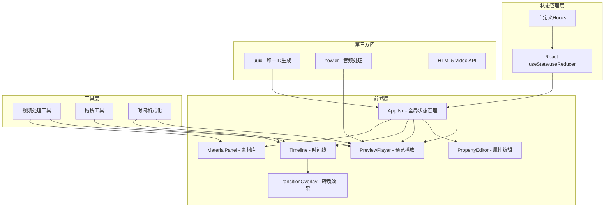

## 1. 架构设计



## 2. 技术描述

- **前端框架**：React@18 + TypeScript@5
- **构建工具**：Vite@5 + @vitejs/plugin-react@4
- **状态管理**：React useState + useReducer（轻量级，无需额外状态库）
- **音频处理**：howler@2.2.4
- **唯一ID**：uuid@9
- **视频处理**：HTML5 Video API + Canvas API（自定义时间线渲染）
- **样式方案**：CSS Modules + CSS Variables（毛玻璃效果、渐变、动画）
- **拖拽实现**：原生HTML5 Drag and Drop API + 自定义拖拽逻辑

## 3. 项目结构

```
src/
├── App.tsx                    # 主组件，全局状态管理
├── main.tsx                   # 入口文件
├── index.css                  # 全局样式、CSS变量
├── types/
│   └── index.ts               # 类型定义
├── modules/
│   ├── material/
│   │   └── MaterialPanel.tsx  # 素材库模块
│   ├── timeline/
│   │   ├── Timeline.tsx       # 时间线模块
│   │   └── TransitionOverlay.tsx # 转场效果模块
│   ├── preview/
│   │   └── PreviewPlayer.tsx  # 预览播放模块
│   └── properties/
│       └── PropertyEditor.tsx # 属性编辑模块
├── hooks/
│   ├── useVideoMetadata.ts    # 视频元数据提取Hook
│   ├── useDragAndDrop.ts      # 拖拽逻辑Hook
│   └── usePlayerControls.ts   # 播放器控制Hook
└── utils/
    ├── time.ts                # 时间格式化工具
    └── video.ts               # 视频处理工具
```

## 4. 数据模型

### 4.1 类型定义

```typescript
// 素材类型
interface Material {
  id: string;
  name: string;
  file: File;
  url: string;
  duration: number;
  thumbnail: string;
  width: number;
  height: number;
}

// 剪辑类型
interface Clip {
  id: string;
  materialId: string;
  startTime: number;
  endTime: number;
  inPoint: number;
  outPoint: number;
  volume: number;
  playbackRate: number;
}

// 转场类型
interface Transition {
  id: string;
  type: 'fade' | 'slide' | 'zoom';
  duration: number;
  fromClipId: string;
  toClipId: string;
}

// 时间线状态
interface TimelineState {
  clips: Clip[];
  transitions: Transition[];
  currentTime: number;
  zoom: number;
  isPlaying: boolean;
  selectedClipId: string | null;
}

// 全局状态
interface AppState {
  materials: Material[];
  timeline: TimelineState;
  filter: {
    keyword: string;
    sortBy: 'name' | 'duration';
  };
}
```

### 4.2 核心数据流

1. **素材上传**：MaterialPanel → 调用视频处理工具 → 提取元数据 → App更新materials
2. **拖拽到时间线**：MaterialPanel拖拽 → Timeline接收 → App添加Clip
3. **调整剪辑**：Timeline交互 → App更新Clip → PreviewPlayer同步预览
4. **添加转场**：TransitionOverlay拖拽 → Timeline接收 → App添加Transition
5. **属性编辑**：PropertyEditor修改 → App更新Clip → Timeline/Preview同步

## 5. 性能优化策略

### 5.1 渲染优化
- 使用React.memo包裹子组件，避免不必要重渲染
- 时间线使用Canvas渲染剪辑块，避免大量DOM节点
- 素材缩略图懒加载，使用Web Worker处理视频帧提取

### 5.2 交互优化
- 拖拽操作使用requestAnimationFrame确保60fps
- 缩放操作使用CSS transform而非重排
- 防抖处理筛选输入，避免频繁过滤

### 5.3 内存优化
- 及时释放ObjectURL，避免内存泄漏
- 限制同时解码的视频数量，使用视频池复用
- 缩略图使用离屏Canvas压缩

## 6. 组件接口定义

### 6.1 MaterialPanel Props
```typescript
interface MaterialPanelProps {
  materials: Material[];
  filter: { keyword: string; sortBy: 'name' | 'duration' };
  onUpload: (files: FileList) => void;
  onFilterChange: (filter: { keyword: string; sortBy: 'name' | 'duration' }) => void;
  onDragStart: (material: Material, e: React.DragEvent) => void;
  collapsed: boolean;
  onToggleCollapse: () => void;
}
```

### 6.2 Timeline Props
```typescript
interface TimelineProps {
  clips: Clip[];
  transitions: Transition[];
  materials: Material[];
  currentTime: number;
  zoom: number;
  selectedClipId: string | null;
  onClipAdd: (materialId: string, startTime: number) => void;
  onClipUpdate: (clipId: string, updates: Partial<Clip>) => void;
  onClipSelect: (clipId: string | null) => void;
  onZoomChange: (zoom: number) => void;
  onTimeChange: (time: number) => void;
  onTransitionAdd: (fromClipId: string, toClipId: string, type: Transition['type']) => void;
}
```

### 6.3 PreviewPlayer Props
```typescript
interface PreviewPlayerProps {
  clips: Clip[];
  transitions: Transition[];
  materials: Material[];
  currentTime: number;
  isPlaying: boolean;
  onPlay: () => void;
  onPause: () => void;
  onTimeChange: (time: number) => void;
}
```

### 6.4 PropertyEditor Props
```typescript
interface PropertyEditorProps {
  clip: Clip | null;
  material: Material | null;
  onClipUpdate: (clipId: string, updates: Partial<Clip>) => void;
  collapsed: boolean;
  onToggleCollapse: () => void;
}
```
